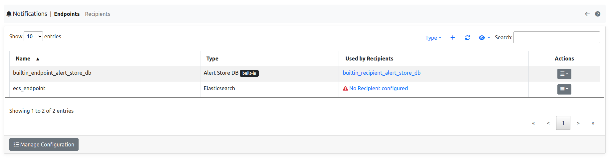
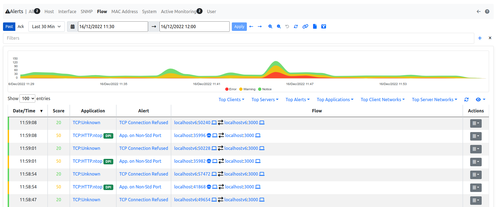
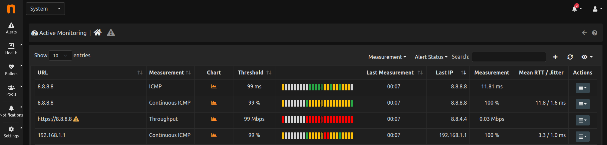
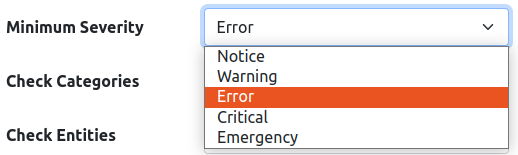
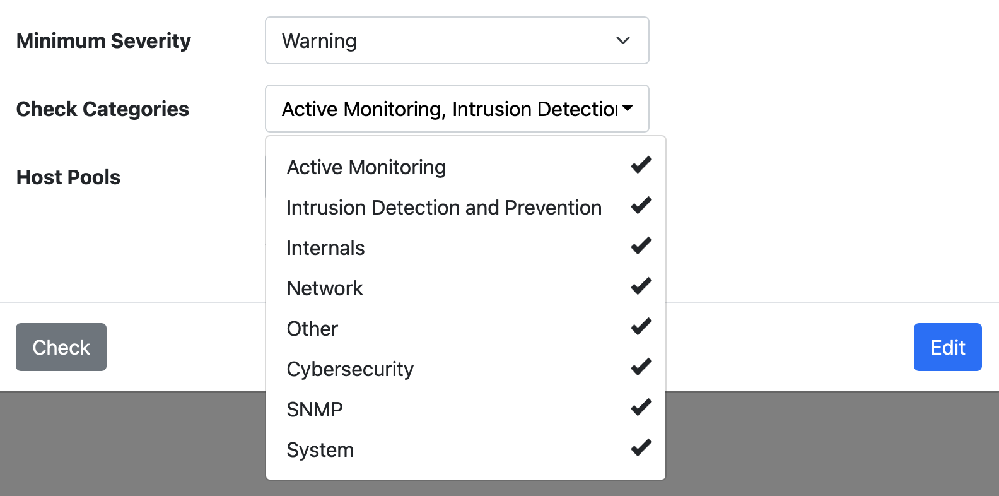

.. _DeliveringAlertsToRecipients:

Delivering Alerts to Recipients
===============================

Once evaluated, alerts are sent to recipients. Recipients, along with their associated endpoints, are managed from the system interface.

Recipients are associated to one, and only one endpoint, but the same endpoint can be shared across multiple recipients.

Endpoints and recipients have a type and a set of configuration parameters which depends on the type. All the available endpoints and recipients are described in the next section.

Endpoints contain common configuration which is then extended with recipients configuration. For example, the *email* endpoint contains the SMTP server address, whereas *email* recipients contain destination email addressses. This allows the creation of multiple *email* recipients, all sharing the same endpoint and, thus, the same SMTP server address.

An extensive example can bee seen at https://www.ntop.org/ntopng/using-ntopng-recipients-and-endpoints-for-flexible-alert-handling/.

Builtin
-------

A builtin SQLite recipient, along with its builtin SQLite endpoint, is always present. This is used to deliver alerts to the internal database and have them accessible inside the web UI. Engaged alerts are not affected by the builtin pair and are always shown. For example, the following alerts are shown under *Flow Alerts* because they have been delivered to the builtin recipient

The builtin recipient cannot be edited or deleted but it can be associated to pools. To continue the example above, alerts shown under *Flow Alerts* have been delivered to the builtin recipient because that recipient was associated to the Default Flow Pool.

The builtin recipient, as any other recipient, can be deassociated from pools, too. This will effectively cause alerts not to be delivered to the internal databse. By default, the builtin recipient is associated to all Default pools.

Delivery Criteria
-----------------

Each recipient can be configured to receive alerts on the basis of two criteria:

- Severity-based
- Type-based

Severity-based
~~~~~~~~~~~~~~

A minimum severity is indicated when creating/editing the recipient. All alerts having the indicated (or an higher severity) will be delivered to the recipient.

Type-based
~~~~~~~~~~

Multiple types can be indicated when creating/editing the recipient. All alerts belonging to the indicated types will be delivered to the recipient.

