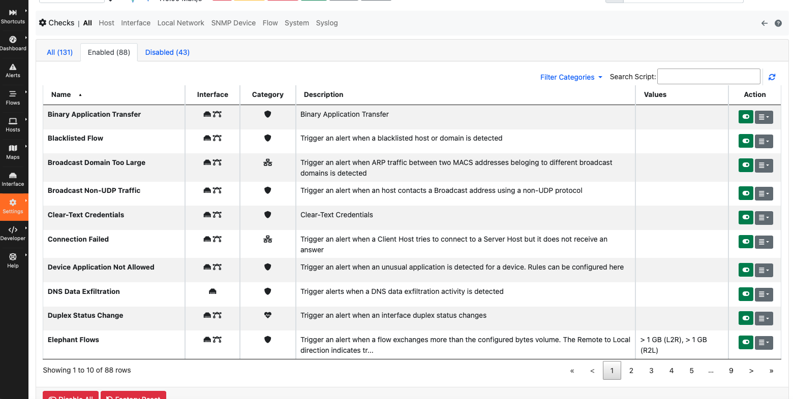

Evaluating Alerts
=================

Checks
------------

ntopng alerts are evaluated with :ref:`WebUIUserScripts`. Checks are executed for hosts, interfaces, SNMP devices, and other network elements, and are configurable from the settings

Although only a **Default** configuration is shown in the figure above, each Check can have multiple configurations. A configuration contains values for thresholds and other User Uscript-specific parameters.

In the example below, the **Default** configuration for Host Checks is configured to trigger a flow flood victim alert when the number of new flows per second generated exceeds 256.

.. figure:: ../img/alerts_default_host_configuration.png
  :align: center
  :alt: Default Configuration for Host Checks

Additional configurations can be created to specify different thresholds (e.g., a value different than 256 for the new flows generated per second), or to toggle on/off each individual Check.

Pools
-----

Check Configurations are applied to pools. Pools are used to group together network elements. :ref:`BasicConceptsHostPools` group together multiple hosts. Similarly, Interface pools group together multiple interfaces, and so on. The same configuration can be applied to multiple pools, but a pool has one and only one configuration applied. Pools are managed from the system interface.

.. figure:: ../img/alerts_pools_management.png
  :align: center
  :alt: Pools Management

The configuration applied to each pool, shown in the table above, can be changed using the *Edit* button under *Actions*.

Checks run against all pool members will use the configuration specified for that pool. For example, an Interface pool **LAN pool** with interface :code:`eno1` can be created and associated with a Checks configuration **LAN config** as shown below

Configuration **LAN config** was previously created from the Users Scripts Configuration page

.. figure:: ../img/alerts_example_lan_pool_config.png
  :align: center
  :alt: Check Configurations list with **LAN config**

Given the association shown above, Interface Checks will be run against :code:`eno1` using the configuration **LAN pool**. All the other interfaces monitored have not been associated to a pool and so will have the **Default** configuration applied.
