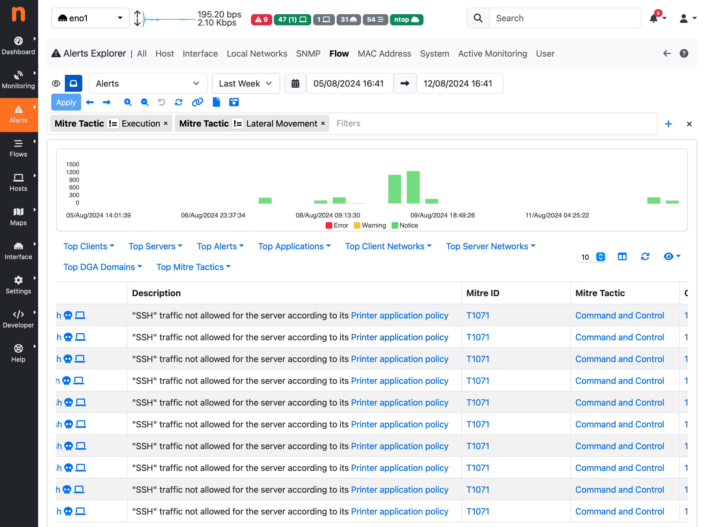

Mitre Classification
====================

ntopng offers in-depth insights into network performance and security, in fact
one of its powerful features is the ability to detect and trigger alerts related 
to network security issues. These alerts are mapped to the MITRE ATT&CK framework, 
a globally recognized knowledge base of adversary tactics and techniques. 
This integration enhances ntopng providing a structured understanding of the nature 
of these threats by associating them with specific MITRE ATT&CK IDs.
This section outlines how ntopng integrates with the MITRE ATT&CK framework and how 
users can navigate and interpret the related data within ntopng.

Mitre ATT&CK Framework Integration
----------------------------------

The MITRE ATT&CK framework is a curated knowledge base and model for cyber adversary 
behavior, including a comprehensive matrix of tactics, techniques, and procedures
that adversaries use. By mapping security alerts to specific ATT&CK IDs, ntopng 
allows users to understand the context of each alert in terms of the adversary's 
behavior and goals:

- Each security alert in ntopng is associated with a specific MITRE ATT&CK ID,
  providing context about the tactics and techniques used in the attack.
- Improved Incident Response: by understanding the ATT&CK ID associated with an alert,
  security teams can prioritize and respond more effectively based on the severity
  and nature of the threat.
- Comprehensive Security Reports: ntopng offers visual representations of the most
  common MITRE attacks, tactics, and techniques through a Security Report, allowing
  for a quick overview of the security landscape.

Security Report
---------------

The Security Report can be found in the Reports page, by selecting it from the list
or available reports in the dropdown. This report visually represent the distribution
of detected attacks, categorized by MITRE tactics, techniques, and specific ATT&CK IDs.
This allows users to quickly assess the most common types of attacks and their prevalence.
The Top Attacks are displayed for each classification, which are the most frequently
occurring attacks.

.. figure:: ../img/security_report.png
   :align: center
   :alt: Security Report
  
   Security Report

Alerts Explorer
---------------

In the Alerts Explorer, each Flow or Host alert triggered by ntopng is displayed with
its corresponding MITRE ATT&CK classification (ID, tactic, technique). This section 
allows users to quickly identify the nature of the threat by referencing the associated 
ATT&CK ID.

Users can also filter alerts based on specific ATT&CK ID, tactic or technique, to focus 
on particular types of threats.

  
   Mitre Classification in Alert Explorer

Alert Details
---------------

Clicking on an alert (or a flow) ntopng will expand the view to show detailed information,
including the ATT&CK ID and the associated tactic description, for each of the flow status
and issue that contributed to trigger the alert.

