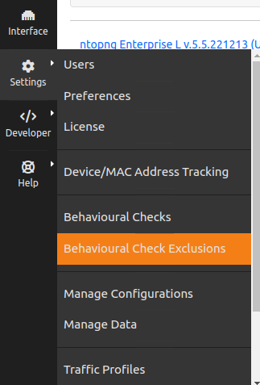
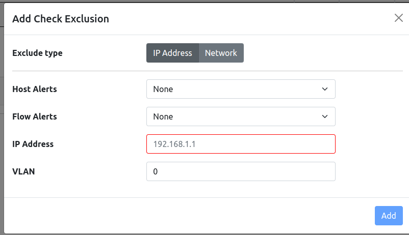
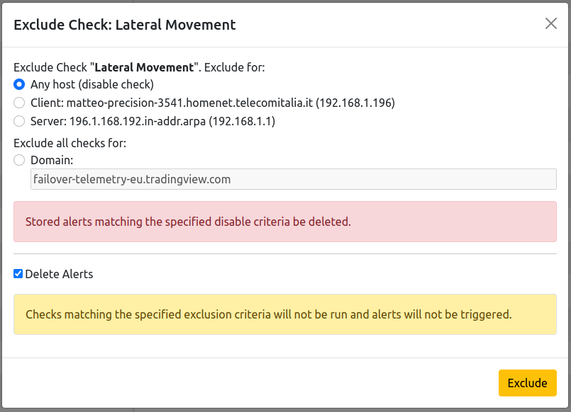
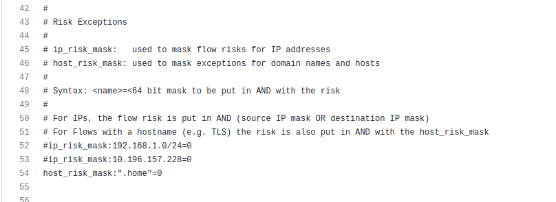

.. _RiskAndCheckExclusion:

Behavioural Check Exclusions
============================

In ntopng it's possible to exclude Hosts from specific alerts.

.. note::

  This feature is only available from Pro Version

  Check Exclusions Page

By clicking the `+` close to the Search above the table, it's possible to add a new host or network to exclude for an Host and a Flow Alert.
Excluded Hosts/Networks will not trigger the specified alert.

  Add Check Exclusion

An other way to exclude an host for a specific alert is by going in the Alert Page (:ref:`BasicConceptAlerts`), click the Action button and then click 'Disable'.
From the opened pop-up it's possible to disable the alert ('Any host') or exclude an host (Client or Server). To remove from the database the alerts disabled for the host, 
toggle the 'Delete Alerts' box or untoggle to not remove them. 

  Add Check Exclusion

Exclude Risks Domain/Networks with nDPI
---------------------------------

It's even possible to exclude Hosts, Networks and even Domains from nDPI Risk Alerts (`nDPI Risks`_) by using nDPI itself.
To do it, specify a nDPI protocol file (an `example`_ can be found in nDPI) that contains exceptions as follows:

  nDPI Risk Exclusion

Then pass this file, using the '-p' option, to ntopng (`[--ndpi-protocols|-p] <file>.protos`).
More information can be found in this `article`_

.. _`example`: https://github.com/ntop/nDPI/blob/dev/example/protos.txt
.. _`nDPI Risks`: https://www.ntop.org/guides/nDPI/flow_risks.html
.. _`article`: https://www.ntop.org/ndpi/howto-define-ndpi-risk-exceptions-for-networks-and-domains/
