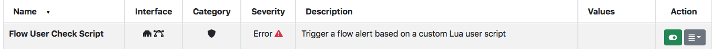

Flow Checks
===========

Flow checks are written in C++ for efficiency reasons. However ntopng also offers a Lua API that can be used to create flow checks. All you need to do is to enable the `Flow User Check Script` behavioural check under the `Settings` menu sidebar. Done that you need to create a script named `custom_flow_lua_script.lua` under `/usr/share/ntopng/scripts/callbacks/checks/flows/`.

ntopng has a sample flow script that you can find `here <https://github.com/ntop/ntopng/tree/dev/scripts/callbacks/checks/flows>`_ and that can be used as reference.

Operational Mode
----------------

The lua script check is executed on all flows as soon as nDPI has detected the application protocol. This means that the script is called once per flow and not periodically (for long standing flows). Through the Lua API, developers have access to the `flow` object that can be used to access information about the flow being checked and also to trigger a flow alert.

Script Example
--------------

Below you can find a simple `custom_flow_lua_script.lua` script.

.. code:: bash

  if(flow.srv_port() == 53) then
     local score   = 100
     local message = "dummy alert message"

     flow.triggerAlert(score, message)
   end

   -- IMPORTANT: do not forget this return at the end of the script
   return(0)

In the script above an alert is triggered flow flows whose server port is 53.

Flow Object Methods
-------------------

- | **flow.cli()**
  | Read the flow client IP (string)

- | **flow.cli_port()**
  | Read the flow client port (number)

- | **flow.srv()**
  | Read the flow server IP (string)

- | **flow.srv_port()**
  | Read the flow server port (number)

- | **flow.protocol()**
  | Read the flow layer 4 protocol (number)

- | **flow.vlan_id()**
  | Read the flow VLAN Id (number)

- | **flow.is_oneway()**
  | Check if the flow is unidirectional, meaning that there is no traffic from server to client (boolean)

- | **flow.is_unicast()**
  | Check if the flow has unicast peers (boolean)

- | **flow.cli2srv_bytes()**
  | Read the flow bytes from client to server (number)

- | **flow.srv2cli_bytes()**
  | Read the flow bytes from server to client (number)

- | **flow.bytes()**
  | Read the total (sent + received) flow bytes (number)

- | **flow.l7_master_proto()**
  | Read the flow nDPI master protocol (number)

- | **flow.l7_proto()**
  | Read the flow nDPI application protocol (number)

- | **flow.l7_proto_name()**
  | Read the flow nDPI protocol name (string)

- | **flow.direction()**
  | Read the flow (e.g. local2remote) direction (string)

- | **flow.http()**
  | For HTTP flows, it reports protocol information (e.g. HTTP URL or return code) or nil otherwise (table)

- | **flow.dns()**
  | For DNS flows, it reports protocol information (e.g. domain name) or nil otherwise (table)

- | **flow.ssh()**
  | For SSH flows, it reports protocol information (e.g. SSH client signatute) or nil otherwise (table)

- | **flow.tls_quic()**
  | For TLS/QUIC flows, it reports protocol information (e.g. TLS ciphers or SNI) or nil otherwise (table)

- | **flow.triggerAlert(score, message)**
  | Triggers an alert for the selected flow. The score parameter (numeric) is used to set the alert score, and the message (string) is used to set the alert string that typically contains a human-readeable message related to the triggered alert.
