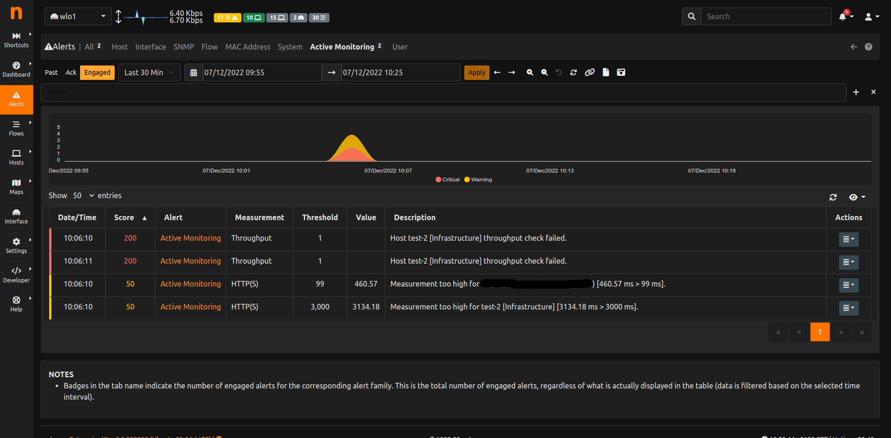
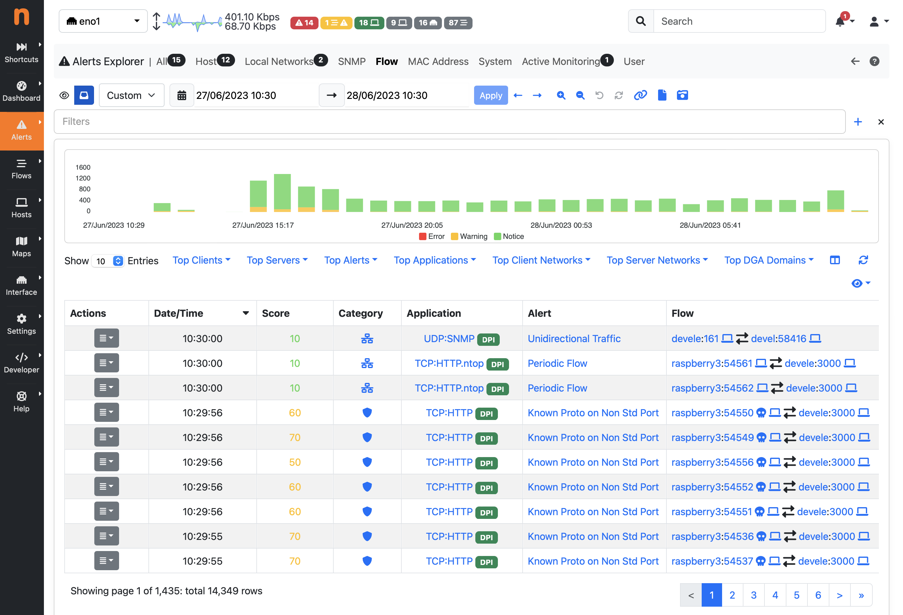
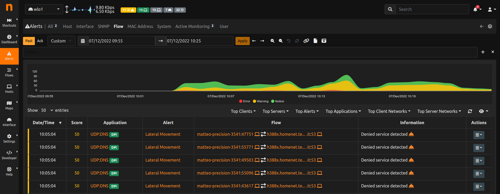
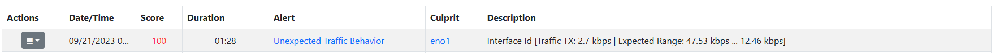
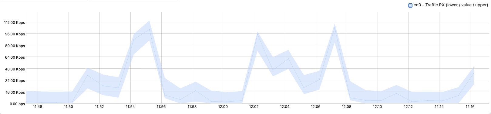
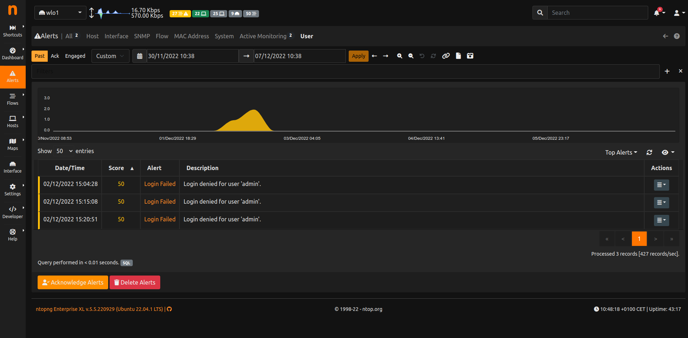
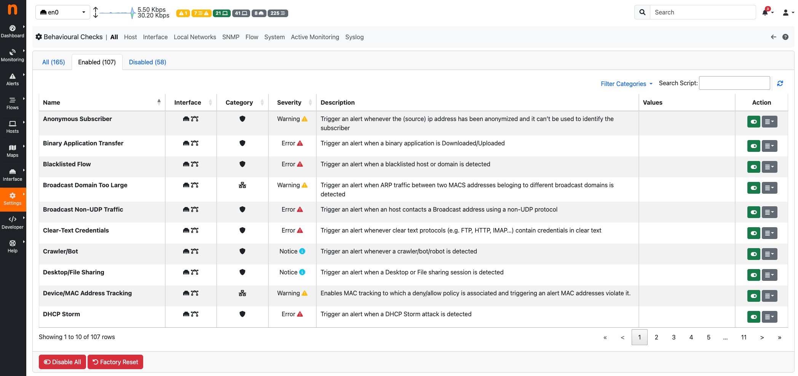

.. _BasicConceptAlerts:

Alerts
======

ntopng generates alerts to report the occurrence of events and user-configurable thresholds. :ref:`WebUIUserScripts` are responsible for the generation of alerts. Enabling and disabling a checks enables or disables the corresponding alerts.

Alerts include, but are not limited to:

- The detection of a new device
- The status change of a switch port detected via SNMP
- The contact of a malware host
- A user activity

Certain alerts are configurable. For example, alerts can be triggered when certain user-configurable thresholds are crossed. As soon as ntopng detects a certain threshold is crossed, it immediately triggers the corresponding alert. Examples of thresholds include:

- "The traffic generated by an host falls below a certain threshold"
- "The number of SYN sent by an host exceeds a certain number so it is considered a scanner"
- "Packet drops of an interface exceeds a given percentage of the total number of monitored packets"
- "The total traffic originated at a network exceeds a certain threshold"

ntopng :ref:`WebUIUserScripts` perform the evaluation of thresholds periodically, at predefined time intervals:

- Every minute
- Every 5 minutes
- Every hour
- Daily

Alerts associated with a threshold have a duration, that is, they are active for a certain period of time. This period of time starts then the threshold is first met and stops when the threshold is no longer met. For this reason, such alerts are said to be *engaged* or *released*, depending on whether the triggering threshold is still met or not.

.. _Engaged Alerts:

Engaged Alerts
--------------

When the threshold is first met, puts the corresponding alert in an *engaged* state. The set of alerts that are currently engaged is available from the engaged alerts page.

  Engaged Alerts Page

.. _Released Alerts:

Released Alerts
---------------

When the triggering threshold of an engaged alert is no longer met, the alert is *released* an it will no longer be visible in the engaged alerts page. Alerts, once released, become available from the past alerts page and their duration is indicated in the corresponding column

  Past Alerts Page

Alerts associated with events don't have a duration associated. They are triggered *at the time of the event* but any duration is not meaningful for them. For this reason, such alerts are never *engaged*  or *released*, they are just *stored* as soon as they are detected, and they are placed under the past alerts page without any duration indicated.

.. _Flow Alerts:

Flow Alerts
-----------

During its execution, ntopng can detect anomalous or suspicious flows for which it triggers special *flow alerts*. Such alerts not only carry the event that caused the alert to be fired, they also carry all the flow details, including source and destination IP addresses, layer-7 application protocol, and ports.

*Flow alerts* are always associated with events and thus they are never *engaged*  or *released* and are placed in a dedicated flow alerts page

  Flow Alerts Page

Behavior Alerts
---------------

  Alert of an ASN with an Unexpected Behavior

Behavior alerts are new types of alerts introduced lately. Differently from the usual alerts, configured using a static threshold, they have the ability to learn throught the time and change their threshold dinamically.

This is achived by using one of the three foresighting alghoritm developed by nDPI: Simple Exponential Smoothing, Double Exponential Smoothing, Triple Exponential Smoothing (Holt-Winters alghoritm).

These alghoritms have the ability to foresight the future and give a prediction of the analized value. Based on this foresighted value the alert is triggered.

The alert is triggered only if the real value is lesser or greater then certain thresholds that nDPI calculates (it gives a lower and upper bound).

  Timeserie of an ASN with an Unexpected Behavior
  

User Activities
---------------

ntopng keeps track of user activities that are related to system management and security, storing them as alerts. 
These activities include:

- Users management: user added or remove, password changed
- Live traffic downloaded
- Traffic extraction (live or PCAP downloaded)
- Host JSON downloaded
- Flows data downloaded
- Alerts settings changes: alerts disabled or enabled, alerts data deleted
- Failed or successful logins
- Traffic recording enabled or disabled
- Hosts/interfaces data deleted
- SNMP device added or removed

User activities are available in the :ref:`BasicConceptSystemInterface`, under the *Past Alerts* page:

  Past Alerts Page with User Activities

Severity
--------

Event and threshold alerts are always associated with a severity that tells the importance of such occurrence. For example, the contact of a blacklisted host is emphasized with a *warning*, whereas a threshold crossed by an host is highlighted with an *error*. Currently, severity levels available those defined in RFC 3164, namely:

- *Emergency*: system is unusable
- *Alert*: action must be taken immediately
- *Critical*: critical conditions
- *Error*: error conditions
- *Warning*: warning conditions
- *Notice*: normal but significant condition
- *Debug*: debug-level messages

  
Entities
--------

Every alert has an entity and an entity value associated. The entity is the subject for which the alert has been generated. The list of entities supported by ntopng are:

- **Hosts**: Layer-3 IP addresses
- **Interfaces**: monitored ntopng interfaces
- **Networks**: ntopng local networks
- **SNMP devices**: devices added to ntopng from the SNMP page
- **SNMP device interfaces**: devices added to ntopng from the SNMP page
- **Flows**: monitored flows
- **Devices**: Layer-2 Mac addresses
- **Host Pools**: the user-created host pools
- **Process**: the ntopng process itself
- **User**: the ntopng GUI user

For example, an alert triggered for host :code:`192.168.1.2` that has exceeded a traffic threshold will have *"host"* as entity and "*192.168.1.2"* as entity value. Similarly, network :code:`192.168.2.0/24` that has exceeded a traffic threshold will have *"network*" as entity and *"192.168.2.0/24"* as entity value.

Entities are not shown when browsing ntopng alert pages as they are clear from the context and alert messages. Understanding how entities work can be useful when propagating alerts to third-party endpoints such as syslog.

Type
----

The full list of alerts is available under the Developer section, page *Alerts and Flow Status Definitions*.

Recipients
----------

Alerts are not only available within the ntopng web GUI, they can also be propagated to the outside using recipients that include mail, slack and syslog. To see the configuration details necessary to use recipients refer to :ref:`DeliveringAlertsToRecipients`.

.. _`device protocols`: ../advanced_features/device_protocols.html
