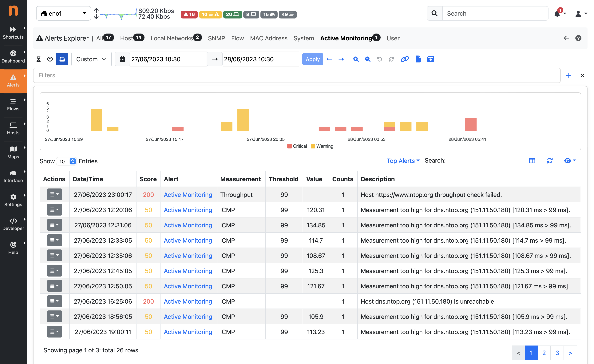
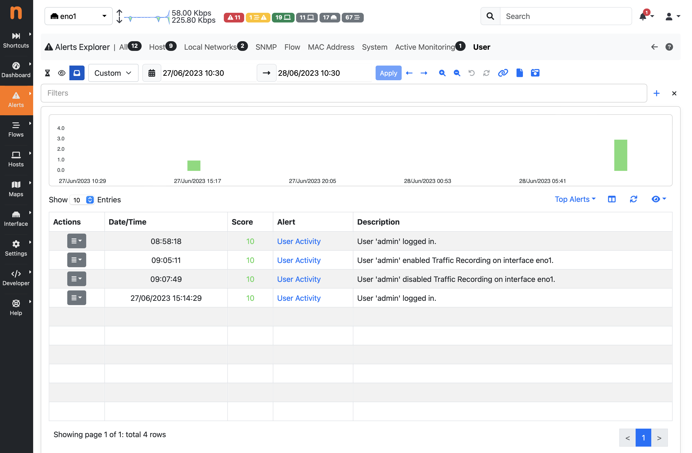

.. _BasicConceptAlerts:

Alerts
======

ntopng generates alerts to report the occurrence of events and user-configurable thresholds. :ref:`WebUIUserScripts` are responsible for the generation of alerts. Enabling and disabling a user scripts enables or disables the corresponding alerts.

Alerts include, but are not limited to:

- The detection of a new device
- The status change of a switch port detected via SNMP
- The contact of a malware host
- A user activity

Certain alerts are configurable. For example, alerts can be triggered when certain user-configurable thresholds are crossed. As soon as ntopng detects a certain threshold is crossed, it immediately triggers the corresponding alert. Examples of thresholds include:

- "The traffic generated by an host falls below a certain threshold"
- "The number of SYN sent by an host exceeds a certain number so it is considered a scanner"
- "Packet drops of an interface exceeds a given percentage of the total number of monitored packets"
- "The total traffic originated at a network exceeds a certain threshold"

Thresholds can be configured for:

- Local hosts
- Interfaces
- Local networks

ntopng :ref:`WebUIUserScripts` perform the evaluation of thresholds periodically at predefined time intervals:

- Every minute
- Every 5 minutes
- Every hour
- Daily

Alerts associated with a threshold have a duration, that is, they are active for a certain period of time. This period of time starts then the threshold is first met and stops when the threshold is no longer met. For this reason, such alerts are said to be *engaged* or *released*, depending on whether the triggering threshold is still met or not.

.. _Engaged Alerts:

Engaged Alerts
--------------

When the threshold is first met, puts the corresponding alert in an *engaged* state. The set of alerts that are currently engaged is available from the engaged alerts page.

.. figure:: ../img/basic_concepts_alerts_engaged_alerts.png
  :align: center
  :alt: Engaged Alerts Page

  Engaged Alerts Page

.. _Released Alerts:

Released Alerts
---------------

When the triggering threshold of an engaged alert is no longer met, the alert is *released* an it will no longer be visible in the engaged alerts page. Alerts, once released, become available from the past alerts page and their duration is indicated in the corresponding column

  Past Alerts Page

Alerts associated with events don't have a duration associated. They are triggered *at the time of the event* but any duration is not meaningful for them. For this reason, such alerts are never *engaged*  or *released*, they are just *stored* as soon as they are detected, and they are placed under the past alerts page without any duration indicated.

.. _Flow Alerts:

Flow Alerts
-----------

During its execution, ntopng can detect anomalous or suspicious flows for which it triggers special *flow alerts*. Such alerts not only carry the event that caused the alert to be fired, they also carry all the flow details, including source and destination IP addresses, layer-7 application protocol, and ports.

*Flow alerts* are always associated with events and thus they are never *engaged*  or *released* and are placed in a dedicated flow alerts page

.. figure:: ../img/basic_concepts_alerts_flow_alerts.png
  :align: center
  :alt: Flow Alerts Page

  Flow Alerts Page

User Activities
---------------

ntopng keeps track of user activities that are related to system management and security, storing them as alerts. 
These activities include:

- Users management: user added or remove, password changed
- Live traffic downloaded
- Traffic extraction (live or PCAP downloaded)
- Host JSON downloaded
- Flows data downloaded
- Alerts settings changes: alerts disabled or enabled, alerts data deleted
- Failed or successful logins
- Remote assistance enabled or disabled
- Traffic recording enabled or disabled
- Hosts/interfaces data deleted
- SNMP device added or removed

User activities are available in the :ref:`BasicConceptSystemInterface`, under the *Past Alerts* page:

  Past Alerts Page with User Activities

Severity
--------

Event and threshold alerts are always associated with a severity that tells the importance of such occurrence. For example, the contact of a blacklisted host is emphasized with a *warning*, whereas a threshold crossed by an host is highlighted with an *error*. Currently, severity levels available are three:

- *Info*. Used for informative alerts, such as devices connections and disconnections or user activities, that don't directly represent any anomalous event or threshold. Identified with a light blue badge.
- *Warning*. Used for alerts that deserve further investigation, such as a SYN probing. Identified with an orange badge.
- *Error*. Used with user-configurable thresholds, for example a traffic threshold crossed by an host. Identified with a red badge.

  
Entities
--------

Every alert has an entity and an entity value associated. The entity is the subject for which the alert has been generated. The list of entities supported by ntopng are:

- **Hosts**: Layer-3 IP addresses
- **Interfaces**: monitored ntopng interfaces
- **Networks**: ntopng local networks
- **SNMP devices**: devices added to ntopng from the SNMP page
- **Flows**: monitored flows
- **Devices**: Layer-2 Mac addresses
- **Host Pools**: the user-created host pools
- **Process**: the ntopng process itself
- **User**: the ntopng GUI user

For example, an alert triggered for host :code:`192.168.1.2` that has exceeded a traffic threshold will have *"host"* as entity and "*192.168.1.2"* as entity value. Similarly, network :code:`192.168.2.0/24` that has exceeded a traffic threshold will have *"network*" as entity and *"192.168.2.0/24"* as entity value.

Entities are not shown when browsing ntopng alert pages as they are clear from the context and alert messages. Understanding how entities work can be useful when propagating alerts to third-party endpoints such as syslog.

Type
----

The list of currently supported alerts, divided by entity, is outlined below:

- Mac Addresses    

  - **New Device** (event): Generated when a new Mac address is seen for the first time by ntopng on a particular interface.
  - **Device Connection** (event): Generated when a previously-seen Mac address starts doing traffic after an inactivity period.
  - **Device Disconnection** (event): Generated when a Mac address goes idle after an activity period.
  - **IP/MAC Change** (event): Generated when the Mac address seen for a given IP changes, for example when the DHCP re-uses an IP address.
  - **Device Protocols** (event): Generated when an anomalous protocol is detected. See `device protocols`_ for more details.

- Host Pools

  - **Host Pool Connection** (event): Generated when ntopng starts seeing traffic for at least one host belonging to a pool.
  - **Host Pool Disconnection** (event): Generated when the last host of a pool becomes idle after an activity period.

- SNMP Devices

  - **Interface Status Change** (event): Indicates whether an interface of an SNMP configured device has changed its status, by going from Up to Down, or vice versa.
  - **Interface Duplex Status Change** (event): Indicates whether an interface of an SNMP configured device has changed its *duplex* status, for example by going from full-duplex to half-duplex.
  - **Interface Discards/Errors** (event): Indicates whether the *discards* or *errors* counters increased on an interface of an SNMP configured device.
  - **Unresponsive Device** (event): Indicates whether a configured SNMP device no longer responds to SNMP queries.
  - **Port Load Threshold** (event): Indicates whether the load (throughput with respect to the link speed) on a port of a configured SNMP device exceed a configured threshold.

  Alerts for SNMP devices can be controlled from *Preferences* -> *SNMP* (after selecting *Expert View* mode). The same alerts can be also disabled for selected devices from *System* -> *SNMP* -> (device) -> (cog icon), and even selected interfaces from *System* -> *SNMP* -> (device) -> *Interfaces* -> (interface) -> (cog icon).

- Flows

  See below for a description of the misbehaving flows alerts.

- Other Entities

  - **TCP SYN Flood** (threshold): Indicates whether an host is exceeding a configurable number of SYN per second. In the alert message it is also indicated if an host is a flooder of if it is a victim of a SYN flood.
  - **Flows Flood** (threshold): Indicates whether an host is creating a number of flows that exceeds a configurable maximum number of flows per second. In the alert message it is also indicated if an host is a flooder of if it is a victim of a flow flood.
  - **Threshold Cross** (threshold): Indicates whether an host, a network or an interface has crossed a configurable threshold. Thresholds can be configured from host, network and interface details page.
  - **Process** (event): Indicates ntopng process status changes, including normal and anomalous restarts.

Alerts used only for the ntopng Edge edition are:

- **Blocked Flow** (event): Generates an alert for every flow that is blocked by ntopng Edge due to configured policies.
- **Quota Exceeded** (event): Signals a quota exceeded for one of the defined users.
- **NFQ Flushed** (event): Indicates whether a flush of the underlying ntopng Edge netfilter queue has been flushed.

Not all the types of alerts are generated by default. Alert generation on a per-type basis can be controlled from the ntopng preferences.

Misbehaving Flows
-----------------

Ntopng can detect possibly anomalous flows, and report them as alerts. Such flows are called "Misbehaving Flows".

Here is a list of possible flows alert types:

  - **Flow Misbehavior** (event): Indicates a generic misbehavior. The alert description contains more details, namely:

    + Slow TCP Connection
    + Slow Application Header
    + Slow Data Exchange (Slowloris?)
    + Low Goodput
    + TCP Connection Issues
    + Severe TCP Connection Issues: Indicates that there are too many retransmissions, OOO or lost packets
    + Elephant flow ("local to remote" or "remote to local"): Indicates that the flow is carrying a lot of data
    + Data Exfiltration: The flow may be a data exfiltration attempt
    + Long-lived flow: The flow is lasting too long
  - **Suspicious Activity** (event): Indicates whether there is a suspicious flow activity, namely when there is one of the following:

    + Suspicious TCP SYN Probing (or server port down)
    + Suspicious TCP Probing
    + TCP connection refused
    + SSL certificate mismatch
    + Invalid DNS query: This can indicate a DGA domain being contacted by a compromised host
  - **Remote client and remote server** (event): Indicates whether a flow has both the client and the server in ntopng remote networks.
  - **Blacklisted Flow** (event): Generated for flows that have the blacklisted client or the blacklisted server (or both).
  - **Web Mining** (event): Used for flows that are supposed to perform mining activities.
  - **Flow blocked** (event): In nEdge, this indicates that the flow has been blocked by policy enforcement
  - **Protocol not allowed for this device type**: Anomalous traffic from a device. This occurs, for example, if a printer device performs Skype traffic, which is not expected to happen.
  - **IDS alert**: an alert generated by an external IDS, e.g. Suricata

Third-Party Endpoints
---------------------

Alerts are not only available within the ntopng web GUI, they can also be propagated to the outside using third party endpoints that include mail, slack and syslog. To see the configuration details necessary to use the endpoints refer to :ref:`ThirdPartyAlertEndpoints`.

.. _`device protocols`: ../advanced_features/device_protocols.html
