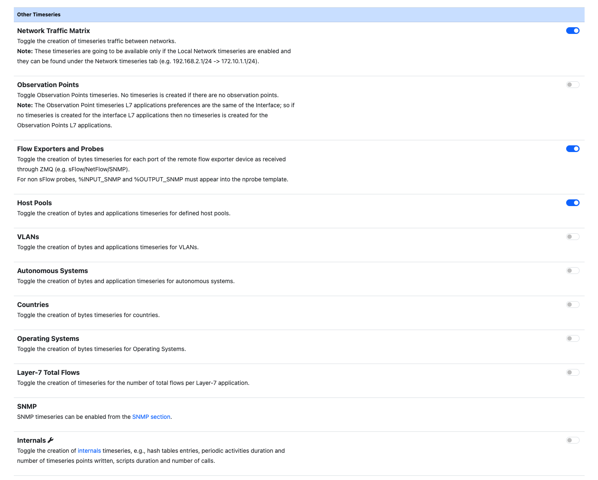

Timeseries
##########

Ntopng creates historical timeseries to be visualized in the charts. In order to
store timeseries data, ntopng supports RRD_ and InfluxDB_ as timeseries drivers.

  Timeseries Preferences

The resolution of data depends on the actual timeseries type. For example, the
network interfaces traffic is usually recorded with a 1 second resolution, whereas the
hosts L7 protocols data usually have 5 minutes resolution. Moreover, in same cases (e.g. RRD),
the resolution of the data depends on how old is the data.

RRD Driver
----------

RRD is the default driver used. It writes data in the form of local `.rrd` files.
With RRD the retention time for recorded data is fixed 1 year. RRD automatically
aggregates old data to save space, reducing its resolution. Hence older data will be
aggregated together and finally be removed after 1 year (in fact RRD stands for *Round Robin*
Database).

Querying a single data series is efficient since the data is contained into a single file,
while performing more complex queries on multiple data series (e.g. when trying to determine
the top protocols) can take some time. Moreover RRD has shown some limitations when writing
a large volume of data, usually leading to gaps in the timeseries data points. With a large
volume of data, the use of InfluxDB is suggested.

.. _InfluxDB Driver:

InfluxDB Driver
---------------

ntopng supports writing and fetching timeseries data from an InfluxDB server.
Since database communication happens via the network, the server can also be located
on an external host.

.. note::

   The minimum supported InfluxDB version is 1.5.1

  InfluxDB Preferences

Here is an overview of the features ntopng provides:

- A database is automatically configured according to the *InfluxDB Database* field value
- It is possible to specify the db authentication credentials if the InfluxDB database is protected
- It is possible to specify the maximum retention time for data

InfluxDB is really suitable to export high frequency data due to the high insertion
throughput. For this reason it's possible to increase the timeseries resolution to
get more detailed historical data. This can be configured from the
"L7 Application Resolution" preference.

.. warning::

  Increasing the timeseries resolution involves more buffering into ntopng. This
  will have a strong impact on the RAM usage on large networks.

.. warning::

  In order to avoid "max-values-per-tag limit exceeded" errors with InfluxDB leading to
  new data being rejected, it's necessary to set `max-values-per-tag = 0` in the
  InfluxDB configuration file, usually located at `/etc/influxdb/influxdb.conf`

.. warning::

  In order to avoid "max-series-per-database limit exceeded" errors with InfluxDB leading to
  new data being rejected, it's necessary to set `max-series-per-database = 0` in the
  InfluxDB configuration file, usually located at `/etc/influxdb/influxdb.conf`. Please note
  that an high cardinality of timeseries may lead to writes/reads performance degradation.
  You can reduce the cardinality by disabling some timeseries and decreasing the maximum
  timeseries retention time.

.. note::

  It is possible to review the current InfluxDB storage size used by ntopng from the
  "Runtime Status" page.

InfluxDB status can be monitored using the  :ref:`InfluxDB Monitor`.
   
Timeseries Configuration
------------------------

Individual timeseries can be enabled or disabled based on the user needs or system
limits. Such limits usually are:

- the storage size (more timeseries means more storage)
- the storage speed
- the time needed to write such timeseries to the timeseries db (in particular, this is
  a problem with RRD)

Moreover, having a lot of timeseries usually means slower query time.

Enabling a "Traffic" timeseries usually has little impact on the performance. On the
other hand, enabling the "Layer-7 Applications" (in particular for the local hosts)
has a high impact since there are many protocols and timeseries must be processed
for each of them.

It is possible to skip timeseries generation for a particular network interface
from the interface settings page. By disabling timeseries generation on a network
interface, no timeseries data will be written for the interface itself and for
all the local hosts belonging to it.

ntopng also provides timeseries on other traffic elements such as Autonomous Systems,
Countries, VLANs and so on, which can be enabled independently.

.. _RRD: https://oss.oetiker.ch/rrdtool

.. _InfluxDB: https://www.influxdata.com
