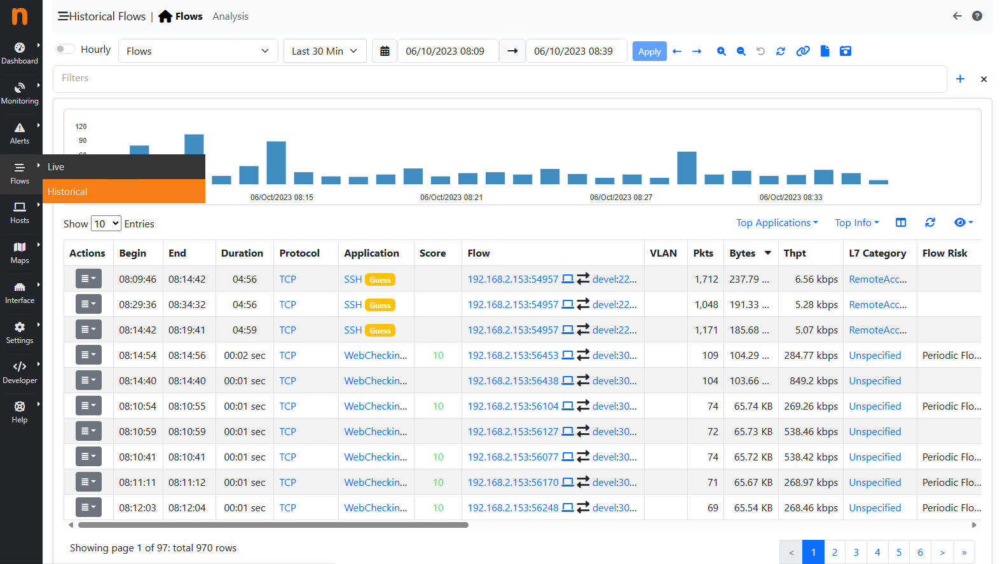

.. _ClickHouse:

ClickHouse
##########

ntopng integrates with ClickHouse to store historical flows and alerts. ClickHouse is an high-performance SQL database. To install ClickHouse refer to the official guide_.

.. _guide: https://clickhouse.com/#quick-start

To connect ntopng to ClickHouse use option :code:`-F`. The format of this option is the following

.. code:: bash

    clickhouse;<host[@port]|socket>;<dbname>;<table name>;<user>;<pw>

Where

- :code:`<host[@port]|socket>` Specifies the database :code:`host` or a :code:`socket` file. By default, port :code:`9000` is used for the connection. To use a different port, specify it with :code:`@port`. The host can be a symbolic name or an IP address.
- :code:`<dbname>` Specifies the name of the database to be used and defaults to :code:`ntopng`
- :code:`<table name>` Specifies the name of the flows table. Currently, this option is ignored.
- :code:`<user>` Specifies an user with read and write permissions on :code:`<dbname>`
- :code:`<pw>` Specifies the password that authenticates :code:`<user>`

Example

To connect ntopng and ClickHouse, both running on the same machine, the following line can be used

.. code:: bash

    ./ntopng -F="clickhouse;127.0.0.1;ntopng;flows;default;default"

In the example above, `127.0.0.1` is used to connect using IPv4 (using the symbolic string :code:`localhost` could resolve to an IPv6 address). A user :code:`default`, identified with password :code:`default`, with read and write permissions on database :code:`ntopng` is indicated as well.

Stored Information
------------------

ntopng stores historical flows and alerts in ClickHouse.

IPv4 and IPv6 flows are stored in table :code:`flows`. A column :code:`INTERFACE_ID` is used to identify the interface on which the flow was seen, this is useful ntopng is monitoring multiple interfaces (see :code:`-i`).

Alerts are stored in several tables, all ending with suffix :code:`_alerts`. The table prefix indicates the alert family, e.g. :code:`host_alerts` table contains alerts for hosts, :code:`flow_alerts` table contains alerts for flows, and so on.

Historical Flows Explorer
-------------------------

When ClickHouse is enabled, an historical flows explorer becomes available in the ntopng web UI.

.. note::

   ClickHouse support is available on all ntopng versions, however, the historical flows explorer is only available in version Enterprise M or above.

The explorer is available from the main menu, under the dashboard section.

  Historical Flows Explorer

