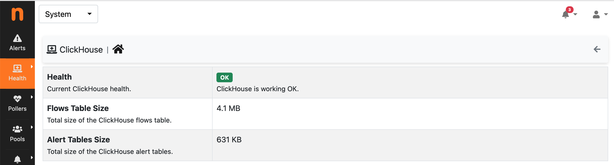
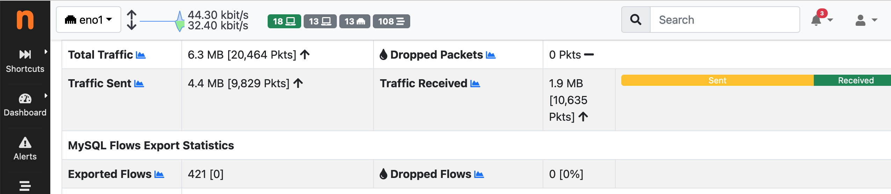

.. _ClickHouse:

Connect to ClicHouse
--------------------

To connect ntopng to ClickHouse use option :code:`-F`. The format of this option is the following

.. code:: bash

    clickhouse;<host[@port]|socket>;<dbname>;<user>;<pw>

Where

- :code:`<host[@port]|socket>` Specifies the database :code:`host` or a :code:`socket` file. By default, port :code:`9000` is used for the connection. To use a different port, specify it with :code:`@port`. The host can be a symbolic name or an IP address.
- :code:`<dbname>` Specifies the name of the database to be used and defaults to :code:`ntopng`
- :code:`<user>` Specifies an user with read and write permissions on :code:`<dbname>`
- :code:`<pw>` Specifies the password that authenticates :code:`<user>`

Example
-------

To connect ntopng and ClickHouse, both running on the same machine, the following line can be used

.. code:: bash

    ./ntopng -F="clickhouse;127.0.0.1;ntopng;default;default"

In the example above, `127.0.0.1` is used to connect using IPv4 (using the symbolic string :code:`localhost` could resolve to an IPv6 address). A user :code:`default`, identified with password :code:`default`, with read and write permissions on database :code:`ntopng` is indicated as well. As shortcut you can use :code:`-F clickhouse` for :code:`F="clickhouse;127.0.0.1;ntopng;default;default"`

Stored Information
------------------

ntopng stores historical flows and alerts in ClickHouse.

IPv4 and IPv6 flows are stored in table :code:`flows`. A column :code:`INTERFACE_ID` is used to identify the interface on which the flow was seen, this is useful ntopng is monitoring multiple interfaces (see :code:`-i`).

Alerts are stored in several tables, all ending with suffix :code:`_alerts`. The table prefix indicates the alert family, e.g. :code:`host_alerts` table contains alerts for hosts, :code:`flow_alerts` table contains alerts for flows, and so on.

Health
------

The health of the currently used ClickHouse database can be checked under the System Interface, "Health" page. The status of the database is shown, along with the space used by flow and alert tables.

  ClickHouse Health

Similarly, the number of exported and dropped flows can be checked, on a per-interface basis, under the interface stats page. Flow export drops should normally stay at zero or be a tiny fraction of the total amount of exported flows. Drops can occur due to the database being temporarily unreachable or not able to received additional data.

  ClickHouse Exported Flows

Migration from nIndex
---------------------

To migrate data from nIndex to clickhouse, we have provided the following script https://github.com/ntop/ntopng/blob/dev/tools/nindex_export_to_ch.sh.

The migration script requires as prerequisites executable :code:`clickhouse-client` and :code:`nindex`. Both executables must be installed on the machine used for the migration, i.e., the machine containing nIndex files locally.

Here are the steps to perform the migration.

- Install ClickHouse as described in the guide_. This will automatically pull in :code:`clickhouse-client`.
- Update the installed ntopng with the most recent development package (version :code:`5.1.211119` or above). This will automatically pull in :code:`nindex`. For packages already installed it suffices to run :code:`apt-get update && apt-get install ntopng` (on Debian/Ubuntu) or :code:`yum install ntopng` (on Centos).
- Open a shell and download the script

.. code:: bash

    $ curl https://raw.githubusercontent.com/ntop/ntopng/dev/tools/nindex_export_to_ch.sh

- Edit the downloaded script and set the proper connection parameters. In particular, change :code:`HOST`, :code:`DB_NAME`, :code:`USER` and :code:`PWD` with a valid ClickHouse host and a user/password pair with read-write privileges on :code:`DB_NAME`.

- Execute the script as root and specify the datadir of ntopng using option :code:`-d`

.. code:: bash

   $ sudo ./nindex_export_to_ch.sh -d /var/lib/ntopng

This will execute the script and perform the necessary migration.

.. note::

   Before executing the migration, make sure to have run ntopng at least one time with ClickHouse. This is necessary to prepare the ClickHouse database structure necessary for the migration.

Example
~~~~~~~

An ntopng instance was running with nIndex enabled for interface :code:`eno1`.

.. code:: bash

   $ sudo /usr/bin/ntopng -F "nindex" -i eno1

To replace nIndex with ClickHouse, the following steps are performed.

- ClickHouse is installed locally following this guide_. :code:`clickhouse-client` can be used to verify connections can be successfully established to the local database

.. code:: bash

   $ clickhouse-client -h 127.0.0.1
   ClickHouse client version 21.11.4.14 (official build).
   Connecting to 127.0.0.1:9000 as user default.
   Connected to ClickHouse server version 21.11.4 revision 54450.

   develv5 :)

- ntopng is updated to the latest development version

.. code:: bash

   $ ntopng --version
   Version: 5.1.211119 [Enterprise/Professional build]

- The configuration of ntopng is changed from nIndex to ClickHouse to make sure it can connect to the ClicHouse server running on the local machine and create the necessary database structure.

.. code:: bash

    sudo /usr/bin/ntopng -F "clickhouse;127.0.0.1;ntopng;flows;default;"

- Now that the database structure is ready, the migration script is downloaded

.. code:: bash

    $ curl https://raw.githubusercontent.com/ntop/ntopng/dev/tools/nindex_export_to_ch.sh

- At the beginning of the downloaded script are the ClickHouse database connection parameters. Parameters are adjusted to connect to the ClickHouse server running locally as follows

.. code::  bash

   HOST="127.0.0.1"
   USER="default"
   PWD=""
   DB_NAME="ntopng"
   DB_FLOWS="flows"

- The migration script is executed providing it with the ntopng data directory that contains the nIndex database files

.. code:: bash

   $ sudo ./nindex_export_to_ch.sh -d /var/lib/ntopng/
   [...]
   Exporting directory: /var/lib/ntopng//plugins0/flows
   Done exporting directory: /var/lib/ntopng//plugins0/flows
   Job accomplished, all flows have been exported

The migration is now complete and all :code:`/flows` directories in the ntopng data directory can safely be deleted.
