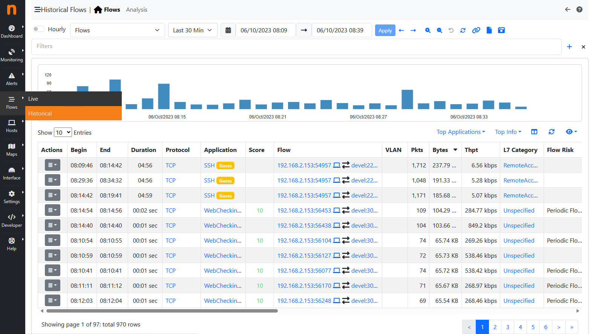
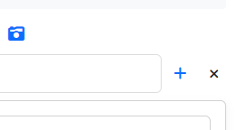
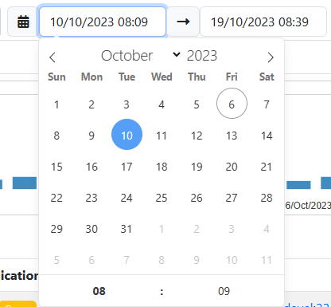
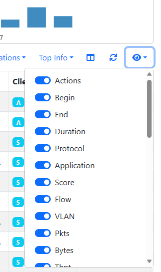
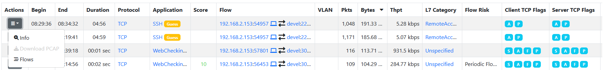
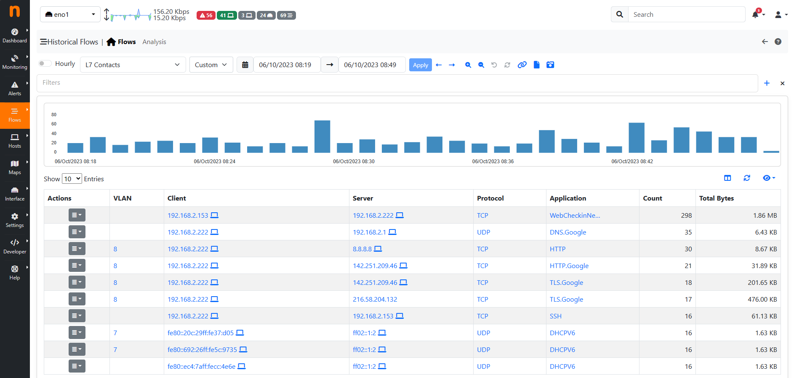
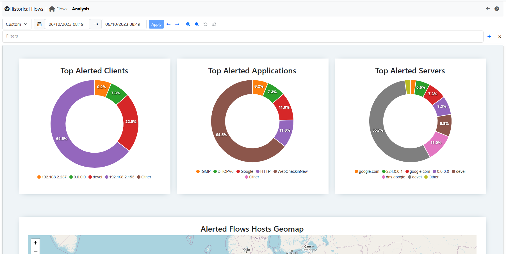

.. _Historical Flow Explorer:

Historical Flows Explorer
-------------------------

When ClickHouse is enabled, an historical flows explorer becomes available in the ntopng web GUI.
This page is used to navigate throw the flows seen and stored by ntopng.

.. note::

   ClickHouse support including the Historical Flows Explorer is only available in ntopng Enterprise M or above.

The explorer is available from the main menu, under the Dashboard section.

  Historical Flows Explorer

It is possible, like for the Alerts Page, to navigate throw the flows by filtering the results.
Multiple filters are available by clicking the various results (e.g. The host `develv5`, to investigate its activities) or by clicking the `+` symbol in the right upper part of the GUI and selecting the wanted filter.

  Filtering

It is possible to navigate throw the time by adjusting the Date and Time using the Navigation Menù or by dragging the time from the chart.

  Navigation Menù

Not all the fields are shown by default into the records, to show/hide them click the `eye` below the chart and select the wanted information.

  Show/Hide Records Info

Other actions are possible by clicking the Action button (left most side of the records). For example the `Info` action redirects the user to a new page with detailed information regarding the record.

  Record Example

Different table views are available from the navigation menù to have a better understanding of the network (e.g. Top Application Contacts, Top Server Ports, ecc.).

  Top L7 Contacts Table

Historical Flows Explorer Analysis
----------------------------------

This page enable the users to create their own charts. To access it, click the `Analysis` entry next to the Home icon in the navigation menù.

  Historical Flows Explorer Analysis

Like for the Table view, users can switch between graphs by using the navigation menù and filter results.
The characteristic of this page is that users can write their own charts, by writing a json file. Each JSON is a different entry of the navigation menù.
These JSON files needs to be added into `/usr/share/ntopng/scripts/historical/analysis/` directory.
They are formatted in the following way:

.. code:: bash

   {
      "name" : "Autonomous Systems",          /* Name of the Navigation Menù Entry */
      
      "i18n_name" : "top_asn",                /* Same as above, but this name needs to be added into the localization file */  
      
      "data_source" : "flows",                /* Which table are users looking at (Alwais use flows) */
    
      "show_in_page" : "analysis",            /* In which page the entry is going to be shown, Table (`analysis`) view or Analysis (`analysis`) view*/
      
      "chart" : [{                            /* An array of charts, each entry is going to be a different chart shown in the GUI */
         "chart_id" : "top_src_asn",          /* An ID of the chart. NB: each ID must be different */
         
         "chart_name" : "Top Src ASN",        /* Chart name, same as above */
         
         "chart_i18n_name" : "top_src_asn",   /* Chart name, same as above */

         "chart_css_styles" : {               /* Optional Feature: CSS chart styles */
               "max-height" : "25rem",
               "min-height" : "25rem",
         },

         "chart_endpoint" : "/lua/rest/v2/get/db/charts/default_rest.lua", /* Endpoint of the chart. By default use this one, change it if particular data are requested and format it as the user like */
         
         "chart_events" : {                                                /* Optional Feature: chart events on click of the value. Use this value by default. */
               "dataPointSelection" : "db_analyze"
         },

         "chart_gui_filter" : "srv_asn",                                   /* Optional Feature: Applied filtering on click of the chart data */
         
         "chart_sql_query" : "SELECT SRC_ASN,any(IPv4NumToString(IPV4_SRC_ADDR)) as IPV4_SRC_ADDR_FORMATTED,SUM(TOTAL_BYTES) /* MySQL query */
                              AS bytes FROM flows WHERE ($WHERE) GROUP BY SRC_ASN ORDER BY bytes DESC LIMIT 10",
         
         "chart_type" : "radar_apex_chart",                                /* Chart type to be displayed */
         
         "chart_record_value" : "bytes",                                   /* Record values (Use the data from the query) */
         
         "chart_record_label" : "SRC_ASN",                                 /* Record label (Use the data from the query) */
         
         "chart_width" : 6,                                                /* Optional Feature: Chart width, it must be an Integer between 1 and 12 */
         
         "chart_y_formatter" : "format_bytes",                             /* Optional Feature: JS tooltip event */
      }]
   }

There are various charts available to be used (substitute the `chart_type` entry with the required chart):

- Donut Chart, use the `donut_apex_chart`;
- Pie Chart, use the `pie_apex_chart`;
- Radar Chart, use the `radar_apex_chart`;
- Polar Area Chart, use the `polararea_apex_chart`;
- Radial Bar Chart, use the `radialbar_apex_chart`;
- Bar Chart, use the `bar_apex_chart`;
- Heatmap Chart, use the `heatmap_apex_chart`;
- Treemap Chart, use the `treemap_apex_chart`;
- Timeline Chart, use the `timeline_apex_chart`;
- Bubble Chart, use the `bubble_apex_chart`;
- Area Chart, use the `area_apex_chart`;

Regarding the Formatting Optional Feature (`chart_y_formatter`) there are different build-in formatters to be used:

- `format_pkts`, used to format packets data;
- `format_value`, used to format generic data (e.g. number of flows);
- `format_bytes`, used to format bytes data; 

If a user would like to have a particular chart with a customized endpoint then an specific endpoint needs to be used.
Please contact us in that case and, if possible, we will release the requested chart.

.. toctree::
    :maxdepth: 1

    historical_flow_analysis_json_example
