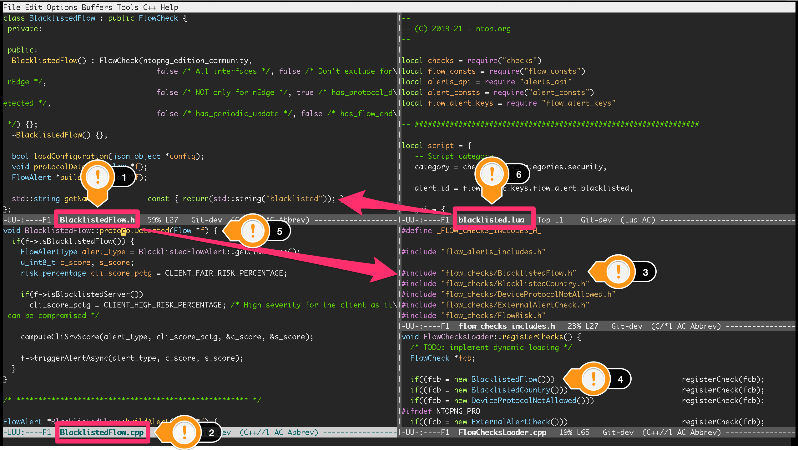
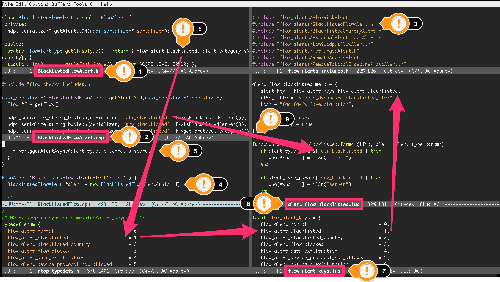

Checks
=========

Alerts are created inside checks. Checks are chunks of code executed by ntopng. Checks are implemented as C++ classes with a predefined interface.

Check interfaces are declared in classes:

- :code:`include/FlowCheck.h` for flows
- :code:`include/HostCheck.h` for hosts

Those classes must be used as base classes when implementing checks:

  - Every host check implemented must inherit from :code:`HostCheck`
  - Every flow check implemented must inherit from :code:`FlowCheck`

Classes are implemented with two files, namely a :code:`.h` file with the class declaration, and a :code:`.cpp` file with the class definition:

  - Host check declarations (:code:`.h` files) are under :code:`include/host_checks`. Host check definitions (:code:`.cpp`) files are under :code:`src/host_checks`.
  - Flow check declarations (:code:`.h` files) are under :code:`include/flow_checks`. Flow check definitions (:code:`.cpp`) files are under :code:`src/host_checks`.

Check Execution
------------------

Checks execution for hosts consists in ntopng calling:

-  :code:`HostCheck::periodicUpdate` approximately every 60 seconds

Every host check, when subclassing :code:`HostCheck`, must override :code:`periodicUpdate` to implement the desired check behavior.

Checks execution for flows consists in ntopng calling for every flow:

- :code:`FlowCheck::protocolDetected` as soon as the Layer-7 is detected
- :code:`FlowCheck::periodicUpdate` approximately every 300 seconds only for flows with a minimum duration of 300 seconds
- :code:`FlowCheck::flowEnd` as soon as the flow ends, i.e., when a TCP session is closed or when an UDP flow timeouts

Every flow check, when subclassing :code:`FlowCheck`, must override one or more of the methods above to implement the desired check behavior.

Check Configuration
----------------------

Checks are configured from the ntopng Web UI. Configuration involves the ability to:

- Turn any check on or off
- Set configuration parameters selectively for every check

A check that is turned off is not executed. Configuration parameters can be used to set a threshold used by the check to decide if it is time to create an alert. Similarly, configuration parameters can be used to indicate a list of IP addresses to exclude when executing checks.

ntopng, to populate the check configuration UI and to properly store the configured check parameters that will be passed to the C++ check class instances, needs to know along with other information:

- Strings (optionally localized) for check names and descriptions
- Type and format of the configuration parameters
- Default parameters, e.g, whether the check is on or off by default

ntopng reads this information from small Lua files located in:

- :code:`scripts/lua/modules/check_definitions/flow/` for flow checks
- :code:`scripts/lua/modules/check_definitions/host` for host checks

These files, documented here (add ref) are mandatory and must be present for a check to be properly executed.

ntopng use names to link check configuration with its C++ class instance. A common :code:`<name>` must be used as:

- The name of the Lua file under :code:`scripts/lua/modules/check_definitions`, e.g., :code:`<name>.lua`
- The string returned by method :code:`getName` in the C++ class file, e.g., :code:`std::string getName() const { return(std::string("<name>")); }`.

Example
-------

The following figure shows the interplay between the various components of a flow check. :code:`BlacklistedFlow` is used for reference. Full-screen is recommended to properly visualize the figure.

  BlacklistedFlow Flow Check

File :code:`BlacklistedFlow.h` *(1)* contains the declaration of class `BlacklistedFlow`, a subclass of :code:`FlowCheck`. The class is defined in :code:`BlacklistedFlow.cpp` *(2)* that contains class methods implementation.

To have :code:`BlacklistedFlow` compiled, an :code:`#include` directive must be added in file :code:`include/flow_checks_includes.h` *(3)*. The directive must contain the path to the class declaration file :code:`BlacklistedFlow.h`.

To have the check loaded and executed at runtime, :code:`BlacklistedFlow` must be instantiated and added to the ntopng checks in file :code:`src/FlowChecksLoader.cpp` *(4)*.

Method :code:`protocolDetected` is overridden and implemented in :code:`BlacklistedFlow.cpp` *(5)* so that ntopng will call it for every flow as soon as the Layer-7 application protocol is detected.

Check configuration UI is populated according to the contents of :code:`scripts/lua/modules/check_definitions/flow/blacklisted.lua` *(6)*. ntopng is able to link the check configuration with its C++ class thanks to the name :code:`blacklisted` as highlighted with the arrow starting at *(6)*. Indeed, to have the C++ and the Lua properly linked, the same name is used for:

- The name of the Lua file
- The string returned by method :code:`getName` in the C++ class file

Alerts
======

Checks create alerts as part of their implementation. A check, during its execution, can detect a certain condition (e.g., an anomaly) for which it decides to create an alert. When the check decides to create an alert, it informs ntopng by passing a reference to the alert.

Alerts are implemented with C++ classes. Alert interfaces are declared in classes:

- :code:`include/FlowAlert.h` for flows
- :code:`include/HostAlert.h` for hosts

Those classes must be used as base classes when implementing alerts:

- Every host alert implemented must inherit from :code:`HostAlert`
- Every flow alert implemented must inherit from :code:`FlowAlert`

Identifying Alerts
------------------

Alerts are uniquely identified with a key, present both in C++ and Lua. In C++ alert keys are enumerated inside file :code:`ntop_typedefs.h`:

- Enumeration :code:`FlowAlertTypeEnum` defines keys for flow alerts
- Enumeration :code:`HostAlertTypeEnum` defines keys for host alerts

Every C++ alert class must implement :code:`getClassType` to return an enumerated alert key. Every enumerated value must be used by one and only one alert class.

In Lua, alert keys are enumerated inside files:

- :code:`scripts/lua/modules/alert_keys/flow_alert_keys.lua` for flow alerts
- :code:`scripts/lua/modules/alert_keys/host_alert_keys.lua` for host alerts

C++ and Lua files must be synchronized, that is, they must have the same enumerated alert keys. This means using the same enumeration names and numbers, in C++:

.. code:: C

  typedef enum {
  flow_alert_normal                           = 0,
  flow_alert_blacklisted                      = 1,
  flow_alert_blacklisted_country              = 2,
  [...]
  } FlowAlertTypeEnum;

and in Lua:

.. code:: lua

  local flow_alert_keys = {
    flow_alert_normal                          = 0,
    flow_alert_blacklisted                     = 1,
    flow_alert_blacklisted_country             = 2,
    [...]
   }

To implement an alert, an additional alert key must be added to bot C++ and Lua.

Alert Formatting
----------------

Alerts are shown graphically inside the ntopng web UI and are also exported to external recipients. ntopng, to format alerts, needs to know along with other information:

- Unique alert keys
- Strings (optionally localized) for alert names and descriptions
- How to handle parameters inserted into the alert from the C++ classes

ntopng reads this information from small Lua files located in:

- :code:`scripts/lua/modules/alert_definitions/flow/` for flow alerts
- :code:`scripts/lua/modules/alert_definitions/host/` for host alerts

These files are mandatory and must be present for an alert to be properly created and visualized. Each file must return a table containing some metadata, including a unique alert key read from one of the Lua alert keys enumeration files. Each alert key must be returned by one and only one Lua file.

Creating Flow Alerts
--------------------

Alert classes are instantiated inside :code:`buildAlert`, a method that must be implemented by each flow check. This method is called by ntopng to create the alert, when it has been told to do so from a flow check.

Checks use :code:`triggerAlertAsync` to tell ntopng to create an alert. Indeed, The actual alert creation is triggered from the flow check with the call :code:`f->triggerAlertAsync`. This call tells ntopng to create an alert identified with :code:`BlacklistedFlowAlert::getClassType()` on the flow instance pointed by :code:`f`.

Creating Host Alerts
--------------------

Alert classes are instantiated inside host checks.

Checks use :code:`triggerAlert` to tell ntopng to create an alert. Indeed, The actual alert creation is triggered from the host check with the call :code:`h->triggerAlert` that wants a pointer to the host alert instance as parameter. This call tells ntopng to create an alert on the host instance pointed by :code:`h`.

Example
-------

The following figure shows the interplay between the various components necessary to create a flow alert. :code:`BlacklistedFlow` is used for reference. Full-screen is recommended to properly visualize the figure.

  BlacklistedFlowAlert Flow Alert

File :code:`BlacklistedFlowAlert.h` *(1)* contains the declaration of class `BlacklistedFlowAlert`, a subclass of :code:`FlowAlert`. The class is defined in :code:`BlacklistedFlowAlert.cpp` *(2)* that contains class methods implementation.

To have :code:`BlacklistedFlowAlert` compiled, an :code:`#include` directive must be added in file :code:`include/flow_alerts_includes.h` *(3)*. The directive must contain the path to the class declaration file :code:`BlacklistedFlowAlert.h`.

Class :code:`BlacklistedFlowAlert` is instantiated inside :code:`buildAlert` *(4)*, a method of flow check :code:`BlacklistedFlow`. Indeed, as seen in the previous section, alerts are created from checks. This method is called by ntopng to create the alert, when it has been told to do so from a check.

The actual alert creation is triggered from the flow check with the call :code:`f->triggerAlertAsync` *(5)*. This call tells ntopng to create an alert identified with :code:`BlacklistedFlowAlert::getClassType()` on the flow instance pointed by :code:`f`.

Method :code:`getClassType()` returns an alert key *(6)* that is enumerated inside file :code:`ntop_typedefs.h`, as part of the :code:`FlowAlertTypeEnum` enumeration - follow the arrow starting at *(6)*. The same key is also enumerated in :code:`flow_alert_keys.lua` *(7)*, with the same enumeration name and number.

The alert key enumerated in Lua is specified as part of the :code:`meta` data of file :code:`alert_flow_blacklisted.lua` *(8)*. This file tells ntopng how to format the alert and its parameters. In particular, :code:`format` is used for the formatting. The third parameter of the function is a Lua table that contains the fields populated in C++. Indeed, method :code:`getAlertJSON` implemented in :code:`BlacklistedFlowAlert.cpp` *(2)* populates fields that are then propagated to the lua :code:`format` with the same names *(9)*. For example, a boolean :code:`cli_blacklisted` is added in C++ and read in Lua to properly format the blacklisted alert.

Checklists
==========

Flows
-----

To create a flow alert, say :code:`BadFlowAlert`, check the following items:

- Implement a flow check :code:`BadFlow` that inherits from :code:`FlowCheck`

    - Place the class declaration file :code:`BadFlow.h` inside :code:`include/flow_checks/BadFlow.h` 
    - Place the class definition file :code:`BadFlow.cpp` inside :code:`src/flow_checks/BadFlow.cpp`
    - Add an :code:`#include "flow_checks/BadFlow.h"` directive in :code:`include/flow_checks_includes.h`
    - Add a :code:`new BadFlow()` constructor in :code:`src/FlowChecksLoader.cpp`

- Implement a Lua file :code:`bad_flow.lua` for the check configuration

    - Place :code:`bad_flow.lua` inside :code:`scripts/lua/modules/check_definitions/flow/`
    - Edit method :code:`getName` in :code:`BadFlow.h` to return string :code:`bad_flow`

- Implement a flow alert :code:`BadFlowAlert` that inherits from :code:`FlowAlert`

    - Place the class declaration file :code:`BadFlowAlert.h` inside :code:`include/flow_alerts/BadFlowAlert.h` 
    - Place the class definition file :code:`BadFlowAlert.cpp` inside :code:`src/flow_alerts/BadFlowAlert.cpp`
    - Add an :code:`#include "flow_alerts/BadFlowAlert.h"` directive in :code:`include/flow_alerts_includes.h`

- Add a unique alert key

    - Add an enumeration value :code:`flow_alert_bad_flow = <NUM>` in :code:`FlowAlertTypeEnum` inside file :code:`ntop_typedefs.h` and make sure :code:`<NUM>` is unique and not already used
    - Edit method :code:`getClassType` in :code:`BadFlowAlert.h` to return enumeration value :code:`flow_alert_bad_flow`
    - Add an enumeration value :code:`flow_alert_bad_flow = <NUM>` inside :code:`scripts/lua/modules/alert_keys/flow_alert_keys.lua` making sure :code:`<NUM>` is the very same number used also in :code:`FlowAlertTypeEnum`

Hosts
-----

To create an host alert, say :code:`BadHostAlert`, check the following items:

- Implement an host check :code:`BadHost` that inherits from :code:`HostCheck`

    - Place the class declaration file :code:`BadHost.h` inside :code:`include/host_checks/BadHost.h` 
    - Place the class definition file :code:`BadHost.cpp` inside :code:`src/host_checks/BadHost.cpp`
    - Add an :code:`#include "host_checks/BadHost.h"` directive in :code:`include/host_checks_includes.h`
    - Add a :code:`new BadHost()` constructor in :code:`src/HostChecksLoader.cpp`

- Implement a Lua file :code:`bad_host.lua` for the check configuration

    - Place :code:`bad_host.lua` inside :code:`scripts/lua/modules/check_definitions/host/`
    - Edit method :code:`getName` in :code:`BadHost.h` to return string :code:`bad_host`

- Implement an host alert :code:`BadHostAlert` that inherits from :code:`HostAlert`

    - Place the class declaration file :code:`BadHostAlert.h` inside :code:`include/host_alerts/BadHostAlert.h` 
    - Place the class definition file :code:`BadHostAlert.cpp` inside :code:`src/host_alerts/BadHostAlert.cpp`
    - Add an :code:`#include "host_alerts/BadHostAlert.h"` directive in :code:`include/host_alerts_includes.h`

- Add a unique alert key

    - Add an enumeration value :code:`host_alert_bad_host = <NUM>` in :code:`HostAlertTypeEnum` inside file :code:`ntop_typedefs.h` and make sure :code:`<NUM>` is unique and not already used
    - Edit method :code:`getClassType` in :code:`BadFlowAlert.h` to return enumeration value :code:`host_alert_bad_host`
    - Add an enumeration value :code:`host_alert_bad_host = <NUM>` inside :code:`scripts/lua/modules/alert_keys/host_alert_keys.lua` making sure :code:`<NUM>` is the very same number used also in :code:`HostAlertTypeEnum`

