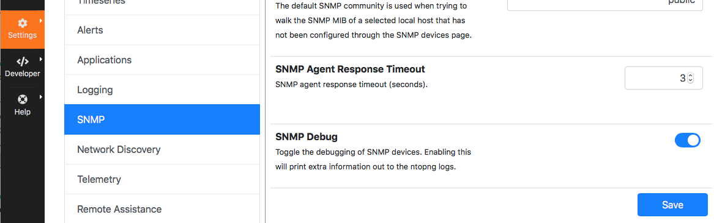
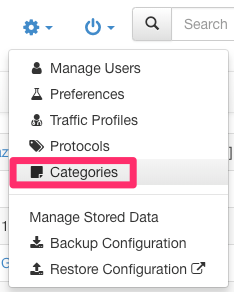
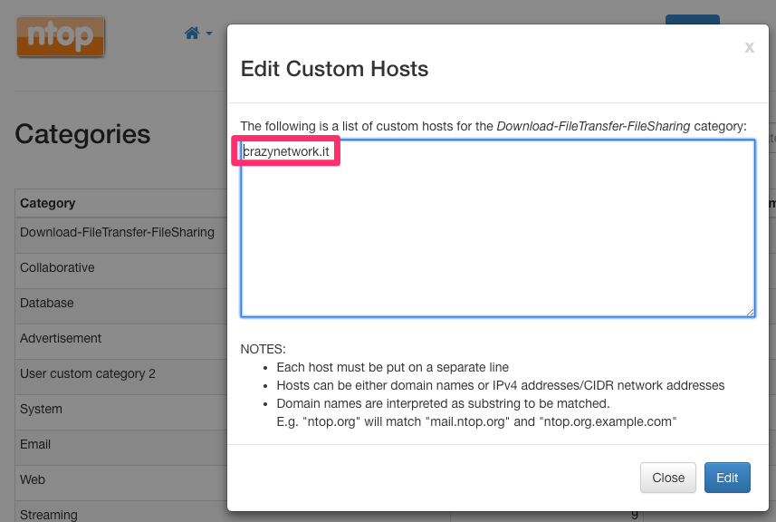

FAQ
###

Licenses
========

I'm using nProbe with ntopng. Do I need a license for it?
---------------------------------------------------------

Yes. See the `nProbe product page <https://www.ntop.org/products/netflow/nprobe/>`_.

I'm using nProbe Agent with ntopng. Do I need a license for it?
---------------------------------------------------------------

Yes. See the `nProbe Agent product page <https://www.ntop.org/products/netflow/nprobe-agent/>`_.

I'm using nProbe Cento with ntopng. Do I need a license for it?
---------------------------------------------------------------

Yes. See the `nProbe Cento product page <https://www.ntop.org/products/netflow/nprobe-cento/>`_.

I'm using n2disk with ntopng. Do I need a license for it?
---------------------------------------------------------

Yes. See the `n2disk product page <https://www.ntop.org/products/traffic-recording-replay/n2disk/>`_.

What to Save: Timeseries, Flows, pcaps
======================================

In it's standard setup, ntopng provides (near-)realtime visibility into what's happening on the network. Historical analyses can be done with ntopng using:

- :ref:`BasicConceptsTimeseries`
- Flows
- pcaps

In terms of disk space used, timeseries take less space than flows which, in turn, take less space than pcaps. This `article <https://www.ntop.org/ntopng/ntopng-disk-requirements-for-timeseries-and-flows/>`_ gives useful indications on the space required.

A good introduction and discussion of how to use timeseries, flows and pcaps to investigate issues is available in blog post `Drill Down Deeper: Using ntopng to Zoom In, Filter Out and Go Straight to the Packets <https://www.ntop.org/n2disk/drill-down-deeper-using-ntopng-to-zoom-in-filter-out-and-go-straight-to-the-packets/>`_.

Timeseries
----------

Timeseries are used to chart metrics over time, such as the bytes sent and received by an host, or the number of bytes for a Layer-7 application.

Use timeseries when neither flows nor packets are required for historical analyses.

Flows
-----

Monitored :ref:`WebGuiFlows` can be saved so they can be accessed when doing historical analyses. This allows to go back in time and browse all the past flows. To dump flows refer to :ref:`Flows Dump` and :ref:`Historical Flows`.

pcaps
-----

Saving pcaps means saving all the traffic seen into files. This allows to go back in time and fetch all the traffic packets seen at any past point in time. This can be highly challenging in terms of space used. To save pcaps, refer to :ref:`UsingNtopngWithN2disk`.

Maximum Number of Interfaces
============================

The recommended number of interfaces monitored by an ntopng running on a commodity quad-core hardware is 8. However, the actual maximum number of interfaces can be greater than 8, when adequate hardware is used.

The maximum number of interfaces depends on the license, as is highlighted in the following table

+--------------+-------------------------------+
|              | Maximum Number of Interfaces  |
+--------------+-------------------------------+
| Community    | 8                             |
+--------------+-------------------------------+
| Pro          | 8                             |
+--------------+-------------------------------+
| Enterprise M | 16                            |
+--------------+-------------------------------+
| Enterprise L | 32                            |
+--------------+-------------------------------+

Limits above also apply when disaggregated interfaces are used. For example, the maximum 32 interfaces limit can be hit when:

- 32 interfaces are used without disaggregation
- A single interface is configured with disaggregation resulting in 31 disaggregated sub-interfaces
- Two interfaces are configured with disaggregation resulting in 15 and 16 disaggregated sub-interfaces, respectively

nIndex
------

The maximum number of interfaces that can be used with nIndex is 16. When more than 16 interfaces are used, those exceeding 16 will work but without nIndex support.

Hardware Sizing
===============

Indications on process, memory and disk required are given below for networks with three different sizes.

Network Size
------------

+--------------+---------------+---------------------------+-----------------------+
|              | Small Network | Medium Network            | Large Network         |
+--------------+---------------+---------------------------+-----------------------+
| Traffic      | < 100Mbps     | Between 100Mbps and 1Gbps | Above 1Gbps           |
+--------------+---------------+---------------------------+-----------------------+
| Active Hosts | Hundredths    | Thousands                 | Hundreds of thousands |
+--------------+---------------+---------------------------+-----------------------+
| Active Flows | Thousands     | Hundreds of thousands     | Millions              |
+--------------+---------------+---------------------------+-----------------------+

.. note::

  On large networks, special extra configuration is required as explained in :ref:`OperatingNtopngOnLargeNetworks`.

Processor and Memory
--------------------

+-----------+---------------+----------------+---------------+
|           | Small Network | Medium Network | Large Network |
+-----------+---------------+----------------+---------------+
| Processor | 2cores+       | 4cores+        | 8cores+       |
+-----------+---------------+----------------+---------------+
| Memory    | 2GB+          | 4GB+           | 16GB+         |
+-----------+---------------+----------------+---------------+

Disk
----

See `ntopng Disk Requirements for Timeseries and Flows <https://www.ntop.org/ntopng/ntopng-disk-requirements-for-timeseries-and-flows/>`_.

Cannot Login into the GUI
=========================

If you locked yourself out of the ntopng GUI after a change in the `authentication method`_,
you can reset the ntopng login method to the default one (local authentication) with the following command:

.. code:: bash

  # For ntopng 3.7 and above:
  redis-cli set ntopng.prefs.local.auth_enabled 1

  # For ntopng 3.6 and below:
  redis-cli set ntopng.prefs.auth_type local

After restarting ntopng, you should be able to login with the administrator credentials.

If you forgot the administrator password, you can reset it with the following command:

.. code:: bash

  redis-cli del ntopng.user.admin.password

After restarting ntopng, you can login with the default ntopng credentials (admin, admin).

.. warning::

   Some browser plugins that perform JavaScript blocking may interfere with the login.
   Sometimes adding an exception for ntopng is not enough. Try to disable them before
   reporting an issue.

.. note::

   If the login issue persist, deleting the browser cookies sometimes helps.

.. _`authentication method`: advanced_features/authentication.html

Too many failed authentication attempts
=======================================

If a device tries to login with wrong credentials too many times, it's IP
address is blacklisted for 5 minutes. In order to manually clean the blacklist,
the following command can be used:

.. code:: bash

  for k in `redis-cli keys ntopng.cache.failed_logins.*`; do redis-cli del $k; done

After executing the above command and restarting ntopng, the device will be able to
login again.

Reset ntopng Preferences
========================

In order to reset the ntopng preferences the following commands can be used:

.. code:: bash

  sudo systemctl stop ntopng
  redis-cli keys "ntopng.*" | xargs redis-cli unlink
  sudo rm /var/lib/ntopng/runtimeprefs.json
  sudo systemctl restart ntopng

.. note::

   On windows instead of restarting ntopnng with the systemctl tool you need to use the Windows Services Manager.

How Can I Troubleshoot SNMP ?
=============================

If SNMP polling is not working as expected it may be necessary to inspect
the low-level SNMP messages exchanged by ntopng and the SNMP agents.
In order to do this SNMP debug must be enabled as follows: inside menu Settings -> Preferences
select SNMP from the left tab and enable "SNMP Debug" then save the form.

When SNMP polling starts (usually every 5 minutes) a detailed log of activities
will be produced. Logs can be accessed as follows

- Log to the system where ntopng is running
- (as root) journalctl -u ntopng --since "1 hour ago" > /tmp/ntopng_log.txt
- Send /tmp/ntopng_log.txt to the ntop team for troubleshooting

     
Do not forget to disable "SNMP Debug" in order to avoid filling
up your disk space with ntopng SNMP logs.
  

How can I monitor the sites visited by an host?
===============================================

To monitor the web sites visited by an host, make sure it is local (if unsure
about what is a local host check page :ref:`Hosts`). Then, you'll be
able to immediately view its visited sites by following the simple
instructions available at :ref:`Sites`.

Note that both plain HTTP sites as well as HTTPS sites are monitored!

How do I know who is using most of my bandwidth?
================================================

Is your Internet connection slow? Do you think someone in the network
is consuming all the available bandwidth? Well, ntopng helps you in
understanding this.

First, have a look at the :ref:`Dashboard` and the
:ref:`DashboardPro`. You'll immediately see the top local talkers and
the top remote destinations there!

Then, you can click on any of the hosts that have the highest throughput to
see what are they doing. Select the :ref:`Flows` page and sort flows
according to an ascending order of the "Actual Thpt" to have
visibility on the actually traffic the host is currently doing.

How can I associate an hostname to a certain category?
======================================================

Let's say you want to want to associate traffic from and to hostname
:code:`crazynetwork.it` to category "Download-FileTransfer-FileSharing" as
you know that that particular host is a mirror for the download of ISO
images.

Select the "Settings" wheel and click on "Categories"

  The Edit Categories Menu Entry

Then, add hostname :code:`crazynetwork.it` to category
"Download-FileTransfer-FileSharing" by clicking on "Edit Hosts".

  The Edit Category Hostnames Page

Finally, save and from that moment on you'll have the matching traffic
opportunely categorized

.. figure:: ./img/faq_edit_traffic_categories_flow.png
  :align: center
  :alt: Flow With a Custom Category

  The Flow Details Page of a Flow with a Custom Category

Additional details and examples can be found at :ref:`CustomCategoryHosts`.

How can I estimate the disk space required by ntopng?
=====================================================

The following blog post gives accurate estimations of the disk space
required by ntopng to store timeseries and flows:
https://www.ntop.org/ntopng/ntopng-disk-requirements-for-timeseries-and-flows/

Cannot see data in Grafana
==========================

When ntopng is configured to export timeseries to InfluxDB, it is possible to use
Grafana with InfluxDB as a data source to create customized dashboard. If the Grafana
visualization does not display any data, here are some steps for the troubleshooting:

- Verify that the data is actually written to the database. An easy way to do this
  is to open the interface charts page into ntopng and see if the past traffic is shown.
  A more accurate way is to run a query from command line:
  `influx -database ntopng -execute 'select * from "iface:traffic" order by time desc limit 1'`
  it will show the most recent data point written into the DB.

- Ensure that the InfluxDB database connected to Grafana is the same as the database
  configured into the ntopng timeseries settings.

- If the data is correctly written to the database, the problem may be related to
  the missing `Time Series Index` due to an InfluxDB version upgrade. The necessary
  steps to enable the TSI are described in the `InfluxDB documentation`_. In short, the
  steps to perform should be:

  1. Change the `[data]` section of the config and set `index-version = "tsi1"`
  2. Convert the existing data to the TSI:
     `su -m influxdb -c "influx_inspect buildtsi -database ntopng -datadir /var/lib/influxdb/data -waldir /var/lib/influxdb/wal"`

.. _`InfluxDB documentation`: https://docs.influxdata.com/influxdb/v1.7/administration/upgrading

Permission denied errors
========================

If the ntopng log shows permission denied errors, then permissions on the ntopng data directory
may need to be set manually.

`Error 'opening '/var/lib/ntopng/1/rrd/bytes.rrd': Permission denied' while calling rrd_fetch_r(/var/lib/ntopng/1/rrd/bytes.rrd, AVERAGE): is the RRD corrupted perhaps`

Such errors usually occur in the following cases:

- ntopng was started as root with `-s` or `--dont-change-users` options and now
  it is started as a normal user

- on Ubuntu 18, sometimes the permissions for new files are wrong.

In order to fix this issue, the following commands should be used:

1. `sudo systemctl stop ntopng`
2. `sudo chown -R ntopng:ntopng /var/lib/ntopng`
3. `sudo find /var/lib/ntopng -type d -exec chmod 700 {} +`
4. `sudo find /var/lib/ntopng -type f -exec chmod 600 {} +`
5. `sudo systemctl restart ntopng`
