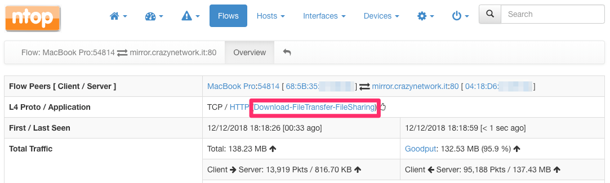

FAQ
###

How can I monitor the sites visited by an host?
===============================================

To monitor the web sites visited by an host, make sure it is local (if unsure
about what is a local host check page :ref:`Hosts`). Then, you'll be
able to immediately view its visited sites by following the simple
instructions available at :ref:`Sites`.

Note that both plain HTTP sites as well as HTTPS sites are monitored!

How do I know who is using most of my bandwidth?
================================================

Is your Internet connection slow? Do you think someone in the network
is consuming all the available bandwidth? Well, ntopng helps you in
understanding this.

First, have a look at the :ref:`Dashboard` and the
:ref:`DashboardPro`. You'll immediately see the top local talkers and
the top remote destinations there!

Then, you can click on any of the hosts that have the highest throughput to
see what are they doing. Select the :ref:`Flows` page and sort flows
according to an ascending order of the "Actual Thpt" to have
visibility on the actually traffic the host is currently doing.

How can I associate an hostname to a certain category?
======================================================

Let's say you want to want to associate traffic from and to hostname
:code:`crazynetwork.it` to category "Download-FileTransfer-FileSharing" as
you know that that particular host is a mirror for the download of ISO
images.

Select the "Settings" wheel and click on "Categories"

.. figure:: ./img/faq_edit_traffic_categories.png
  :align: center
  :alt: Edit Categories

  The Edit Categories Menu Entry

Then, add hostname :code:`crazynetwork.it` to category
"Download-FileTransfer-FileSharing" by clicking on "Edit Hosts".

  The Edit Category Hostnames Page

Finally, save and from that moment on you'll have the matching traffic
opportunely categorized

  The Flow Details Page of a Flow with a Custom Category

Additional details and examples can be found at :ref:`CustomCategoryHosts`.
