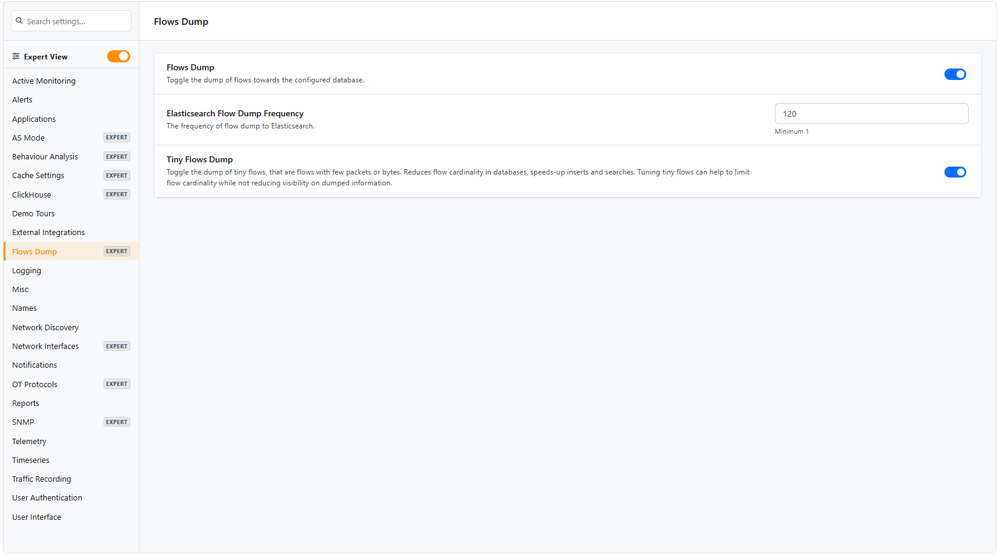

.. _FlowsDump:

Flows Dump (ClickHouse)
#######################

Ntopng supports flows dump towards multiple downstream databases, namely ClickHouse, Elasticsearch and Syslog. Flows dump is enabled using option :code:`-F`.

.. note::

  ClickHouse support is the recommended database backend used to dump flows and alerts.

When flows dump is enabled, a new `Flow Dump Settings` tab appears in the preferences.

  Flows Dump Settings

`Flow Dump Settings` entries are:

- `Flows Dump`: to toggle the dump of flows during the execution of ntopng. Flows dump can be turned on or off using this toggle. Turning flows dump off may be useful when the destination downstream database is running out of space, for debug purposes, or when the user only wants alerts stored in :ref:`ElasticsearchAlerts`.
- `Tiny Flows Dump`: to toggle the dump of tiny flows. Tiny flows are small flows, that is, flows totalling less than a certain configurable number of packets or bytes. Excluding tiny flows from the dump is an effective strategy to reduce the number of dumped flows. This reduction is mostly effective when dumped flows are used to do analyses based on the volume. It is not recommended to use this option when dumped flows are used for security analyses.
- `ElasticSearch Flow Dump Frequency`: is the frequency of the flow dump towards ElasticSearch.

These settings are effective for all databases.

.. toctree::
    :maxdepth: 2

    clickhouse/index
    elastisearch/index
    kafka/index
    syslog/index
