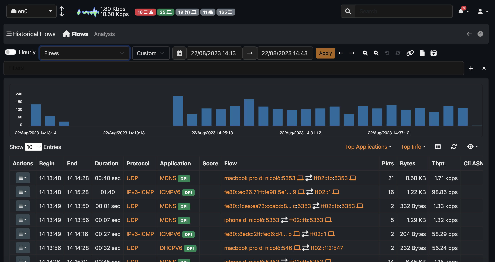

.. _Historical Flows:

Historical Flow Explorer
========================

.. warning::

  MySQL flow explorer is deprecated and it has ben discontinued in favor of the :ref:`ClickHouse` flows explorer.
  ClickHouse support is not available on Windows and embedded architectures.

When ClickHouse is enabled, an historical flows explorer becomes available in the ntopng web GUI.
This page is used to navigate throw the flows seen and stored by ntopng.

.. note::

   ClickHouse support including the Historical Flows Explorer is only available in ntopng Enterprise M or above.

The explorer is available from the left sidebar, under the Flows section.

.. figure:: img/clickhouse_flow_explorer.png
  :align: center
  :alt: Historical Flows Explorer

  Historical Flows Explorer

It is possible, like for the Alerts Page, to navigate throw the flows by filtering the results.
Multiple filters are available by clicking the various results (e.g. The host `develv5`, to investigate its activities) or by clicking the `+` symbol in the right upper part of the GUI and selecting the wanted filter.

.. figure:: img/add_filters.png
  :align: center
  :alt: Historical Flows Explorer

  Filtering

It is possible to navigate throw the time by adjusting the Date and Time using the Navigation Menù or by dragging the time from the chart.

.. figure:: img/historical_flow_nav_menu.png
  :align: center
  :alt: Historical Flows Explorer

  Navigation Menù

Not all the fields are shown by default into the records, to show/hide them click the `eye` below the chart and select the wanted information.

.. figure:: img/historical_flow_show_columns.png
  :align: center
  :alt: Historical Flows Explorer

  Show/Hide Records Info

Other actions are possible by clicking the Action button (left most side of the records). For example the `Info` action redirects the user to a new page with detailed information regarding the record.

.. figure:: img/flow_record_example.png
  :align: center
  :alt: Historical Flows Explorer

  Record Example

Different table views are available from the navigation menù to have a better understanding of the network (e.g. Top Application Contacts, Top Server Ports, ecc.).

.. figure:: img/historical_flow_explorer_top_l7.png
  :align: center
  :alt: Historical Flows Explorer

  Top L7 Contacts Table

Historical Flows Explorer Analysis
----------------------------------

This page enable the users to create their own charts. To access it, click the `Analysis` entry next to the Home icon in the navigation menù.

.. figure:: img/historical_flow_analysis.png
  :align: center
  :alt: Historical Flows Explorer

  Historical Flows Explorer Analysis

Like for the Table view, users can switch between graphs by using the navigation menù and filter results.
The characteristic of this page is that users can write their own charts, by writing a json file. Each JSON is a different entry of the navigation menù.
These JSON files needs to be added into `/usr/share/ntopng/scripts/historical/analysis/` directory.
They are formatted in the following way:

.. code:: bash

   {
      "name" : "Autonomous Systems",          /* Name of the Navigation Menù Entry */
      
      "i18n_name" : "top_asn",                /* Same as above, but this name needs to be added into the localization file */  
      
      "data_source" : "flows",                /* Which table are users looking at (Alwais use flows) */
    
      "show_in_page" : "analysis",            /* In which page the entry is going to be shown, Table (`analysis`) view or Analysis (`analysis`) view*/
      
      "chart" : [{                            /* An array of charts, each entry is going to be a different chart shown in the GUI */
         "chart_id" : "top_src_asn",          /* An ID of the chart. NB: each ID must be different */
         
         "chart_name" : "Top Src ASN",        /* Chart name, same as above */
         
         "chart_i18n_name" : "top_src_asn",   /* Chart name, same as above */

         "chart_css_styles" : {               /* Optional Feature: CSS chart styles */
               "max-height" : "25rem",
               "min-height" : "25rem",
         },

         "chart_endpoint" : "/lua/rest/v2/get/db/charts/default_rest.lua", /* Endpoint of the chart. By default use this one, change it if particular data are requested and format it as the user like */
         
         "chart_events" : {                                                /* Optional Feature: chart events on click of the value. Use this value by default. */
               "dataPointSelection" : "db_analyze"
         },

         "chart_gui_filter" : "srv_asn",                                   /* Optional Feature: Applied filtering on click of the chart data */
         
         "chart_sql_query" : "SELECT SRC_ASN,any(IPv4NumToString(IPV4_SRC_ADDR)) as IPV4_SRC_ADDR_FORMATTED,SUM(TOTAL_BYTES) /* MySQL query */
                              AS bytes FROM flows WHERE ($WHERE) GROUP BY SRC_ASN ORDER BY bytes DESC LIMIT 10",
         
         "chart_type" : "radar_apex_chart",                                /* Chart type to be displayed */
         
         "chart_record_value" : "bytes",                                   /* Record values (Use the data from the query) */
         
         "chart_record_label" : "SRC_ASN",                                 /* Record label (Use the data from the query) */
         
         "chart_width" : 6,                                                /* Optional Feature: Chart width, it must be an Integer between 1 and 12 */
         
         "chart_y_formatter" : "format_bytes",                             /* Optional Feature: JS tooltip event */
      }]
   }

There are various charts available to be used (substitute the `chart_type` entry with the required chart):

- Donut Chart, use the `donut_apex_chart`;
- Pie Chart, use the `pie_apex_chart`;
- Radar Chart, use the `radar_apex_chart`;
- Polar Area Chart, use the `polararea_apex_chart`;
- Radial Bar Chart, use the `radialbar_apex_chart`;
- Bar Chart, use the `bar_apex_chart`;
- Heatmap Chart, use the `heatmap_apex_chart`;
- Treemap Chart, use the `treemap_apex_chart`;
- Timeline Chart, use the `timeline_apex_chart`;
- Bubble Chart, use the `bubble_apex_chart`;
- Area Chart, use the `area_apex_chart`;

Regarding the Formatting Optional Feature (`chart_y_formatter`) there are different build-in formatters to be used:

- `format_pkts`, used to format packets data;
- `format_value`, used to format generic data (e.g. number of flows);
- `format_bytes`, used to format bytes data; 

If a user would like to have a particular chart with a customized endpoint then an specific endpoint needs to be used.
Please contact us in that case and, if possible, we will release the requested chart.

.. toctree::
    :maxdepth: 1

    historical_flow_analysis_json_example

Enabling Flow Dump
------------------

ntopng can dump flows data to a persistent storage and provides view to browse
recorded flows data in the past. Check out the `Flows Dump documentation`_ for more details on
how to setup the connection and the historical views available for this mode.

In order to dump flows to disk ntopng requires the `-F clickhouse` option to be
specified as described in the `Flows Dump documentation`_. After this is enabled,
new "Flows" entries will appear into the historical charts `tabular view`_ dropdown:

.. figure:: img/historical_flows_dropdown.png
  :align: center
  :alt: Historical Charts dropdown with flows

Browsing Flows
--------------

To analyze historical flows on ntopng with ClickHouse, it is possible to use the flows views. 
The flows views comprise a list of aggregation views for the historical flows, and they are contextually relevant for the specified time frame.

In the image below, it is possible to locate the flows views indicated by the highlighted label. 
By default, the flows views set is "Flows," which represents the standard view of the Historical Flows.

Historical flows data can be accessed from the `Historical Charts`_ .

.. figure:: img/historical_flows_top_l7_contacts.png
  :align: center
  :alt: Historical Flows Top L7 Contacts

By clicking on the |drilldown_icon| icon, it's possible to explode a particular communication
or host and analyze the raw flows.

.. figure:: img/historical_flows_raw_flows.png
  :align: center
  :alt: Raw Flows

The picture above, for example, shows the raw flows between `PC local` and
`17.248.146.148` having the `AppleiCloud` protocol.

Here is an overview of the currently available flows views:

  - Flows (Bytes Chart): Displays the flows view with a bytes chart
  - Flows (Score Chart): Displays the flows view with a score chart
  - Alerted Domains: Shows the count of alerted domains
  - Clients: Displays the top hosts as flow clients and their traffic
  - Conversations: Shows the top conversations <client, server> with the highest number of flows and total traffic
  - L7 Contacts: L7 Contacts: Displays the top <client, server, L7 protocol> pairs and their total traffic
  - Latency By AS: Displays the average latency of source and destination Autonomous Systems
  - Number of Hosts: Shows the number of IPv4 Clients, IPv4 Servers, IPv6 Clients, and IPv6 Servers
  - Server Contacts: Displays servers ordered by the number of connections
  - Server Ports: Shows the count of used destination ports
  - Servers: Displays the top hosts as flow servers and their traffic
  - Top Clients Contacts: Shows the clients that contact the highest number of different servers
  - Top Contacted Servers: Shows the servers contacted by the highest number of different clients
  - Top Local Talkers: Displays the top local hosts with the most traffic
  - Top Receiver AS: Displays the top Autonomous Systems with the most received traffic
  - Top Receiver Countries: Displays the top countries with the most received traffic
  - Top Receiver Networks: Displays the top networks with the most received traffic
  - Top Remote Destinations: Displays the top remote destinations with the most traffic
  - Top Sender AS: Displays the top Autonomous Systems with the most sent traffic
  - Top Sender Countries: Displays the top countries with the most sent traffic
  - Top Sender Networks: Displays the top networks with the most sent traffic
  - Visited Sites: Shows the most visited domains

The corresponding definitions of the flow views are available on the filesystem as JSON files under /usr/share/ntopng/scripts/historical/tables/*.json.

Adding a new flow view is as simple as placing one more JSON file within the same folder.

Here is an example JSON file for the Clients flow view.

.. code:: json

  {
    "name" : "Clients",
    "i18n_name" : "clients",
    "data_source" : "flows",
    "show_in_page" : "overview",
    "hourly": true,
    "visualization_type" : "table",
    "select" : {
      "items" : [
        {
          "name" : "VLAN_ID"
        },
        {
          "name" : "IPV4_SRC_ADDR"
        },
        {
          "name" : "IPV6_SRC_ADDR"
        },
        {
          "name" : "SRC_LABEL"
        },
        {
          "name" : "SRC_COUNTRY_CODE"
        },
        {
          "name" : "total_bytes",
          "func" : "SUM",
          "param" : "TOTAL_BYTES",
          "value_type" : "bytes"
        }
      ]
    },
    "filters" : {
      "items" : [
        {
          "name": "PROBE_IP"
        },
        {
          "name": "INPUT_SNMP"
        },
        {
          "name": "OUTPUT_SNMP"
        }
      ]
    },
    "groupby" : {
      "items" : [
        {
          "name" : "VLAN_ID"
        },
        {
          "name" : "IPV4_SRC_ADDR"
        },
        {
          "name" : "IPV6_SRC_ADDR"
        },
        {
          "name" : "SRC_LABEL"
        },
        {
          "name" : "SRC_COUNTRY_CODE"
        }
      ]
    },
    "sortby" : {
      "items" : [
        {
          "name" : "total_bytes",
          "order" : "DESC"
        }
      ]
    }
  }

The JSON format is self-explanatory. It is possible to define the columns to be shown under the select tree, the columns on which the group-by is applied under the groupby tree, and the default column on which sorting is applied under the sortby tree. Aggregation functions can also be defined, such as the 'sum' item in the example. 
For more complicated examples, it is recommended to take a look at the built-in query definitions available in the same folders.

The complete list of columns is available in the database schema located at /usr/share/ntopng/httpdocs/misc/db_schema_clickhouse.sql

Exporting Flows
---------------

By clicking on the |flow_export_icon| icon, it's possible to download a copy of
the raw flows in CSV format. Here is the same data shown in the picture above in
CSV format:

.. code:: bash

  L7_PROTO|IP_DST_PORT|FLOW_TIME|BYTES|FIRST_SEEN|LAST_SEEN|IP_SRC_PORT|NTOPNG_INSTANCE_NAME|IP_PROTOCOL_VERSION|IPV4_SRC_ADDR|JSON|PACKETS|IPV4_DST_ADDR|INTERFACE_ID|PROFILE|INFO|IPV6_DST_ADDR|VLAN_ID|PROTOCOL|IPV6_SRC_ADDR
  143|443|1544712866|18262|1544712646|1544712866|32886|PC local|4|192.168.1.6||53|17.248.146.148|1|ssl|feedbackws.icloud.com|::|0|6|::
  143|443|1544712876|13958|1544712749|1544712876|34078|PC local|4|192.168.1.6||46|17.248.146.148|1|ssl|p66-iwmb0.icloud.com|::|0|6|::
  143|443|1544718548|203978|1544718247|1544718548|38928|PC local|4|192.168.1.6||431|17.248.146.148|1|ssl|p66-ckdatabasews.icloud.com|::|0|6|::
  143|443|1544718821|175770|1544718548|1544718821|38928|PC local|4|192.168.1.6||370|17.248.146.148|1|ssl|p66-ckdatabasews.icloud.com|::|0|6|::
  143|443|1544723738|14663|1544723557|1544723738|49328|PC local|4|192.168.1.6||45|17.248.146.148|1|ssl|p66-pushws.icloud.com|::|0|6|::

Data Retention
--------------

The retention of the flows dump on disk can be configured from the
:ref:`Data Retention` setting.

.. |drilldown_icon| image:: img/drilldown_icon.png
.. |flow_export_icon| image:: img/flow_export_icon.png
.. _`Flows Dump documentation` : advanced_features/flows_dump.html
.. _`Historical Charts`: web_gui/historical.html
.. _`tabular view`: web_gui/historical.html#tabular-view
