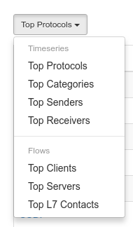
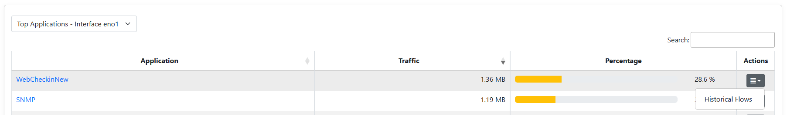
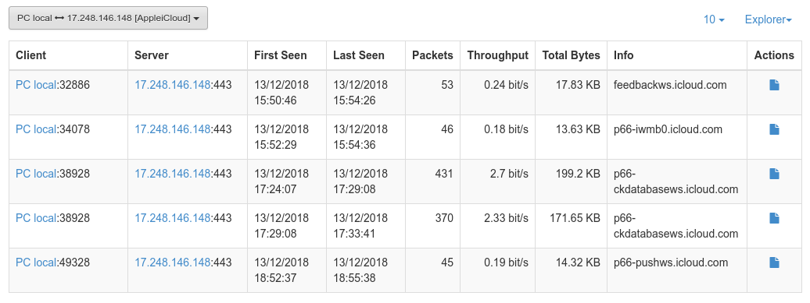

.. _Historical Flows:

Historical Flows
================

ntopng can dump flows data to a persistent storage and provides view to browse
recorded flows data in the past.

Traditionally, in order to provide historical data, ntopng required a connected
MySQL database. Check out the `Flows Dump documentation`_ for more details on
how to setup the connection and the historical views available for this mode.

However, due to the users feedback on the MySQL low performance with high flow
insertion rates, ntopng now integrates a specialized flows
dump database called nIndex which overcomes the limits of MySQL. This is currently
available only in the enterprise version of ntopng for Linux/x86_64 architectures.

.. note::

  The historical views provided with the MySQL integration (like the "Historical Explorer")
  are *not* compatible with nIndex.

.. warning::

  nIndex is only available on Linux/x86_64 architectures.

The rest of this page documents the use of nIndex as flows storage.

Enabling Flow Dump
------------------

In order to dump flows to disk ntopng requires the `-F nindex` option to be
specified as described in the `Flows Dump documentation`_. After this is enabled,
new "Flows" entries will appear into the historical charts `tabular view`_ dropdown:

Browsing Flows
--------------

Historical flows data can be accessed from the `Historical Charts`_ and are contextual
for the specified time frame.

Here is an overview of the currently available flows views:

  - Top Clients: shows the top hosts as flow clients and their traffic as flow clients
  - Top Servers: shows the top hosts as flow servers and their traffic as flow servers
  - Top L7 Contacts: shows the top <client, server, L7 protocol> pairs and their total traffic

By clicking on the |drilldown_icon| icon, it's possible to explode a particular communication
or host and analyze the raw flows.

The picture above, for example, shows the raw flows between `PC local` and
`17.248.146.148` having the `AppleiCloud` protocol.

Exporting Flows
---------------

By clicking on the |flow_export_icon| icon, it's possible to download a copy of
the raw flows in CSV format. Here is the same data shown in the picture above in
CSV format:

.. code:: bash

  L7_PROTO|IP_DST_PORT|FLOW_TIME|BYTES|FIRST_SEEN|LAST_SEEN|IP_SRC_PORT|NTOPNG_INSTANCE_NAME|IP_PROTOCOL_VERSION|IPV4_SRC_ADDR|JSON|PACKETS|IPV4_DST_ADDR|INTERFACE_ID|PROFILE|INFO|IPV6_DST_ADDR|VLAN_ID|PROTOCOL|IPV6_SRC_ADDR
  143|443|1544712866|18262|1544712646|1544712866|32886|PC local|4|192.168.1.6||53|17.248.146.148|1|ssl|feedbackws.icloud.com|::|0|6|::
  143|443|1544712876|13958|1544712749|1544712876|34078|PC local|4|192.168.1.6||46|17.248.146.148|1|ssl|p66-iwmb0.icloud.com|::|0|6|::
  143|443|1544718548|203978|1544718247|1544718548|38928|PC local|4|192.168.1.6||431|17.248.146.148|1|ssl|p66-ckdatabasews.icloud.com|::|0|6|::
  143|443|1544718821|175770|1544718548|1544718821|38928|PC local|4|192.168.1.6||370|17.248.146.148|1|ssl|p66-ckdatabasews.icloud.com|::|0|6|::
  143|443|1544723738|14663|1544723557|1544723738|49328|PC local|4|192.168.1.6||45|17.248.146.148|1|ssl|p66-pushws.icloud.com|::|0|6|::

Data Retention
--------------

The retention of the flows dump on disk can be configured from the
:ref:`Data Retention` setting.

.. |flow_export_icon| image:: img/flow_export_icon.png
.. _`Flows Dump documentation` : advanced_features/flows_dump.html
.. _`Historical Charts`: web_gui/historical.html
.. _`tabular view`: web_gui/historical.html#tabular-view
