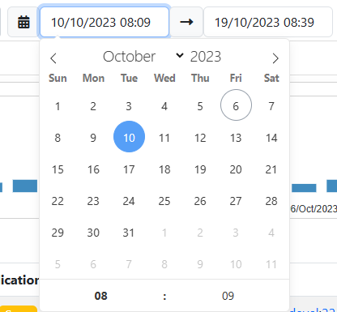
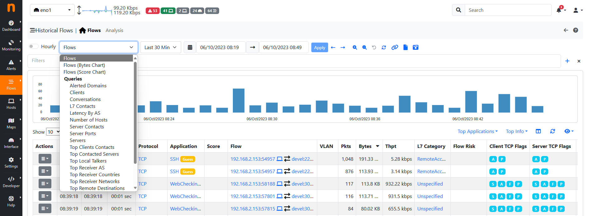

.. _Historical Flows:

Historical Flow Explorer
========================

.. warning::

  MySQL flow explorer is deprecated and it has ben discontinued in favor of the :ref:`ClickHouse` flows explorer.
  ClickHouse support is not available on Windows and embedded architectures.

When ClickHouse is enabled, an historical flows explorer becomes available in the ntopng web GUI.
This page is used to navigate through the flows seen and stored by ntopng.

.. note::

   ClickHouse support including the Historical Flows Explorer is only available in ntopng Enterprise M or above.

The explorer is available from the left sidebar, under the Flows section.

.. figure:: img/clickhouse_flow_explorer.png
  :align: center
  :alt: Historical Flows Explorer

  Historical Flows Explorer

It is possible, as for the Alerts Page, to navigate through the flows by filtering the results.
Multiple filters are available by clicking the various results (e.g. The host `develv5`, to investigate its activities) or by clicking the `+` symbol in the right upper part of the GUI and selecting the wanted filter.

.. figure:: img/add_filters.png
  :align: center
  :alt: Historical Flows Explorer

  Filtering

It is possible to navigate through the time by adjusting the Date and Time using the Navigation Menu or by dragging the time from the chart.

  Navigation Menu

Not all the fields are shown by default into the records, to show/hide them click the `eye` below the chart and select the wanted information.

.. figure:: img/historical_flow_show_columns.png
  :align: center
  :alt: Historical Flows Explorer

  Show/Hide Records Info

Other actions are possible by clicking the Action button (left most side of the records). For example the `Info` action redirects the user to a new page with detailed information regarding the flow.

.. figure:: img/flow_record_example.png
  :align: center
  :alt: Historical Flows Explorer

  Flow Example

Historical flows data can be also accessed from the `Historical Charts`_ .

.. figure:: img/historical_flows_top_l7_contacts.png
  :align: center
  :alt: Historical Flows Top L7 Contacts

Enabling Flow Dump
------------------

ntopng can dump flows data to a persistent storage and provides view to browse
recorded flows data in the past. Check out the `Flows Dump documentation`_ for more details on
how to setup the connection and the historical views available for this mode.

In order to dump flows to disk ntopng requires the `-F clickhouse` option to be
specified as described in the `Flows Dump documentation`_.

Custom Queries
--------------

In order to analyze historical flows dumped by ntopng on ClickHouse, it is possible
to use the use additional flows views, with custom queries that can aggregate the 
data according to some criteria, or manipulate the data in any way allowed by SQL.

The default flows view in the Historical Flows Explorer is "Flows", 
which shows the full list of raw flows.

In addition to the raw "Flows", additional built-in views are available, which are
built on top of the Custom Queries engine. Here is an overview of the currently 
available flows views:

  - Flows (Bytes Chart): Displays the flows view with a bytes chart
  - Flows (Score Chart): Displays the flows view with a score chart
  - Alerted Domains: Shows the count of alerted domains
  - Clients: Displays the top hosts as flow clients and their traffic
  - Conversations: Shows the top conversations <client, server> with the highest number of flows and total traffic
  - L7 Contacts: L7 Contacts: Displays the top <client, server, L7 protocol> pairs and their total traffic
  - Latency By AS: Displays the average latency of source and destination Autonomous Systems
  - Number of Hosts: Shows the number of IPv4 Clients, IPv4 Servers, IPv6 Clients, and IPv6 Servers
  - Server Contacts: Displays servers ordered by the number of connections
  - Server Ports: Shows the count of used destination ports
  - Servers: Displays the top hosts as flow servers and their traffic
  - Top Clients Contacts: Shows the clients that contact the highest number of different servers
  - Top Contacted Servers: Shows the servers contacted by the highest number of different clients
  - Top Local Talkers: Displays the top local hosts with the most traffic
  - Top Receiver AS: Displays the top Autonomous Systems with the most received traffic
  - Top Receiver Countries: Displays the top countries with the most received traffic
  - Top Receiver Networks: Displays the top networks with the most received traffic
  - Top Remote Destinations: Displays the top remote destinations with the most traffic
  - Top Sender AS: Displays the top Autonomous Systems with the most sent traffic
  - Top Sender Countries: Displays the top countries with the most sent traffic
  - Top Sender Networks: Displays the top networks with the most sent traffic
  - Visited Sites: Shows the most visited domains
  - Major Connection State: Displays TCP Major Connection State (ATTEMPTED, ESTABLISHED, CLOSED)
  - Minor Connection State: Displays TCP :ref:`Minor Connection State`

.. figure:: img/historical_flow_explorer_top_l7.png
  :align: center
  :alt: Historical Flows Explorer

  Top L7 Contacts Table

The above built-in Custom Queries can be extended by the user by creating
simple JSON files containing the query description. The query definitions corresponding
to the above built-in queries are available on the filesystem as JSON files under 
/usr/share/ntopng/scripts/historical/tables/*.json.
Adding a new flow view is as simple as placing one more JSON file within the same folder.

Here is an example JSON file for the Clients flow view.

.. code:: json

  {
    "name" : "Clients",
    "i18n_name" : "clients",
    "data_source" : "flows",
    "show_in_page" : "overview",
    "hourly": true,
    "visualization_type" : "table",
    "select" : {
      "items" : [
        {
          "name" : "VLAN_ID"
        },
        {
          "name" : "IPV4_SRC_ADDR"
        },
        {
          "name" : "IPV6_SRC_ADDR"
        },
        {
          "name" : "SRC_LABEL"
        },
        {
          "name" : "SRC_COUNTRY_CODE"
        },
        {
          "name" : "total_bytes",
          "func" : "SUM",
          "param" : "TOTAL_BYTES",
          "value_type" : "bytes"
        }
      ]
    },
    "filters" : {
      "items" : [
        {
          "name": "PROBE_IP"
        },
        {
          "name": "INPUT_SNMP"
        },
        {
          "name": "OUTPUT_SNMP"
        }
      ]
    },
    "groupby" : {
      "items" : [
        {
          "name" : "VLAN_ID"
        },
        {
          "name" : "IPV4_SRC_ADDR"
        },
        {
          "name" : "IPV6_SRC_ADDR"
        },
        {
          "name" : "SRC_LABEL"
        },
        {
          "name" : "SRC_COUNTRY_CODE"
        }
      ]
    },
    "sortby" : {
      "items" : [
        {
          "name" : "total_bytes",
          "order" : "DESC"
        }
      ]
    }
  }

The JSON format is self-explanatory. It is possible to define the columns to be shown under the select tree, 
the columns on which the group-by is applied under the groupby tree, and the default column on which sorting is 
applied under the sortby tree. Aggregation functions can also be defined, such as the 'sum' item in the example. 
For more complicated examples, it is recommended to take a look at the built-in query definitions available in the same folders.

The complete list of columns is available in the database schema located at /usr/share/ntopng/httpdocs/misc/db_schema_clickhouse.sql

Historical Flows Explorer Analysis
----------------------------------

Similar to Custom Queries, this page enables the users to create and display their own charts for analysing the traffic on the database.
To access it, click the `Analysis` entry next to the Home icon in the navigation menu.

.. figure:: img/historical_flow_analysis.png
  :align: center
  :alt: Historical Flows Explorer

  Historical Flows Explorer Analysis

As for the Table view, users can switch between graphs by using the navigation menu and filter results.
The characteristic of this page is that users can write their own charts, by writing a json file. Each JSON is a different entry of the navigation menu.
These JSON files needs to be added into `/usr/share/ntopng/scripts/historical/analysis/` directory.
They are formatted as follows:

.. code:: bash

   {
      "name" : "Autonomous Systems",          /* Name of the Navigation Menu Entry */
      
      "i18n_name" : "top_asn",                /* Same as above, but this name needs to be added into the localization file */  
      
      "data_source" : "flows",                /* Which table are users looking at (Alwais use flows) */
    
      "show_in_page" : "analysis",            /* In which page the entry is going to be shown, Table (`analysis`) view or Analysis (`analysis`) view*/
      
      "chart" : [{                            /* An array of charts, each entry is going to be a different chart shown in the GUI */
         "chart_id" : "top_src_asn",          /* An ID of the chart. NB: each ID must be different */
         
         "chart_name" : "Top Src ASN",        /* Chart name, same as above */
         
         "chart_i18n_name" : "top_src_asn",   /* Chart name, same as above */

         "chart_css_styles" : {               /* Optional Feature: CSS chart styles */
               "max-height" : "25rem",
               "min-height" : "25rem",
         },

         "chart_endpoint" : "/lua/rest/v2/get/db/charts/default_rest.lua", /* Endpoint of the chart. By default use this one, change it if particular data are requested and format it as the user like */
         
         "chart_events" : {                                                /* Optional Feature: chart events on click of the value. Use this value by default. */
               "dataPointSelection" : "db_analyze"
         },

         "chart_gui_filter" : "srv_asn",                                   /* Optional Feature: Applied filtering on click of the chart data */
         
         "chart_sql_query" : "SELECT SRC_ASN,any(IPv4NumToString(IPV4_SRC_ADDR)) as IPV4_SRC_ADDR_FORMATTED,SUM(TOTAL_BYTES) /* MySQL query */
                              AS bytes FROM flows WHERE ($WHERE) GROUP BY SRC_ASN ORDER BY bytes DESC LIMIT 10",
         
         "chart_type" : "radar_apex_chart",                                /* Chart type to be displayed */
         
         "chart_record_value" : "bytes",                                   /* Record values (Use the data from the query) */
         
         "chart_record_label" : "SRC_ASN",                                 /* Record label (Use the data from the query) */
         
         "chart_width" : 6,                                                /* Optional Feature: Chart width, it must be an Integer between 1 and 12 */
         
         "chart_y_formatter" : "format_bytes",                             /* Optional Feature: JS tooltip event */
      }]
   }

There are various charts available to be used (replace the `chart_type` entry with the required chart):

- Donut Chart, use the `donut_apex_chart`;
- Pie Chart, use the `pie_apex_chart`;
- Radar Chart, use the `radar_apex_chart`;
- Polar Area Chart, use the `polararea_apex_chart`;
- Radial Bar Chart, use the `radialbar_apex_chart`;
- Bar Chart, use the `bar_apex_chart`;
- Heatmap Chart, use the `heatmap_apex_chart`;
- Treemap Chart, use the `treemap_apex_chart`;
- Timeline Chart, use the `timeline_apex_chart`;
- Bubble Chart, use the `bubble_apex_chart`;
- Area Chart, use the `area_apex_chart`;

Regarding the Formatting Optional Feature (`chart_y_formatter`) there are different build-in formatters to be used:

- `format_pkts`, used to format packets data;
- `format_value`, used to format generic data (e.g. number of flows);
- `format_bytes`, used to format bytes data; 

If a user would like to have a particular chart with a customized endpoint then a specific endpoint needs to be used.
Please contact us in that case and, if possible, we will release the requested chart.

.. toctree::
    :maxdepth: 1

    historical_flow_analysis_json_example

Exporting Flows
---------------

By clicking on the |flow_export_icon| icon, it's possible to download a copy of
the raw flows in CSV format. Here is the same data shown in the picture above in
CSV format:

.. code:: bash

  L7_PROTO|IP_DST_PORT|FLOW_TIME|BYTES|FIRST_SEEN|LAST_SEEN|IP_SRC_PORT|NTOPNG_INSTANCE_NAME|IP_PROTOCOL_VERSION|IPV4_SRC_ADDR|JSON|PACKETS|IPV4_DST_ADDR|INTERFACE_ID|PROFILE|INFO|IPV6_DST_ADDR|VLAN_ID|PROTOCOL|IPV6_SRC_ADDR
  143|443|1544712866|18262|1544712646|1544712866|32886|PC local|4|192.168.1.6||53|17.248.146.148|1|ssl|feedbackws.icloud.com|::|0|6|::
  143|443|1544712876|13958|1544712749|1544712876|34078|PC local|4|192.168.1.6||46|17.248.146.148|1|ssl|p66-iwmb0.icloud.com|::|0|6|::
  143|443|1544718548|203978|1544718247|1544718548|38928|PC local|4|192.168.1.6||431|17.248.146.148|1|ssl|p66-ckdatabasews.icloud.com|::|0|6|::
  143|443|1544718821|175770|1544718548|1544718821|38928|PC local|4|192.168.1.6||370|17.248.146.148|1|ssl|p66-ckdatabasews.icloud.com|::|0|6|::
  143|443|1544723738|14663|1544723557|1544723738|49328|PC local|4|192.168.1.6||45|17.248.146.148|1|ssl|p66-pushws.icloud.com|::|0|6|::

Data Retention
--------------

The retention of the flows dump on disk can be configured from the
:ref:`Data Retention` preferences setting.

.. _`Flows Dump documentation` : advanced_features/flows_dump.html
.. _`Historical Charts`: web_gui/historical.html
.. _`tabular view`: web_gui/historical.html#tabular-view

Hourly Historical Flows
-----------------------
 
.. note::

   The Hourly Historical Flows view is exclusive to ntopng Enterprise XL.

Enabling the 'Hourly' flag on the Historical Flow Explorer in ntopng displays an aggregated view of the historical flows.

.. figure:: img/clickhouse_hourly_historical_flows.png
  :align: center
  :alt: Hourly Historical Flows Explorer
  
  Hourly Historical Flows Explorer

The historical flows are aggregated by several fields, including:

- **Begin** (Start epoch of the flows)
- **End** (End epoch of the flows)
- **Protocol** (L4 Protocol)
- **Application** (L7 Protocol)
- **Flow** (Client IP - Client Port - Server IP - Server Port)
- **Avg Score** (The average score of the aggregated raw flows)
- **Total Flows** (The total number of aggregated flows in the single entry)
- **Pkts** (The total number of packets in the aggregated flows in the single entry)
- **Total Bytes** (The sum of TX and RX traffic of the aggregated flows in the single entry)
- **Client ASN** (Autonomous System Number assigned to the client)
- **Server ASN** (Autonomous System Number assigned to the server)
- **Flow Risk** (Level of risk associated with flow)
- **Flow Exporter** (System or tool exporting flow data)
- **Client Network** (Network associated with the client)
- **Server Network** (Network associated with the server)
- **In SNMP iface** (Input SNMP interface)
- **Out SNMP iface** (Output SNMP interface)
- **Client Country** (Country associated with the client)
- **Server Country** (Country associated with the server)
- **Client MAC** (MAC Address of the client)
- **Server MAC** (MAC Address of the server)
- **ntopng Instance Name**

With Hourly Historical Flows, it is possible to better analyze past traffic by providing a summary of historical flows.

Clicking on the 'Flows' entry in the 'Actions' menu of a specific hourly historical flow entry allows the user to navigate back to the Historical Flows, filtered by client IP, server IP, server port, flow exporter, and ntopng instance name. 

.. figure:: img/clickhouse_hourly_flows_button.png
  :align: center
  :alt: Hourly Historical Flows - Flows button

  Hourly Historical Flows - Flows button

This displays the flows that compose the single entry of the hourly historical flows.

.. figure:: img/clickhouse_historical_flows_filtered_with_hourly_fields.png
  :align: center
  :alt: Historical Flows Filtered

  Historical Flows Filtered

On the Hourly Historical Flows Explorer, many 'Top Filters' are present, including:

.. figure:: img/clickhouse_hourly_historical_flows_filters.png
  :align: center
  :alt: Hourly Historical Flows Filters

  Hourly Historical Flows Filters

- **Top Applications** (L7 Protocols with most traffic)
- **Top Protocols** (L4 Protocols with most traffic)
- **Top Clients** (Clients with most traffic)
- **Top Servers** (Servers with most traffic)
- **Top Hosts** (Hosts with most traffic)

Aggregation Preferences
-----------------------

On the preferences page, in the ClickHouse tab, it is possible to modify the hourly flows aggregation settings.

.. figure:: img/clickhouse_hourly_historical_flows_settings.png
  :align: center
  :alt: Hourly Historical Flows Settings

  Hourly Historical Flows Settings

- **ClickHouse Aggregated Flows Data Retention**: Number of days to retain aggregated flow information (must be greater than the retention period for unaggregated flows); the default is 60 days.
- **ClickHouse Limit Aggregated Flows**: Maximum number of aggregated flow entries to insert in each hourly dump.
- **ClickHouse Minimum Aggregated Flow Traffic**: Discard aggregated flows with a size less than the specified value (in kilobytes).
- **Include Alerted Flows**: Include all alerted flows in the aggregated flows.

Replay Historical Flows
-----------------------

Although the Historical Flow Explorer provides a lot of flexibility for analysing historical flows (by means of filtering capabilities, reports, graphical analysis pages, custom queries) it does not provide all the analysis features which are available for live traffic. In order to overcome this, an historical flows replay functionality has been introduced in ntopng 6.2 (and later versions), to be able to restore and analyse historical flows on a virtual "live" ntopng interface.

In order to replay historical flows, go to the Historical Flow Explorer, select a time frame (and optionally some filters) and click on the Replay button in the toolbox.

.. figure:: img/historical_flows_replay_button.png
  :align: center
  :alt: Historical Flows Replay Button

  Historical Flows Replay Button

This will create a new *Database* "live" interface, similar to any other physical interface in ntopng. Please note that:

- Records processing may take a while, depending on the number of records selected from the database. A "Loading" badge appears at the top of the page until records processing completes.
- Since traffic is analysed as live traffic, there is a maximum number of active flows and hosts that can be stored in memory and thus processed. This depends on the configured flow and host cache size (the same limitation for physical interfaces applies).

.. figure:: img/historical_flows_replay_loading.png
  :align: center
  :alt: Historical Flows Live View

  Historical Flows Live View

