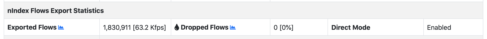
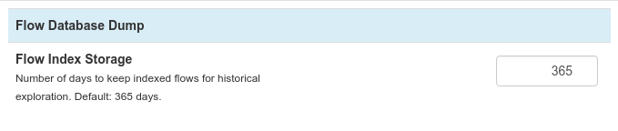

Historical Flows
================

ntopng can dump flows data to a persistent storage and provides view to browse
recorded flows data in the past.

Traditionally, in order to provide historical data, ntopng required a connected
MySQL database. Check out the `Flows Dump documentation`_ for more details on
how to setup the connection and the historical views available for this mode.

However, due to the users feedback on the MySQL low performance with high flow
insertion rates, ntopng now integrates a *beta version* of a specialized flows
dump database called nIndex which overcomes the limits of MySQL. This is currently
available only in the enterprise version of ntopng.

.. note::

  The historical views provided with the MySQL integration (like the "Historical Explorer")
  are *not* compatible with nIndex.

The rest of this page documents the use of nIndex as flows storage.

Enabling Flow Dump
------------------

.. warning::

  This is a beta feature. It may contain bugs which corrupt the flows data.
  Use the MySQL flow dump for a stable flow storage.

In order to dump flows to disk ntopng requires the `-F nindex` option to be
specified. After this is enabled, new "Flows" entries will appear into the
historical charts `tabular view`_ dropdown:

Direct Mode
-----------

nIndex is a high-performance network-oriented database, at high flow rates
the flow dump performance could be limited by the performance of the
ntopng analysis engine, especially when many and heavy user's scripts are
enabled. A *direct* mode can be enabled in order to dump flows as soon as
they are collected from ZMQ, before they are even processed by ntopng, 
improving the performance and reducing the possibility of flow drops.
In order to enable *direct* mode the `-F nindex;direct` option should be 
specified.

.. note::

  Direct mode is only available in ntopng Enterprise L when collecting flows from ZMQ.

It is possible to verify that direct mode is actually enabled in the interface
status page, by checking that *Direct Mode* is *enabled*.

Please note that some flow information may be missing when enabling this
mode, as the ntopng analysis engine is bypassed and flow details are not
augmented.

Browsing Flows
--------------

Historical flows data can be accessed from the `Historical Charts`_ and are contextual
for the specified time frame.

Here is an overview of the currently available flows views:

  - Top Clients: shows the top hosts as flow clients and their traffic as flow clients
  - Top Servers: shows the top hosts as flow servers and their traffic as flow servers
  - Top L7 Contacts: shows the top <client, server, L7 protocol> pairs and their total traffic

By clicking on the |drilldown_icon| icon, it's possible to explode a particular communication
or host and analize the raw flows.

.. figure:: img/historical_flows_raw_flows.png
  :align: center
  :alt: Raw Flows
  :scale: 70

The picture above, for example, shows the raw flows between `PC local` and
`17.248.146.148` having the `AppleiCloud` protocol.

Exporting Flows
---------------

By clicking on the |flow_export_icon| icon, it's possible to download a copy of
the raw flows in CSV format. Here is the same data shown in the picture above in
CSV format:

.. code:: bash

  L7_PROTO|IP_DST_PORT|FLOW_TIME|BYTES|FIRST_SEEN|LAST_SEEN|IP_SRC_PORT|NTOPNG_INSTANCE_NAME|IP_PROTOCOL_VERSION|IPV4_SRC_ADDR|JSON|PACKETS|IPV4_DST_ADDR|INTERFACE_ID|PROFILE|INFO|IPV6_DST_ADDR|VLAN_ID|PROTOCOL|IPV6_SRC_ADDR
  143|443|1544712866|18262|1544712646|1544712866|32886|PC local|4|192.168.1.6||53|17.248.146.148|1|ssl|feedbackws.icloud.com|::|0|6|::
  143|443|1544712876|13958|1544712749|1544712876|34078|PC local|4|192.168.1.6||46|17.248.146.148|1|ssl|p66-iwmb0.icloud.com|::|0|6|::
  143|443|1544718548|203978|1544718247|1544718548|38928|PC local|4|192.168.1.6||431|17.248.146.148|1|ssl|p66-ckdatabasews.icloud.com|::|0|6|::
  143|443|1544718821|175770|1544718548|1544718821|38928|PC local|4|192.168.1.6||370|17.248.146.148|1|ssl|p66-ckdatabasews.icloud.com|::|0|6|::
  143|443|1544723738|14663|1544723557|1544723738|49328|PC local|4|192.168.1.6||45|17.248.146.148|1|ssl|p66-pushws.icloud.com|::|0|6|::

Retention Time
--------------

The retention of the flows dump on disk can be configured from the
"Flow Database Dump" preferences:

.. |drilldown_icon| image:: img/drilldown_icon.png
.. |flow_export_icon| image:: img/flow_export_icon.png
.. _`Flows Dump documentation` : advanced_features/flows_dump.html#mysql
.. _`Historical Charts`: web_gui/historical.html
.. _`tabular view`: web_gui/historical.html#tabular-view
