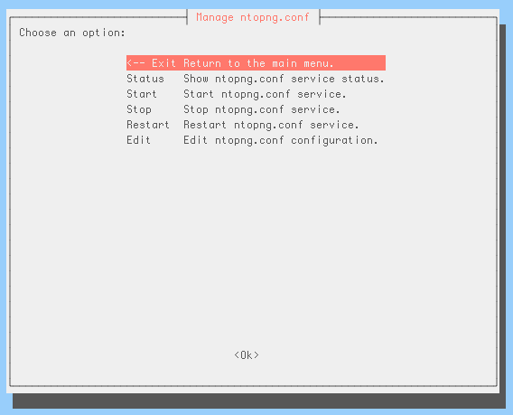

The ntopng Configuration File
=============================

Command line options can be grouped in a plain text file, that is typically named :code:`ntopng.conf`. Note that any name is acceptable except when ntopng is run as a daemon in which case ntopng.conf file name must be used.

Options in the configuration file must be reported one per line. Comment lines are accepted as well and have to be prefixed with a :code:`#`. Option name and option value must be separated with a :code:`=`. The latter is necessary even for options that doesn't require a value. For example, to disable interface promiscuous mode, one would use :code:`--no-promisc` when starting ntopng directly from the command line or would add a line :code:`--no-promisc=` in the configuration file when starting ntopng as a daemon.

An example of a configuration file is the following

.. code:: bash

   # Listen on localhost:3000 only
   --http-port=:3000

   # Use prefix due to nginx proxy
   --http-prefix="/ntopng"

   # Everybody's admin
   #--disable-login=1

   # Do not resolve any names
   --dns-mode=3

   # Limit memory usage
   --max-num-flows=200000
   --max-num-hosts=250000

   # Dump flows to MySQL
   --dump-flows=mysql;localhost;ntopng;flows;ntopng;xxx

   #--verbose

Configuration Changes
---------------------

The configuration file can be edited manually with any text editor. Linux-based distributions are also shipped with an automatic configuration script :code:`ntopng-config` that provides a graphical way to modify the configuration file. The script can be executed, with root privileges, from the command line

.. code:: bash

   $ sudo ntopng-config

A graphical interface is presented to modify some common options of ntopng.conf by selecting option :code:`Edit`.

  The ntopng-config Script

Specifically, it allows to change the maximum number of hosts and flows, as well as to configure local networks and interfaces.
