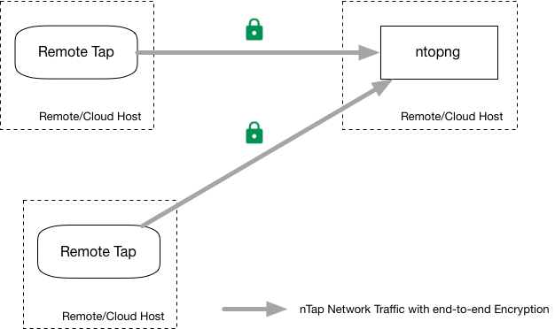

.. _nTapInterface

Using nTap as Virtual Tap with ntopng
#####################################

Sometimes you need to analyze traffic on a remote host, and NetFlow is not an option. In this case you need to enable a remote span that allows you to capture packets on a remote host and divert them to the host where ntopng runs. This task is usually carried on by a `virtual tap <https://en.wikipedia.org/wiki/Network_tap>`_ that is often quite expensive.

ntop has developed `nTap <https://www.ntop.org/products/traffic-analysis/ntap/>`_ that is a software wirtual tap, suitable to be deployed in the cloud, in a VM, container or physical host. nTap is logically implemented with two components: a remote tap that captures traffic, encrypts it, and sends it to a central collector application that implements a virtual ethernet interface to which applications can connect.

A single ntopng instance can collect traffic from multiple remote taps.

Below you can find a summary of the commands that need to be used in order to collect nTap traffic. All commands need to be started by root or via sudo.

ntopng Enterprise L
-------------------

The Enterprise L edition of ntopng has native nTap support meaning that you do not need a nTap license as ntopng embeds the logic present in the nTap collector. 

Suppose to start ntopng on host 1.2.3.4 and let it listen on port 1234, and encrypt traffic with key 'hello'. You can start the applications as follows:

- [ntopng host] ntopng -i ntap:1234:hello
- [remote host we want we want to monitor] tap -i eth0 -c 1.2.3.4:1234 -k hello

All Other ntopng Editions
-------------------------

All other ntopng versions can collect nTap traffic via the collector component that instead require a separate license:

Suppose to start ntopng on host 1.2.3.4 and let it listen on port 1234, and encrypt traffic with key 'hello'. You can start the applications as follows:

- [ntopng host] collector -p 1234 -k hello -i ntap0
- [ntopng host] ntopng -i ntap0
- [remote host we want we want to monitor] tap -i eth0 -c 1.2.3.4:1234 -k hello

