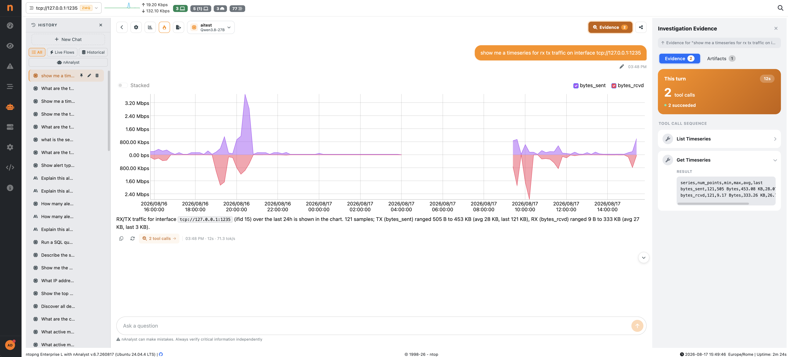
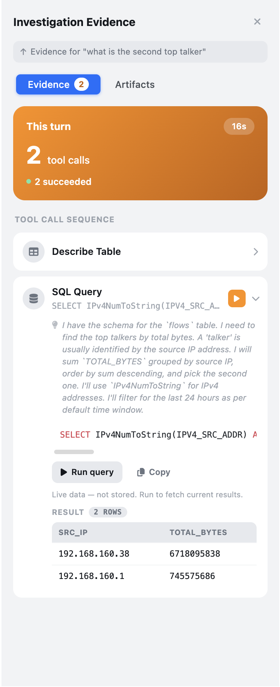

.. _nAnalystNoBlackBox:

Explainability — No Black Box
==============================

A core design principle of nAnalyst is that every answer must be verifiable. Unlike generic AI assistants that produce text with no traceable source, nAnalyst exposes the full chain of reasoning behind every response.

Evidence log
------------

Every chat response includes an evidence log — a structured record of:

- **Tools called** — which of the 25+ domain tools were invoked and in what order
- **SQL executed** — the exact ClickHouse queries run against your data
- **Raw results** — the data returned by each tool call before summarisation
- **Reasoning steps** — the agent's intermediate conclusions as it assembled the answer

The evidence log is shown when clicking `X Tool Calls` button at the end of the respone message. Clicking this, opens a side panel with all the evidemce used to answer the question, for example all tool calls executed, if they were successful or not.

Evidence panel
--------------

The **Evidence** panel opens on the right side of the chat and lists every tool call made while answering the currently selected turn.

   nAnalyst Evidence panel, showing the tool call sequence for a turn

For each turn, the panel header shows:

- **Elapsed time** for the turn (e.g. ``27s``)
- **Total tool calls** made
- **Success count** (e.g. ``4 succeeded``) — a status dot summarizes the turn: green when every call succeeded, red when at least one tool call failed or returned an error

Below the header, the **tool call sequence** lists each call in the order it was executed, with an icon identifying the tool family (table lookup, SQL query, chart, etc.). A tool call that failed — a malformed query, a permission error, an empty/unexpected result the agent had to recover from — is highlighted in red in the sequence, so you can immediately spot which step needed a retry or caused the agent to change strategy, without reading the full transcript.

Clicking a row expands it to show:

- The full SQL statement or tool parameters used
- The agent's stated reasoning for that call (why it chose this tool/query)
- The raw result returned by the tool

Rerunning a query from the UI
------------------------------

Every ``SQL Query`` row in the evidence panel has a **Run query** button (▶). Clicking it re-executes the exact statement the agent ran, directly against ClickHouse, without going back through the LLM — letting you independently confirm the number, or check whether the underlying data has changed since the agent's answer was generated.

   Evidence row expanded, showing the query text and the Run query action

Why this matters
----------------

Black-box AI answers create a trust problem in security contexts. If an analyst cannot verify why the AI reached a conclusion, they cannot rely on it during an incident.

nAnalyst's evidence log means:

- Every claim in the answer maps to a specific data row
- SQL can be copied and re-run independently to validate results
- Investigations are reproducible and shareable across team members
- Evidence can be attached to incident reports or tickets

Interpretable results
---------------------

nAnalyst does not hallucinate network data. It only states facts that are backed by tool-call results. If the data needed to answer a question is not available, nAnalyst says so rather than guessing.

Charts and tables embedded in responses are generated directly from the SQL result sets — there is no additional LLM-driven data transformation between the database and the visualisation. Chart artifacts are rendered in vueJS, so they are fast, reactive and the same components used throughout the ntopng user interface.
