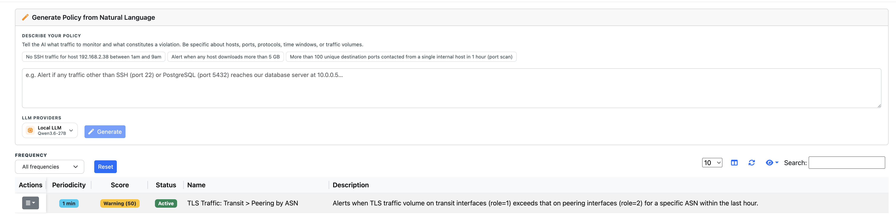
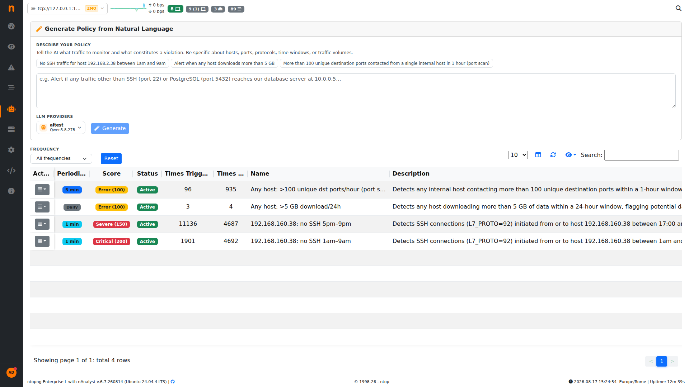
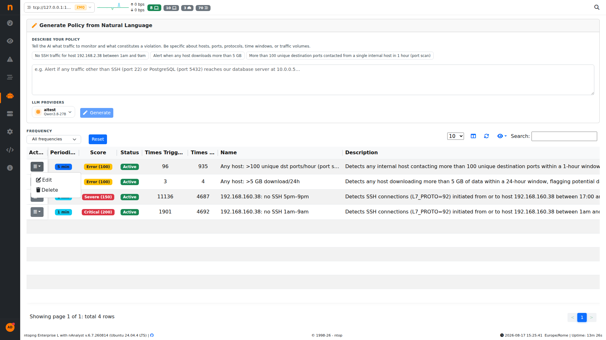

.. _nAnalystPolicies:

AI-Generated Network Policies
==============================

nAnalyst can translate a plain-English security or operational requirement into an executable network policy that generates ntopng alerts when violated.

   nAnalyst AI Policy

How policy generation works
----------------------------

1. **Describe the requirement** — state what behaviour should be detected or forbidden:

   .. code-block:: text

      "No SSH for host 192.168.2.38 during business hours"

      "Alert if any host's traffic is more than 2x its hourly baseline"

      "Detect outbound connections to non-approved countries"

2. **Agent generates the SQL** — nAnalyst writes a ClickHouse query that captures the policy condition. The query is shown to you for review before it is saved.

3. **Execution schedule** — you choose how often the policy query runs: every 1 minute, 5 minutes, 1 hour, or daily.

4. **Alert registration** — when the query detects a violation, ntopng generates a standard alert that appears in the alert dashboard as a new AI Policy alert and can trigger any configured notification channel (email, Slack, syslog, etc.).

5. **Interpretability** — nAnalyst executes the query once immediately and explains the results in plain language so you can validate the policy catches what you expect before it goes live.

Reviewing and managing policies
--------------------------------

Saved policies are listed in the nAnalyst policy panel (**nAnalyst -> Policies**, ``/lua/pro/ai_policy.lua``). For each policy the table shows:

- **Periodicity** — the execution schedule (1 min, 5 min, daily, ...)
- **Score** — the severity assigned to alerts this policy generates (e.g. Error 100, Severe 150, Critical 200)
- **Status** — Active/paused
- **Times Triggered** — how many times this policy's condition matched and fired an alert
- **Times Run** — how many times the policy query has been executed, regardless of whether it matched
- **Name** and **Description** — the plain-English summary

   Policy execution debug counters: Times Triggered vs. Times Run

**Times Run** vs **Times Triggered** is the debug signal for tuning a policy: a policy with a high run count but zero (or very low) trigger count is likely too narrow or checking a condition that rarely occurs, while a policy that triggers on nearly every run is either catching a real, persistent problem or is too broad and needs tightening. Comparing the two numbers side by side lets you spot both cases without digging through the alert log.

Both counters persist across ntopng restarts and are reset only when the policy itself is deleted.

Policies can be edited, paused, or deleted from the same panel.

   nAnalyst Policy Edit

Complex policy examples
-----------------------

nAnalyst can express sophisticated conditions that would be time-consuming to write manually:

- Traffic volume anomalies (e.g., 2× hourly baseline)
- Protocol violations (e.g., unencrypted HTTP from a specific subnet)
- Geolocation rules (e.g., outbound to sanctioned countries)
- Time-based access controls (e.g., no RDP outside business hours)
- Peer relationship changes (e.g., a host contacting a new external IP for the first time)

The agent validates that the SQL it generates is syntactically correct and semantically consistent with the described intent before presenting it for confirmation.
