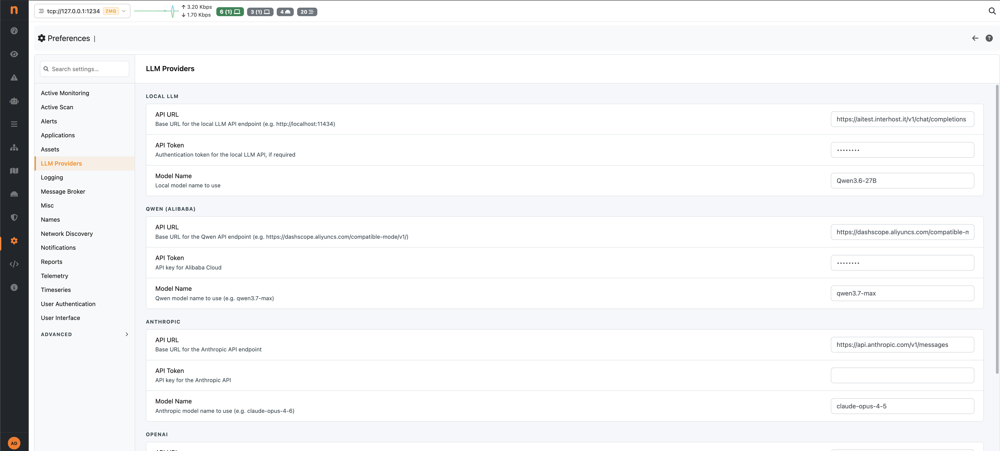
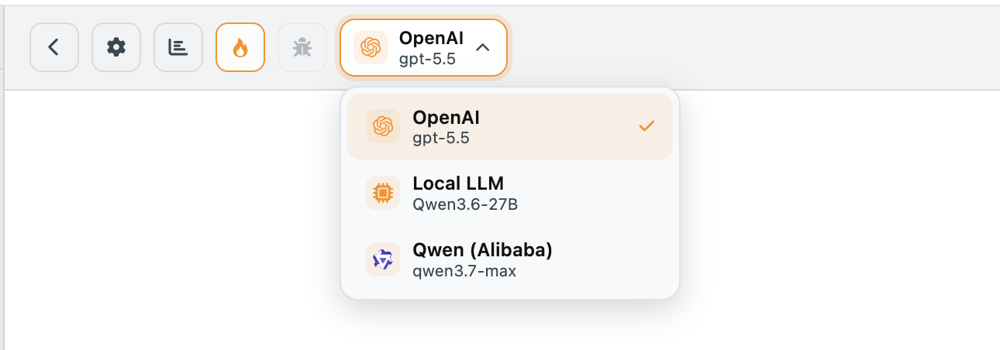
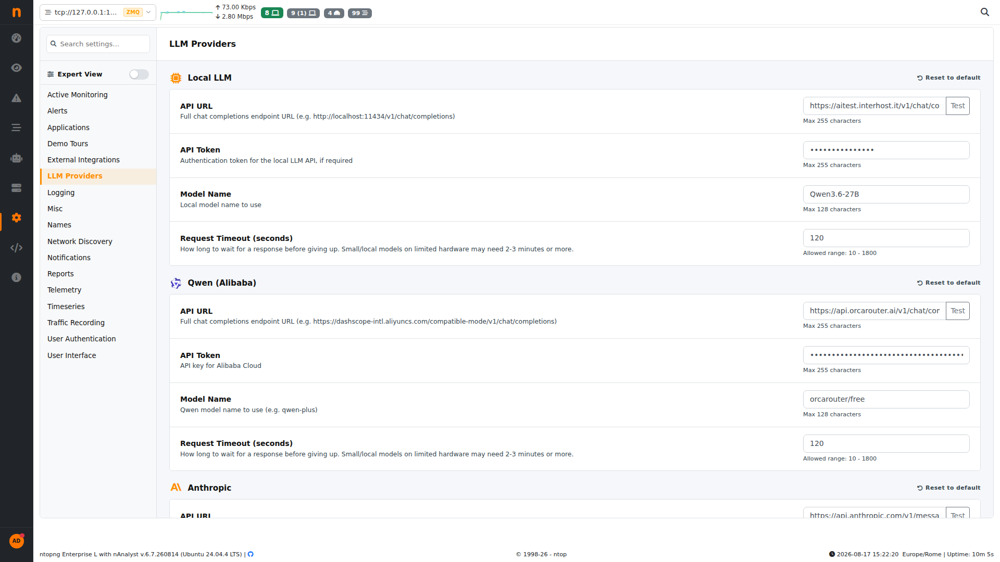
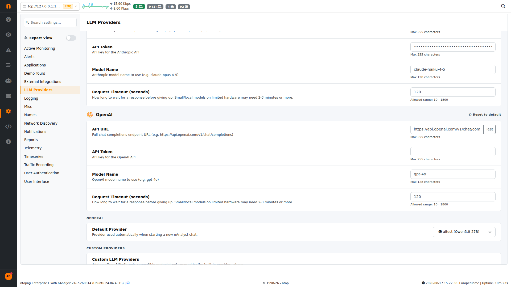
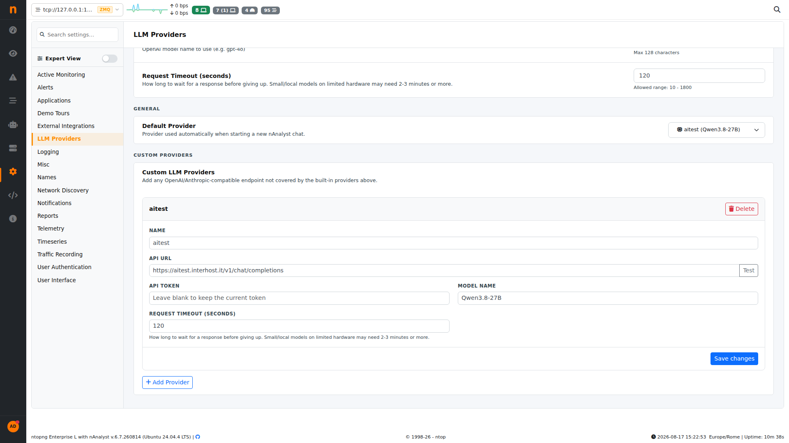

.. _nAnalystLLMSetup:

LLM Setup
=========

nAnalyst requires an LLM backend for reasoning and natural language generation. It supports multiple providers and can run entirely on-premises with a local inference server.

Supported backends
------------------

+---------------------------+-------------------------------------------------------------+
| Backend                   | Notes                                                       |
+===========================+=============================================================+
| `Anthropic (Claude)`_     | Pay-per-use cloud API                                       |
+---------------------------+-------------------------------------------------------------+
| `OpenAI (GPT models)`_    | Pay-per-use cloud API                                       |
+---------------------------+-------------------------------------------------------------+
| `AWS Bedrock`_            | OpenAI-compatible endpoint; regional data residency         |
+---------------------------+-------------------------------------------------------------+
| `Qwen (Alibaba Cloud)`_   | Pay-per-use cloud API; OpenAI-compatible                    |
+---------------------------+-------------------------------------------------------------+
| `llama-cpp`_              | Local inference; OpenAI-compatible server                   |
+---------------------------+-------------------------------------------------------------+
| `vllm`_                   | Local inference; OpenAI-compatible server                   |
+---------------------------+-------------------------------------------------------------+
| `sglang`_                 | Local inference; OpenAI-compatible server                   |
+---------------------------+-------------------------------------------------------------+
| Any OpenAI-compatible API | Set a custom endpoint URL                                   |
+---------------------------+-------------------------------------------------------------+

.. _Anthropic (Claude): https://www.anthropic.com/api
.. _OpenAI (GPT models): https://platform.openai.com/docs/overview
.. _AWS Bedrock: https://aws.amazon.com/bedrock/
.. _Qwen (Alibaba Cloud): https://www.alibabacloud.com/en/solutions/generative-ai/qwen
.. _llama-cpp: https://github.com/ggml-org/llama.cpp
.. _vllm: https://docs.vllm.ai/
.. _sglang: https://docs.sglang.ai/

Configuration
-------------

LLM settings are configured in ntopng under **Settings -> LLM Providers**.

Required fields:

- **API Key** — your LLM provider API key (not required for local servers)
- **Endpoint URL** — the API base URL (default values are pre-filled for Anthropic and OpenAI)
- **Model name** — the model identifier (e.g., ``claude-sonnet-4-6``, ``gpt-4o``, ``qwen3-235b-a22b``, ``llama3.2``)

The API key is stored locally on the ntopng instance and never transmitted to any service other than the configured LLM endpoint.

   nAnalyst LLM Connection Setup

Choosing a model
----------------

**Cloud APIs** offer the highest reasoning quality and are recommended for complex investigations and policy generation. Costs depend on usage volume (see :ref:`nAnalystUsageStats`).

**Local inference servers** provide full data privacy — no data leaves your premises at all, including to the LLM — at the cost of lower reasoning quality for complex tasks. They are suitable for high-volume, simpler queries or environments with strict data sovereignty requirements.

.. tip::

   For optimal results, use a model with a context window of at least 32k tokens. Larger context windows allow nAnalyst to include more evidence in a single reasoning step.

Switching models
----------------

You can change the active LLM model at any time from the LLM model panel. Existing conversations retain their original model metadata in the usage log. New messages will use the newly chosen model.

   nAnalyst Switch LLM Model

Per-provider settings and request timeout
------------------------------------------

Each built-in provider (Local LLM, Qwen, Anthropic, OpenAI) has its own independent configuration block under **Settings -> LLM Providers**: API URL, API Token, Model Name, and **Request Timeout (seconds)**.

   Per-provider configuration: API URL, token, model name, request timeout

The request timeout controls how long ntopng waits for a response from that specific provider before giving up, independently of the other configured providers. It accepts values from **10 to 1800 seconds**. Small local models running on limited hardware often need 2-3 minutes or more — raise the timeout accordingly rather than lowering expectations on model choice.

A **Test** button next to each API URL field sends a lightweight request to confirm the endpoint is reachable and credentials are valid before you save.

Each provider block also has its own **Reset to default** action (top-right of the block), which clears that provider's URL, token, model name, and timeout back to the ntopng defaults without touching the other configured providers.

Default provider
-----------------

Under **General**, the **Default Provider** dropdown selects which configured provider (built-in or custom) is used automatically whenever a new nAnalyst chat is started.

   Default Provider selector, listing built-in and custom providers

Changing the default provider does not affect conversations already in progress — it only applies to chats created after the change. You can still switch the model for an individual chat from the in-chat LLM model panel (see `Switching models`_ above), overriding the default for that conversation only.

Custom providers
-----------------

Beyond the four built-in providers, nAnalyst supports adding an arbitrary number of **custom LLM providers** under **Settings -> LLM Providers -> Custom Providers**. This covers any OpenAI-compatible or Anthropic-compatible endpoint not already covered by the built-in list — for example a self-hosted gateway, a second local inference server, or an internal LLM router.

   Custom LLM Providers panel, showing a configured custom provider

Each custom provider has:

- **Name** — a label used to identify the provider in the model switcher and the Default Provider dropdown
- **API URL** — the full chat-completions endpoint (OpenAI/Anthropic-compatible)
- **API Token** — authentication token for the endpoint; leave blank when editing to keep the currently stored token unchanged
- **Model Name** — the model identifier the endpoint expects
- **Request Timeout (seconds)** — independent per-provider timeout, same 10-1800s range as the built-in providers

To add a provider, click **+ Add Provider**, fill in the fields, and click **Save changes**. Multiple custom providers can be configured simultaneously and all appear alongside the built-in providers in the model switcher and the Default Provider dropdown, so you can run investigations across several LLM backends without reconfiguring anything mid-session. A custom provider can be removed with the **Delete** button on its block.
