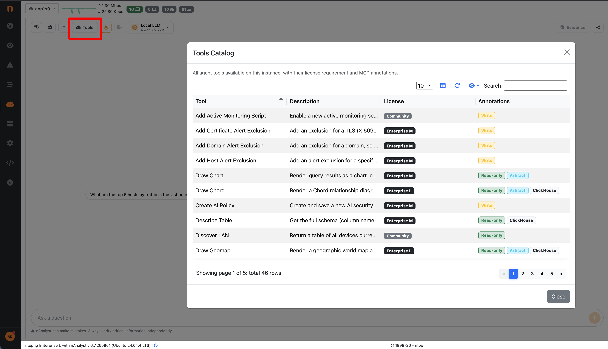

.. _nAnalystToolsLicensing:

Tools and Licensing
===================

nAnalyst exposes network intelligence functions to the AI agent as discrete
**tools**. Which tools are available depends on your ntopng license: higher
editions unlock progressively more tools, following the same license model used
throughout ntopng (see :ref:`versions and licensing <AvailableVersions>`).

The agentic tool layer was introduced in ntopng **6.7**.

.. tip::

   You do not need this page to see what your instance can do. From Enterprise M
   upward, click the **Tools** button in the nAnalyst chat header to open the
   :ref:`Tools Catalog <nAnalystToolsCatalog>` — a live, searchable list of every
   tool available to the agent on this box, with its license and annotations.

License model
-------------

nAnalyst is **included from Enterprise M upward** — there is no separate nAnalyst
SKU and no per-tool add-on to purchase. The chat assistant and its full reasoning
loop require at least Enterprise M. Community and Pro installations expose only
the live-data tools listed below and do not include the chat assistant.

The number of tools grows sharply with the edition:

+-----------------+-------+------------+----------------------------------------------------+
| Edition         | Tools | Cumulative | What it adds                                        |
+=================+=======+============+====================================================+
| Community / Pro | 9     | 9          | Live host / flow / LAN visibility (no chat)         |
+-----------------+-------+------------+----------------------------------------------------+
| Enterprise M    | +7    | 16         | Chat assistant; ClickHouse SQL (``query`` /         |
|                 |       |            | ``list_tables`` / ``describe_table``); live flow    |
|                 |       |            | inspection (``get_live_flow``); network-config      |
|                 |       |            | lookups (``list_expected_servers`` /                |
|                 |       |            | ``list_networks``); ``chart`` limited to **pie**    |
|                 |       |            | and **line** chart types                            |
+-----------------+-------+------------+----------------------------------------------------+
| Enterprise L    | +8    | 24         | Host alert-exclusion; multi-probe / infrastructure  |
|                 |       |            | tools (flow exporters, observation points, infra    |
|                 |       |            | stats, top exporter interfaces); asset DB; flow     |
|                 |       |            | ACL; site Sankey                                    |
+-----------------+-------+------------+----------------------------------------------------+
| Enterprise XL   | +31   | 55         | Everything else: live host inspection; historical   |
| (and up)        |       |            | flow; timeseries; protocol lookup; SNMP device      |
|                 |       |            | inventory; the remaining chart types (bar, bubble,  |
|                 |       |            | heatmap) and the Sankey / chord / geomap artifacts; |
|                 |       |            | AI security policies; domain / certificate alert    |
|                 |       |            | exclusions; OT / ICS protocols (Modbus, PROFINET,   |
|                 |       |            | S7comm); Wazuh SIEM; network access policy; sites   |
+-----------------+-------+------------+----------------------------------------------------+

Higher editions always include everything unlocked by lower editions. Gating is
enforced **per tool in code**: ``pro_tools.lua`` skips registering any tool whose
edition gate the running instance does not meet. If your license does not include
a tool, that tool is never registered for the session — it is invisible to the
agent, not merely rejected at call time. The same tool set is used regardless of
the client (chat interface or :ref:`MCP <nAnalystMCP>`).

.. note::

   ``chart`` is available from Enterprise M, but only the **pie** and **line**
   chart types render below Enterprise XL. Asking for a bar, bubble or heatmap
   chart on Enterprise M or L returns a "requires Enterprise XL" error to the
   agent.

Annotations
-----------

Each tool carries machine-readable annotations, shown in the in-product **Tools
Catalog** (open it from the tools icon in the nAnalyst chat header):

- **read-only** — does not modify ntopng state; safe to run unattended
- **write** — mutates configuration (policy, alert exclusion, monitoring); always
  confirmed with the user before execution
- **artifact** — can emit a rendered object in the chat (chart, geomap, Sankey,
  chord)
- **clickhouse** — requires the ClickHouse historical flow store to be enabled

Tool reference
--------------

.. list-table::
   :header-rows: 1
   :widths: 22 44 16 18

   * - Tool
     - Description
     - License
     - Annotations
   * - ``add_active_monitoring_script``
     - Enable a new active-monitoring check for a host
     - Community
     - write
   * - ``discover_lan``
     - Active + passive LAN device discovery (ARP/mDNS/SSDP, MAC-table fallback)
     - Community
     - read-only
   * - ``get_country_stats``
     - Top-N countries by traffic on the current interface
     - Community
     - read-only
   * - ``get_interface_addresses``
     - IP addresses of the monitored interface
     - Community
     - read-only
   * - ``get_live_flows_for_host``
     - Active flows involving one IP
     - Community
     - read-only
   * - ``get_live_flows_summary``
     - Aggregated live-flow summary (by country/app/proto/…)
     - Community
     - read-only
   * - ``get_mac_info``
     - Manufacturer, device type, pool, IPs for a MAC
     - Community
     - read-only
   * - ``list_available_active_monitoring_scripts``
     - Active-monitoring script catalog
     - Community
     - read-only
   * - ``list_enabled_active_monitoring_scripts``
     - Currently enabled active-monitoring checks
     - Community
     - read-only
   * - ``chart``
     - Render a chart. **pie/line from Enterprise M; bar/bubble/heatmap require Enterprise XL**
     - Enterprise M
     - read-only, artifact
   * - ``describe_table``
     - Full column schema (name, type, comment) for a ClickHouse table
     - Enterprise M
     - read-only, clickhouse
   * - ``get_live_flow``
     - Live flow snapshot for the flow currently open in the UI
     - Enterprise M
     - read-only
   * - ``list_expected_servers``
     - Approved DNS/NTP/DHCP/SMTP/gateway server whitelist
     - Enterprise M
     - read-only
   * - ``list_networks``
     - Configured local network CIDR subnets for an interface
     - Enterprise M
     - read-only
   * - ``list_tables``
     - List queryable ClickHouse tables with one-line descriptions
     - Enterprise M
     - read-only, clickhouse
   * - ``query``
     - Execute arbitrary ClickHouse SQL against ntopng tables
     - Enterprise M
     - read-only, clickhouse
   * - ``add_host_alert_exclusion``
     - Suppress alerts for a host IP (reason mandatory)
     - Enterprise L
     - write
   * - ``get_access_control_list``
     - Configured flow-level ACL rules
     - Enterprise L
     - read-only
   * - ``get_asset_info``
     - Persistent asset identity/inventory from the DB
     - Enterprise L
     - read-only, clickhouse
   * - ``get_infrastructure_stats``
     - Aggregate stats across all interfaces
     - Enterprise L
     - read-only
   * - ``get_observation_point_exporters``
     - Exporters reporting to an observation point
     - Enterprise L
     - read-only
   * - ``get_site_sankey``
     - Site-to-site traffic Sankey
     - Enterprise L
     - read-only, artifact
   * - ``get_top_exporter_interfaces``
     - Top exporter interfaces by traffic
     - Enterprise L
     - read-only
   * - ``list_flow_exporters``
     - All NetFlow/sFlow/IPFIX exporters feeding ntopng
     - Enterprise L
     - read-only
   * - ``add_certificate_alert_exclusion``
     - Suppress alerts for a TLS certificate
     - Enterprise XL
     - write
   * - ``add_domain_alert_exclusion``
     - Suppress alerts toward a domain
     - Enterprise XL
     - write
   * - ``chord``
     - Chord diagram for same-type entity relationships
     - Enterprise XL
     - read-only, artifact, clickhouse
   * - ``create_ai_policy``
     - Create + save an AI security policy
     - Enterprise XL
     - write
   * - ``geomap``
     - Geographic world map (choropleth heatmap or live dots)
     - Enterprise XL
     - read-only, artifact, clickhouse
   * - ``get_asn_config``
     - Configured customer / sub-customer / remote ASN policy
     - Enterprise XL
     - read-only
   * - ``get_exporter_sites_map``
     - Flow exporters grouped by site (graph / sankey)
     - Enterprise XL
     - read-only, artifact
   * - ``get_historical_flow``
     - Historical single-flow record from ClickHouse
     - Enterprise XL
     - read-only
   * - ``get_host_info``
     - Live real-time host stats (flows, scores, alerts, QoE, DNS, TCP health)
     - Enterprise XL
     - read-only
   * - ``get_modbus_stats``
     - Modbus (ICS) per-flow stats
     - Enterprise XL
     - read-only
   * - ``get_nedge_firewall_policy``
     - nEdge inter-LAN firewall rules (nEdge only)
     - Enterprise XL
     - read-only
   * - ``get_network_policy``
     - Local/corporate device networks + whitelists
     - Enterprise XL
     - read-only
   * - ``get_profinet_stats``
     - PROFINET (ICS) per-flow stats
     - Enterprise XL
     - read-only
   * - ``get_s7comm_stats``
     - S7comm / Siemens (ICS) per-flow stats
     - Enterprise XL
     - read-only
   * - ``get_site_traffic``
     - Site-to-site traffic matrix (bytes per site pair)
     - Enterprise XL
     - read-only
   * - ``get_snmp_device_config``
     - SNMP polling config for one device
     - Enterprise XL
     - read-only
   * - ``get_snmp_device_info``
     - Full SNMP device snapshot (interfaces, LLDP/CDP neighbors)
     - Enterprise XL
     - read-only
   * - ``get_snmp_interface_details``
     - Detailed stats for one SNMP interface
     - Enterprise XL
     - read-only
   * - ``get_snmp_interface_roles``
     - SNMP interface roles (transit/peering/access) across devices
     - Enterprise XL
     - read-only
   * - ``get_timeseries``
     - Fetch timeseries as compact min/max/avg/last summary
     - Enterprise XL
     - read-only, artifact
   * - ``get_vlan_traffic``
     - VLAN traffic by port/protocol, live or historical
     - Enterprise XL
     - read-only, artifact
   * - ``get_wazuh_alert_exceptions``
     - Configured Wazuh digest exceptions
     - Enterprise XL
     - read-only
   * - ``get_wazuh_alert_rules``
     - Configured Wazuh digest rules
     - Enterprise XL
     - read-only
   * - ``get_wazuh_alerts``
     - Security alerts ingested from Wazuh SIEM/HIDS
     - Enterprise XL
     - read-only
   * - ``list_ai_policies``
     - List configured AI security policies
     - Enterprise XL
     - read-only
   * - ``list_protos``
     - nDPI protocols/apps for a category
     - Enterprise XL
     - read-only
   * - ``list_sites``
     - Configured sites and their networks
     - Enterprise XL
     - read-only
   * - ``list_snmp_devices``
     - All SNMP-monitored devices
     - Enterprise XL
     - read-only
   * - ``list_timeseries``
     - Discover timeseries schemas, tags, metrics for an entity
     - Enterprise XL
     - read-only
   * - ``resolve_proto``
     - Batch-resolve protocol names ↔ IDs (l4/app/cat)
     - Enterprise XL
     - read-only
   * - ``sankey``
     - Render multi-hop flow-path Sankey diagram
     - Enterprise XL
     - read-only, artifact, clickhouse

.. _nAnalystToolsCatalog:

The Tools Catalog
-----------------

From **Enterprise M** upward, the nAnalyst chat page has a **Tools** button in
its header (toolbox icon, top toolbar). Clicking it opens the **Tools Catalog**:
a modal that enumerates *every* tool registered for the current session — the
same list the AI agent itself sees.

   The Tools Catalog modal, opened from the nAnalyst chat header

For each tool the catalog shows:

- **Name** — the human-readable tool name
- **Description** — what the tool does
- **License** — the minimum edition that unlocks it (Community, Enterprise M,
  Enterprise L, or Enterprise XL)
- **Annotations** — ``read-only`` / ``write``, plus ``artifact`` and
  ``clickhouse`` where they apply

The table is searchable and sortable (by name or license), so an operator can
quickly answer "what can this assistant actually do on this box?" and "what
would upgrading unlock?". Only tools your license includes are listed — a tool
your edition does not unlock is never registered and therefore never appears,
matching exactly what the agent can call.

