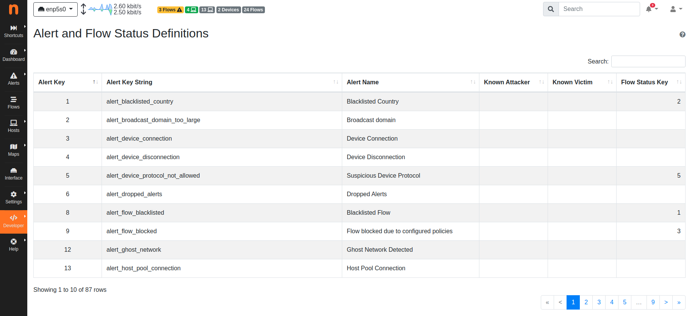

.. _Alert Definitions:

Alert Definitions
=================

A plugin enables alerts to be generated. All the alerts a plugin is willing to generate require a file in plugin subdirectory :code:`./alert_definitions/`. The file contains all the necessary information which is required to properly show, localize and format an alert.

The file must return a Lua table with the following keys:

- :code:`alert_key`: A constant uniquely identifying this alert.
- :code:`i18n_title`: A string indicating the title of the alert. ntopng localizes the string as described in :ref:`Plugin Localization`.
- :code:`i18n_description` (optional): Either a string with the alert
  description or a function returning an alert description string. When :code:`i18n_description` is a string, ntopng localizes as described in :ref:`Plugin Localization`.
- :code:`icon`: A Font Awesome 5 icon shown next to the :code:`i18n_title`.

.. _Alert Key:

Alert Key
---------

The :code:`alert_key` is a constant uniquely identifying the alert. Constants are available in file `alert_keys.lua <https://github.com/ntop/ntopng/blob/dev/scripts/lua/modules/alert_keys.lua>`_. The file contains a table :code:`alert_keys` with two sub-tables:

- :code:`ntopng`
- :code:`user`

Plugins distributed with ntopng must have their :code:`alert_key` s defined in sub-table :code:`ntopng`. User plugins must have their :code:`alert_key` s defined in sub-table :code:`user`.

Sub-tables can be extended adding new :code:`alert_key` s to either the :code:`ntopng` or the :code:`user` table. Each :code:`alert_key` has an integer number assigned which `must be unique`.

.. note::

  Alert keys are guaranteed to be constant and never changing, even across ntopng releases.

.. warning::

  Prior to 2020-04-15 there was no concept of :code:`alert_key`. Backward compatibility with alerts generated before that date is not ensured.

.. _Alert Description:

.. _Status Key:

Flow Status Key
---------------

The :code:`status_key` is a constant uniquely identifying the status used only by alerts regarding flows. Constants are available in file `flow_keys.lua <https://github.com/ntop/ntopng/blob/dev/scripts/lua/modules/flow_keys.lua>`_. The file contains a table :code:`flow_keys` with two sub-tables:

- :code:`ntopng`
- :code:`user`

Plugins distributed with ntopng must have their :code:`status_key` s defined in sub-table :code:`ntopng`. User plugins must have their :code:`status_key` s defined in sub-table :code:`user`.

Sub-tables can be extended adding new :code:`status_key` s to either the :code:`ntopng` or the :code:`user` table. Each :code:`status_key` has an integer number assigned which `must be unique`.

.. note::

  Status keys are guaranteed to be constant and never changing, even across ntopng releases.

.. warning::

  Prior to 2020-04-15 there was no concept of :code:`status_key`. Backward compatibility with statuses generated before that date is not ensured.

Alert Description
-----------------

Alert description :code:`i18n_description` can be either a string with the alert description or a function returning an alert description string.

String
~~~~~~

When the alert description is string, it is localized as described in :ref:`Plugin Localization`. An :code:`alert_json` table is passed as the parameters table for the localization. Keys and values of :code:`alert_json` can be used to add parameters to the localization string.

Function
~~~~~~~~

When the alert description is a function, it gets called with three parameters:

- :code:`ifid`: An integer number uniquely identifying the interface which is triggering the alert.
- :code:`alert`: A Lua table containing the details of the alert.
- :code:`alert_json`: A Lua table that can be used to add parameters to the localization string.

The function is expected to return a string which is possibly localized. It is up to the plugin to call the :code:`i18n()` localization function to do the actual localization. ntopng will not perform any localization on the returned value of the function.

Examples
--------

The first example considers :ref:`Blacklisted Flows` created in the :ref:`Plugin Examples`. It's
:code:`./alert_definitions` `blacklisted sub-directory <https://github.com/ntop/ntopng/tree/dev/scripts/plugins/blacklisted/alert_definitions>`_ contains file :code:`alert_flow_blacklisted.lua`. Contents of this file are

.. code:: lua

   local alert_keys = require "alert_keys"

   return {
     alert_key = alert_keys.ntopng.alert_flow_blacklisted,
     i18n_title = "alerts_dashboard.blacklisted_flow",
     icon = "fas fa-exclamation",
   }

This file is very simple as it just :code:`return` s a table with three
keys. :code:`alert_key` is a constant defined in :code:`alert_keys.ntopng`, :code:`i18n_title` is localized in `en.lua <https://github.com/ntop/ntopng/blob/dev/scripts/locales/en.lua>`_ and other localization files. :code:`icon` is used to select the `warning sign <https://fontawesome.com/icons/exclamation-triangle>`_ which will be printed
next to the title. :code:`i18n_description` has been omitted as the alert does not need any extra description apart from the title.

Second example considers plugin :ref:`Flow Flooders`.
It's :code:`./alert_definitions` `flow_flood sub-directory <https://github.com/ntop/ntopng/tree/dev/scripts/plugins/flow_flood/alert_definitions>`_ contains file :code:`alert_flows_flood.lua`. Contents of this file are

.. code:: lua

     local alert_keys = require "alert_keys"

     local function formatFlowsFlood(ifid, alert, threshold_info)
       local alert_consts = require("alert_consts")
       local entity = alert_consts.formatAlertEntity(ifid, alert_consts.alertEntityRaw(alert["alert_entity"]), alert["alert_entity_val"])
       local value = threshold_info.value

       if(value == nil) then value = 0 end

       if(alert.alert_subtype == "flow_flood_attacker") then
	 return i18n("alert_messages.flow_flood_attacker", {
	   entity = firstToUpper(entity),
	   value = string.format("%u", math.ceil(value)),
	   threshold = threshold_info.threshold,
	 })
       else
	 return i18n("alert_messages.flow_flood_victim", {
	   entity = firstToUpper(entity),
	   value = string.format("%u", math.ceil(value)),
	   threshold = threshold_info.threshold,
	 })
       end
     end

     -- #######################################################

     return {
       alert_key = alert_keys.ntopng.alert_flows_flood,
       i18n_title = "alerts_dashboard.flows_flood",
       i18n_description = formatFlowsFlood,
       icon = "fas fa-life-ring",
     }

The file returns a table with the keys as described above. However,
here, :code:`i18n_description` is a function. This function will be
called automatically with the three parameters as described above. This function uses
:code:`alert_consts.formatAlertEntity` to properly format the alert
(remember that either an host or a network can be a flooder) and then
returns an :code:`i18n` localized string.

.. _Alert Summary:

Alert Summary
-------------

It is possible to find all the Alerts defined with their general infos into ntopng WEB GUI in the section :code:`Developer -> Alert and Flow Status Definitions`.

The general infos are:

- :code:`Alert Key`: The constant uniquely identifying this alert defined above with :code:`alert_key`.
- :code:`Alert Key String`: The string indicating the title of the alert, defined above with :code:`i18n_title`.
- :code:`Alert Name`: A human readable string indicating the name of the alert.
- :code:`Known Attacker`: Checked if an attacker is set up by the alert script.
- :code:`Known Victim`: Checked if a victim is set up by the alert script.
- :code:`Flow Status Key`: The constant uniquely identifying the status, defined above with :code:`status_key`.

