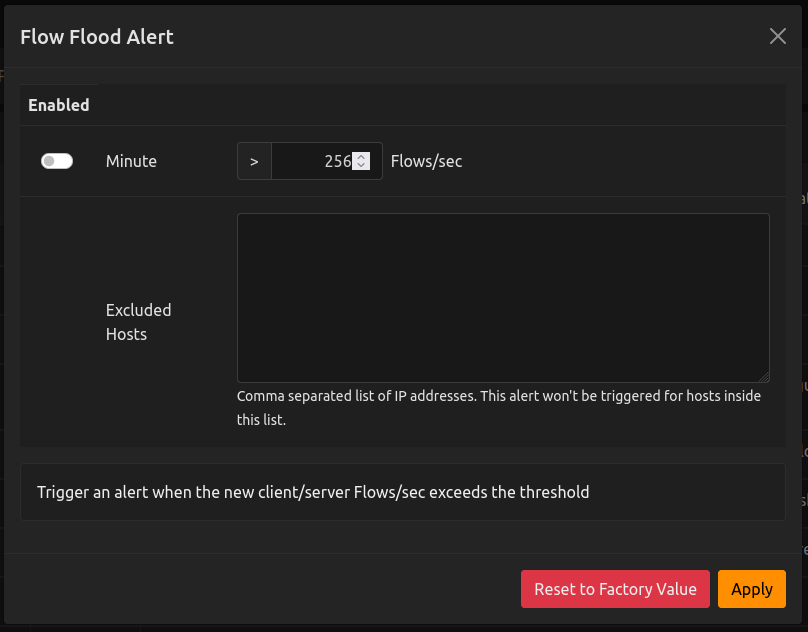
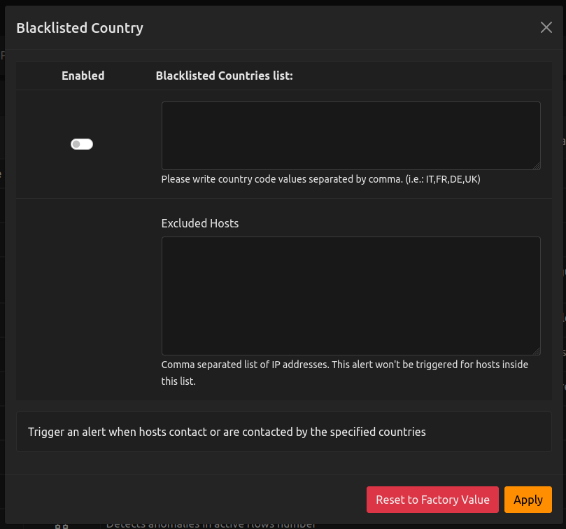

.. _Web GUI:

Checks GUI
################

Checks can define their own configuration and allow the final user
to modify it by providing a specialized GUI.

The GUI is defined into the Check via the :code:`gui` attribute:

.. code:: lua

  local script = {
    default_value = {
      operator = "gt",
      threshold = 50,
    },

    ...

    gui = {
      i18n_title = "entity_thresholds.syn_victim_title",
      i18n_description = "entity_thresholds.syn_victim_description",
      input_builder = "threshold_cross",
    }

    ...
  }

The most important GUI attributes are:

  - :code:`i18n_title`: (mandatory) a localization string for the title of the
    element
  - :code:`i18n_description`: (mandatory) a localization string for the
    description of the element
  - :code:`input_builder`: defines the template which will be used to
    render the GUI. If it's not defined, the user will only be able to
    enable or disable the checks without any additional configuration.

The :code:`default_value` can be used to define a default for the configuration. Its format
depends on the `input_builder` used, see below for more information.

Input Builders
--------------

Input builders defines which template to use to render the GUI. The currently
available input builders are:

- :code:`threshold_cross`: allow the user to define a threshold and an operator (">" or "<")
- :code:`items_list`: allows the user to insert a list of items
- :code:`long_lived`: template specialized for the long lived flows plugin
- :code:`elephant_flows`: template specialized for the elephant flows plugin
- :code:`flow_mud`: template specialized for the `flow MUD plugin`_

Currently the user is limited to the above input builders but in the future it will be
possible to define new input builders. The input builders backend code can be found in `checks_templates.lua`_
whereas the frontend code can be found in `scripts-list-utils.js`_.

Here is a description of the most useful input builders.

Threshold Cross
---------------

The Threshold Cross input builder allows the user to configure a threshold for a specific
metric (e.g. the DNS traffic) for one or more granularities. Each granularity can be separately
enabled.

When the `threshold_cross` input builder is used, the check can specify some additional parameters into
the :code:`gui` section:

- :code:`field_max`: max value for the threshold field
- :code:`field_min`: min value for the threshold field
- :code:`field_step`: step value for the threshold field
- :code:`field_operator`: can be used to fix a specific threshold operator: :code:`gt`
  for the ">" operator, :code:`lt` for the "<" operator
- :code:`i18n_field_unit`: localization string to be displayed after the threshold
  field (e.g. "Bytes" in the example above). `checks.field_units` provides some commonly used values.

Here is an example showing the usage of the `threshold_cross` input builder:

.. code:: lua

  local script = {
    ...

    gui = {
      i18n_title = "entity_thresholds.syn_victim_title",
      i18n_description = "entity_thresholds.syn_victim_description",
      input_builder = "threshold_cross",

      i18n_field_unit = checks.field_units.syn_sec, -- Syn/Sec
      field_max = 65535,                                  -- Max 65535 Syn/Sec
      field_min = 1,                                      -- Min 1 Syn/Sec
      field_operator = "gt";                              -- Only ">" will be shown
    }
  }

  function script.hooks.min(params)
    local value = host.getSynFlood()["hits.syn_flood_victim"] or 0

    -- Check if the configured threshold is crossed by the value and possibly trigger an alert.
    alerts_api.checkThresholdAlert(params, alert_consts.alert_types.alert_tcp_syn_flood, value)
  end

  ..

The current script configuration is available into `params.check_config`:

- :code:`operator`: contains :code:`gt` for ">" or :code:`lt` for "<"
- :code:`threshold`: contains the numeric value for the threshold

This information is internally used by `alerts_api.checkThresholdAlert` to
check if the threshold is currently crossed and in such case trigger a threshold cross alert.

Items List
----------

This input builder allows the user to insert a list of items. The items
must be separated by a comma.

When using such input builder, the user
script must also specify the :code:`item_list_type`: parameter into the
:code:`gui` section, which tells ntopng the format of each item for the validation.

Here is a list supported types:

- :code:`country`: each item is a country code (e.g. "IT")
- :code:`proto_or_category`: each item is a protocol (e.g. `Youtube`) or
  category (e.g. `SocialNetworks`)
- :code:`string`: each item is a single word (e.g. "www.ntop.org")
- :code:`device_type`: each item is a device type (e.g. "Printer")

Here is an example showing the usage of the `items_list` input builder
to check if flow is coming/going to one of the configured blacklisted
countries:

.. code:: lua

  local script = {
    ...

    gui = {
      i18n_title = "alerts_dashboard.blacklisted_country",
      i18n_description = "alerts_dashboard.blacklisted_country_descr",
      input_builder = "items_list",
      item_list_type = "country",
    }

    ...
  }

  function script.hooks.protocolDetected(now, conf)
    local cli_country = flow.getClientCountry()
    local srv_country = flow.getServerCountry()

    -- conf.items contains the list of countries that the user has
    -- configured from the GUI
    for _, country in pairs(conf.items) do
      if (country == cli_country) or (country == srv_country) then
        print("Blacklisted country found! " .. country)
      end
    end
  end

  ...

As shown into the example, the configured list of countries can be found
in :code:`conf.items`.

.. _`scripts-list-utils.js`: https://github.com/ntop/ntopng/blob/dev/httpdocs/js/config_callbacks/scripts-list-utils.js
.. _`checks_templates.lua`: https://github.com/ntop/ntopng/blob/dev/scripts/lua/modules/checks_templates.lua
.. _`flow MUD plugin`: https://github.com/ntop/ntopng/tree/dev/scripts/plugins/mud
