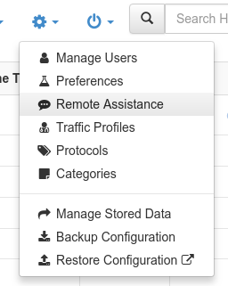
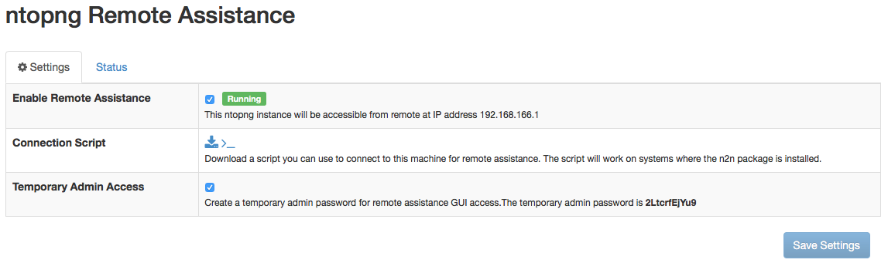
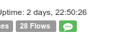
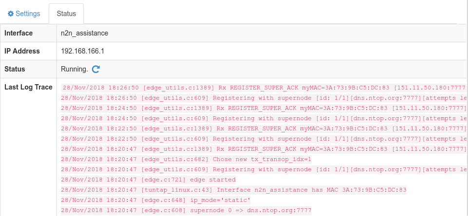

Remote Assistance
=================

A common problem when requesting remote assistance is to get access to the user machine.
Usually the user machine is behind a NAT or a firewall which blocks incoming connections,
and it a problem for the non-technical user to setup port forwarding and firewall rules.
Remote access is available for user support. It is handy whenever you need for instance to access your ntopng behind a firewall and you do not want to setup a VPN. As n2n relies on the concept of supernode, ntop has setup on your behalf a public supernode for avoid you doing that. However we encourage you to setup your private supernode and configure it in ntopng preferences, so that you can have a fully private remote access infrastructure.

.. warning::
   Enabling the remote assistance you enable people to connect to your ntopng host by providing them the right credentials. The ntop team has no access to your ntopng instance unless you provide them credentials.

   
In order to ease remote assistance, ntopng integrates n2n_ and provides a web console
to enable remote access. This console is available only for distributions where the n2n package
is available. Please refer to http://packages.ntop.org for more information about the n2n package.

.. warning::
  ntopng assumes that certain script files are placed in certain locations, as installed by the ntopng prebuild package.
  This means that, if ntopng is compiled from source, special care must be taken to place these files at the correct locations
  in order to make remote assistance available.

The console can be accessed from the `Remote Assistance` menu entry:

When the remote assistance is enabled, the machine running ntopng will take part to a dedicated virtual network. 

In order to receive remote assistance, you need to download the *Connection Script* available in the same page,
and provide it to the support team.

.. warning::

  The connection script contains connection credentials so it must be sent only to trusted peers

If you need to provide assistance, you should run the script in your Linux machine with the n2n package installed 
(other platforms such as Windows and OSX can also be supported on request). You will take part to the machine 
virtual network **bypassing NAT and firewalls**. The ntopng instance will be available at IP address 192.168.166.1

The script can be run from the terminal as follows:

.. code:: bash

    chmod +x n2n_assistance.sh
    ./n2n_assistance.sh

If the `Temporary Admin Access` flag is checked, you enable a temporary access as admin (this to avoid disclosing the admin credentials to third parties). If this option is not enabled, the regular admin (or any other user) password has to be provided to the remote end for connection.

.. warning::

   - ntop is not responsible for any damage, security violation or vulnerability caused by enabling remote assistance
   - It is the user's responsibility to ensure that the network security policies allow virtual networks creation
   - Enabling remote assistance you grant access to the host where ntopng is running (i.e. it is an encrypted VPN) so the remote host is also accessible (i.e. you can SSH to it for instance) and not just the ntopng web interface.

Remote Assistance Status
------------------------

As long as the remote assistance is active, an icon will be displayed in the top status bar:

By clicking on it, it's possible to check the service status and log.

Security Considerations
-----------------------

Here are some consideration about the remote assistance security:

- The supernode cannot decode the virtual network traffic as it's encrypted.
- When the ntopng service is stopped, the remote assistance will be stopped too.
- The remote assistance service must be manually disabled from the ntopng GUI in the Settings panel, when remote assistance is concluded, otherwise it is automatically disabled after 24 hours.
- Traffic forwarding via the virtual network interface (i.e. the remote host where ntopng is running will not route traffic via n2n) is disabled to increase security

.. _n2n: https://github.com/ntop/n2n
