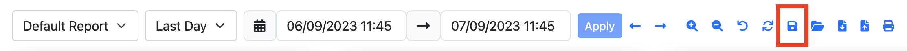

.. _Reports:

Traffic Reports
===============

When ClickHouse is enabled, a Reports page becomes available in the ntopng web GUI under the Dashboard > Reports menu.

This section describes how to use this functionality to build traffic reports on demand or automatically/periodically and get notified about their availability.

.. note::

   ClickHouse support including Historical Flows Explorer and Reports is only available in ntopng Enterprise M or above.

The picture below shows an example of report generate by ntopng:

  Report Preview

ntopng implements a flexible dashboarding engine that allows you to define custom reports by means of graphical components and data sources.
This means that multiple templates can be defined, according to the user requirements, to build reports with charts and data which is meaningful
for the specific user, network and use case. A dropdown at the top of the Reports page lets you select the desired template to be used to build
the report out of those available.

  Report Templates

The report is build using traffic information in a selected time frame. It is possible to select an arbitrary time interval by using the
dropdown and the range picker at the top of the Reports page.

  Report Time Interval

Save/Open Reports on ntopng
---------------------------

After selecting a report template and a time window, a report is generated and displayed. It is possible to save it by clicking on the
Save button.

  Report Save Button

A dialog will ask for a name for the report. By clicking Save, the report is stored on disk the same machine running ntopng as a JSON file
containing all the information required to reload the same report in future for further analysis.

  Report Save

In order to reload a previously-saved report, an Open button is available.

  Report Open Button

A dialog will let you select the report, out of those previously saved in ntopng.

.. note:: 

   In case of multiple users, reports generated by an administrator is visible by all administrators, instead reports generated by a non-privileged user is visible only to
   the same user (and traffic visibility restrictions will apply according to the configured user permissions), and the non-privileged user cannot see reports generated by administrators.

Through the same dialog it is also possible to delete a report (the selected one) or all reports.

  Report Open and Delete

.. warning::

   Reports are automatically deleted after some time according to the configured data retention. Please read the Data Retention section for further information.

Backup/Load Reports Locally
---------------------------

In addition to saving reports on the machine running ntopng, it is also possible to download a report locally to keep a backup or forward it to someone else.
In order to dowload a report backup click on the Download button. This will download a JSON file containing all the information required to reload the report
on the same or a different ntopng installation for visualization.

  Report Download Button

In order to reload a report from a JSON file previously downloaded, click on the Upload button.

  Report Upload Button

A dialog allows you to upload a report backup in JSON format and visualize it in ntopng. Please note this report is just visualized, no copy is stored on
the machine running ntopng. However it is also possible to save it by clicking on the Save button as described in the previous section. 

  Report Upload

Print Report (PDF)
------------------

A print functionality is also available to actually print or generate a PDF from a reports, this is possible by clicking on the Print button.

  Report Print Button

When printing a report the rendering engine does its best to fit all the graphical components in standard printing formats (e.g. A4).

  Report Print

Automatic Reports and Notifications
-----------------------------------

In addition to the manual Report generation, automatic reports can also be enabled in ntopng. This means that ntopng can build
for instance daily reports every night, with traffic information for the last 24h. In order to enable this, a global setting is
available under Settings -> Preferences -> Reports -> Daily Reports Generation. 

  Automatic Report Preference

By enabling Daily Reports Generation, ntopng generates a report for every interface, every day. It is possible to disable automatic
reports on selected interfaces through the Interface -> Details -> Settings -> Create Daily Reports setting, which is enabled by
default after enabling the global setting.

  Automatic Report Interface Preference

When a new report has been generated and it is available, ntopng can also send a notification to inform the user, e.g. by sending an
email. In order to enable notifications, a Notification Endpoint and Recipient should be configured. In the Recipient configuration,
Traffic Reports should be selected as Notification Type.

  Report Notification Recipient

Below you can find an example of email notification sent by ntopng to notify the user about the availability of a new daily report,
with a direct link to go to the actual report.

  Report Email Notification Preview

Data Retention
--------------

All the reports stored on ntopng, both manually or automatically created, can be automatically deleted by ntopng after some time
in order to implement a data retention policy and avoid filling the disk due to the number of reports growing undefinitely.
There is a default data retention time configured in ntopng, this can be changed from the  Settings -> Preferences -> Reports -> 
Reports Data Retention section.

  Report Data Retention Preference

