Reports Editor
==============

The reports editor allows you to build custom reports by creating new templates.
A collection of widgets is available, they can be combined to define a template.

The Dashboard -> Traffic Report page includes a button in the toolbar to create
a new template, as shown in the picture below.

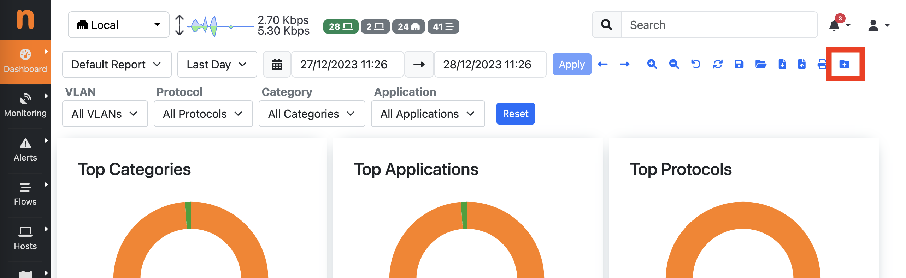

  New Template Button

A dialog appears to configure the Template name.

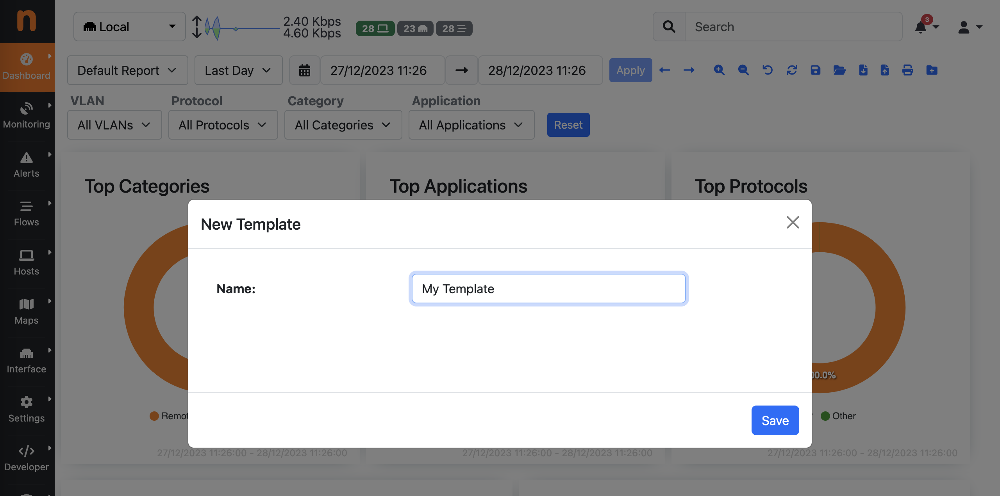

  New Template Dialog

After creating the new template, it becomes available and can be selected
from the reports selector dropdown. 

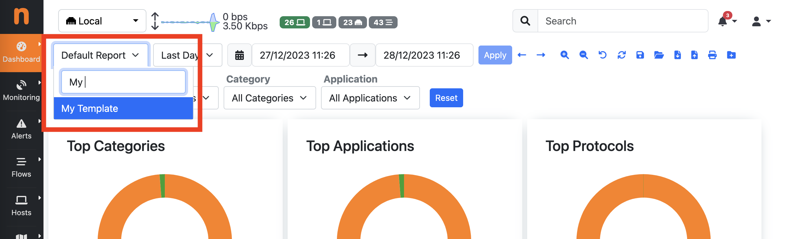

  Report Template Selector

By seleting a new template, an empty report is shown as the template is
initially empty and need to be customized.

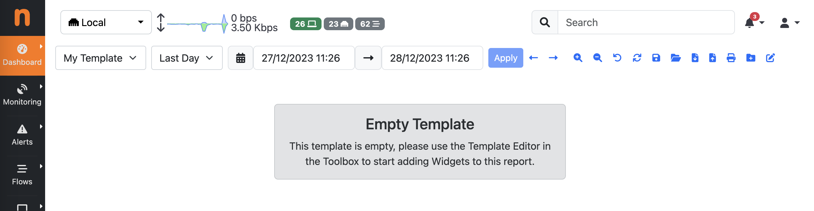

  Empty Report Template

A Template Editor toggle is available in the toolbox when a custom
template is selected. This allows you to enter the edit mode.

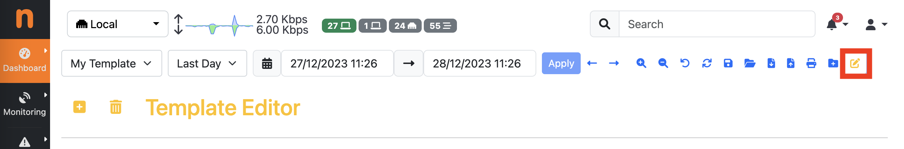

  Report Editor Button

When entering the edit mode, a new toolbox for the Template Editor appears.
The toolbox includes buttons for adding Widgets to the template, or deleting
the template. By clicking on the Add Widget button, a dialog appears with a
list of available Widgets that can be added to the template.

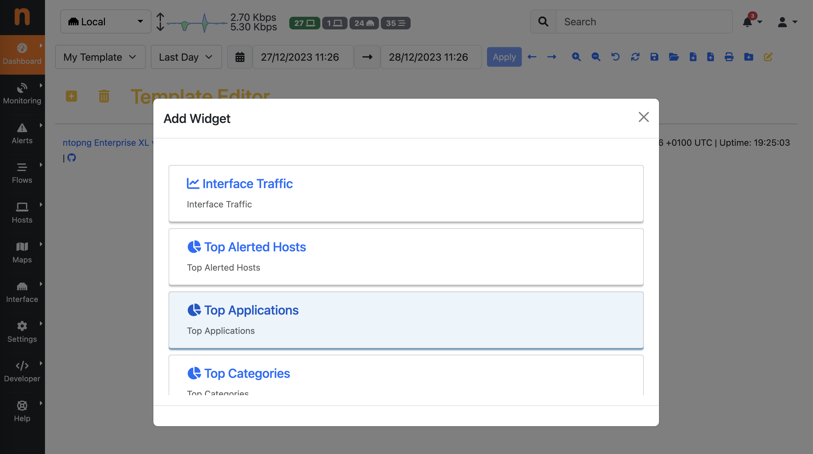

  Report Widgets

When adding a Widget, this is appended to the template, with a default configuration.

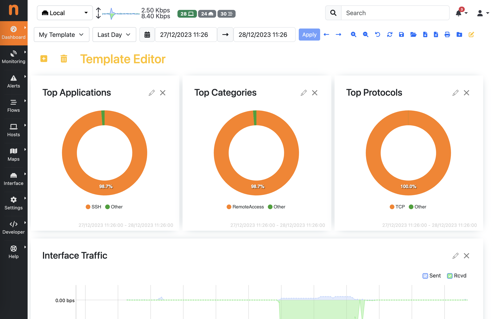

  Report Template

Widget can be organized and sorted by dragging and dropping them around.

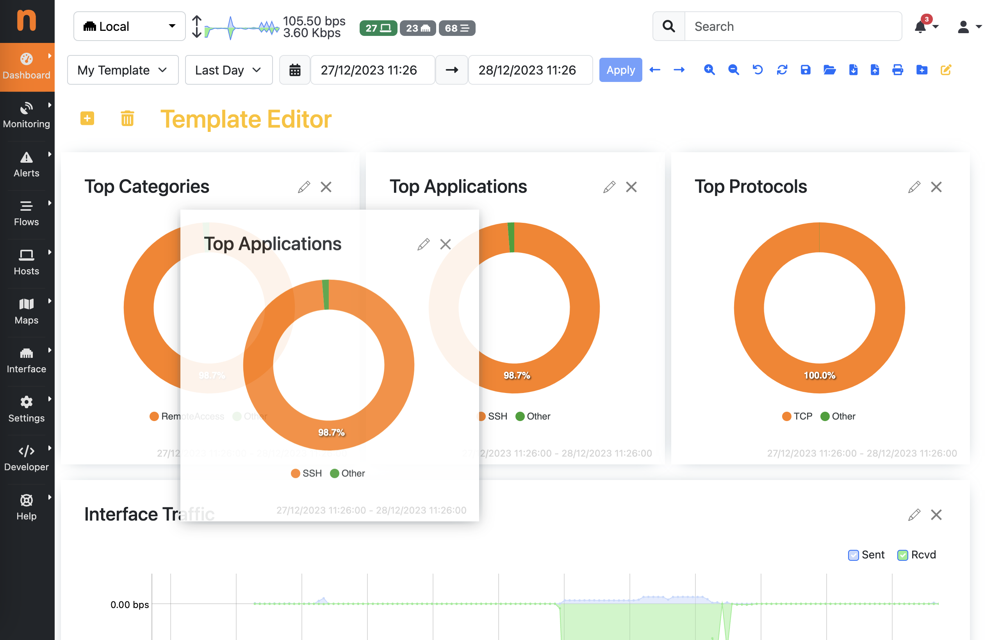

  Widgets Drad and Drop

In edit mode, a few controls appear on the widgets themselves, including buttons
for editing the widget configuration or removing them from the template.

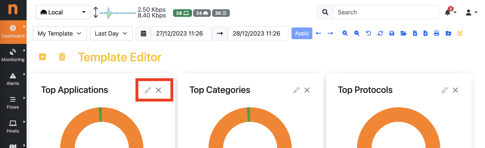

  Widget Actions in Edit Mode

By clicking on the edit button on a widget, it is possible to configure them,
including changing:

- displayed title
- widget size (heigth and width)
- time reference (the Time Offset is used to show traffic information with a time shift with respect to the time selected for the report, e.g. show traffic information 1 week ago, to compare it with the current traffic)

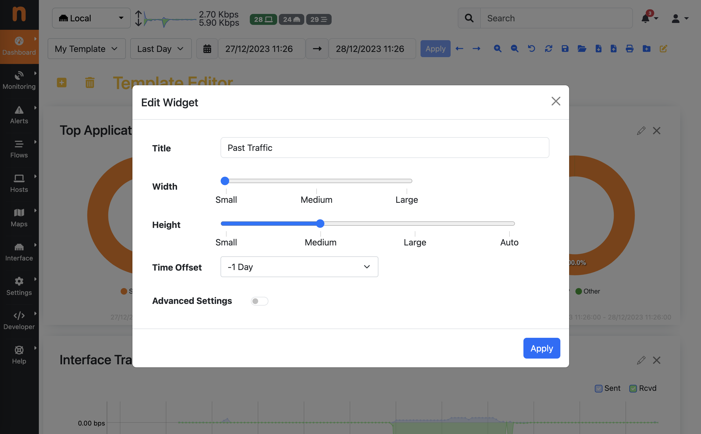

  Widget Settings

An Advanced Settings toggle is also available. This allows to deeply customize
the content of the Widget, by changing settings including the REST API URL and
parameters, which are encoded in JSON format.

Special tokens are also supported in the JSON configuration to dynamically pass
arguments to the widgets, e.g. $IFID$ is dynamically replaced with the current
interface ID selected in ntopng while rendering the report.

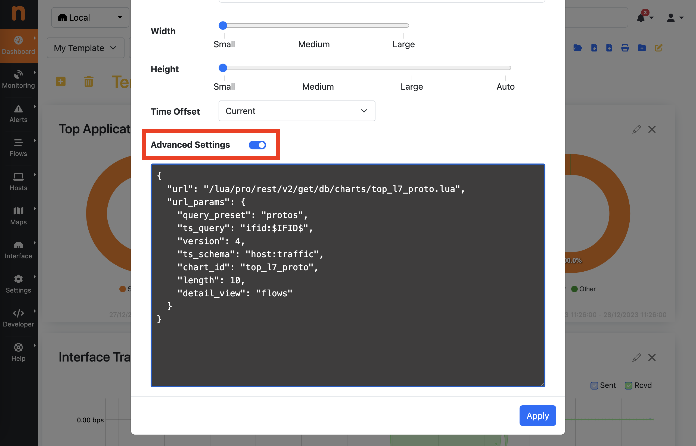

  Widget Advanced Settings

Any change to the template is automatically saved (there is no Save button in
the template editor).

