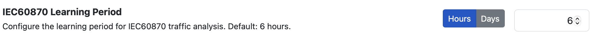
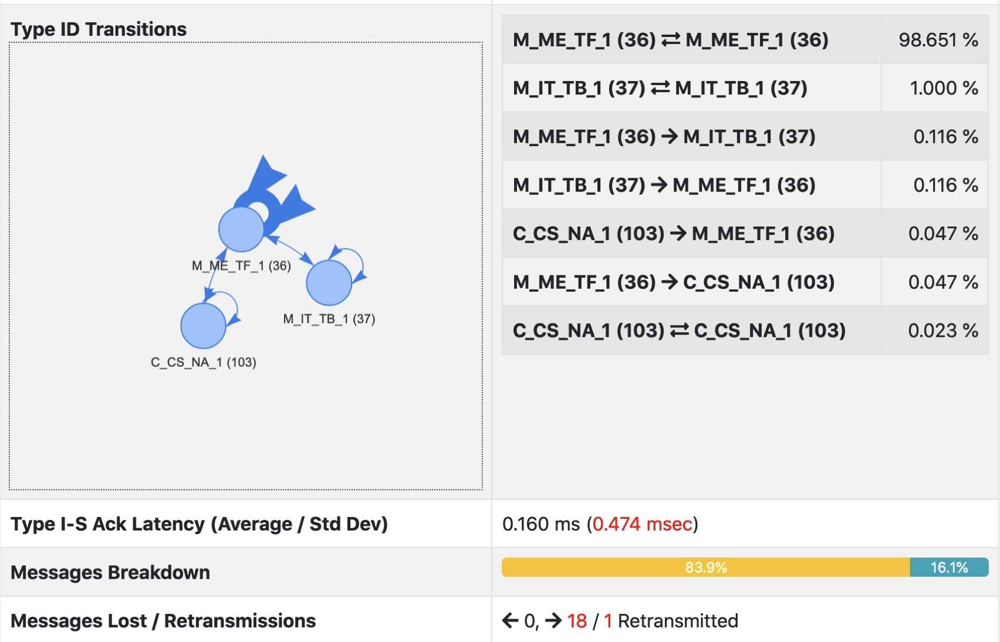

IEC 60870-5-104
===============

`IEC 60870-5-104 <https://en.wikipedia.org/wiki/IEC_60870-5>`_ is a protocol used mostly in electrical engineering and power system automation. This protocol is detected by ntopng and dissected overtime by detecting changes in behaviour for each network flow.

For each IEC flow, ntopng dissects flow communications

.. figure:: ../img/IEC_Flows.png
  :align: center
  :alt: IEC Flows Detection

and reports in realtime traffic statistics. In addition to this, ntopng learns the protocol transitions as configured in preferences, this as each IEC flow has different peculiarities and transitions for which a model is created.

For the specified duration, ntopng builds a model for each flow in order to understand how it behaves overtime. When the learning period for a flow is over, ntopng matches the traffic agains the model and triggers an alert whenever

IEC 60870-5-104 Checks
----------------------

Under the bahevioural checks page, you can enable specific protocol checks.

- IEC Invalid Command Transition

  The transitions number is invalid (C-C > 10 and M-M/M-C/C-< == 0)
  
- IEC Invalid Transition

  An alert is triggered when after the IEC learning perios, a new transiion (nor previously observed) is detected.
  
- IEC Unexpected TypeID

  In the behavioural check it is possible to specify the list of IEC 60870-5-104 TypeIDs that are allowed. Any other TypeIDs will trigger an alert.

You can `read more here <https://www.ntop.org/ntopconf2022/pdf/Scheu.pdf>`_ for more information,
