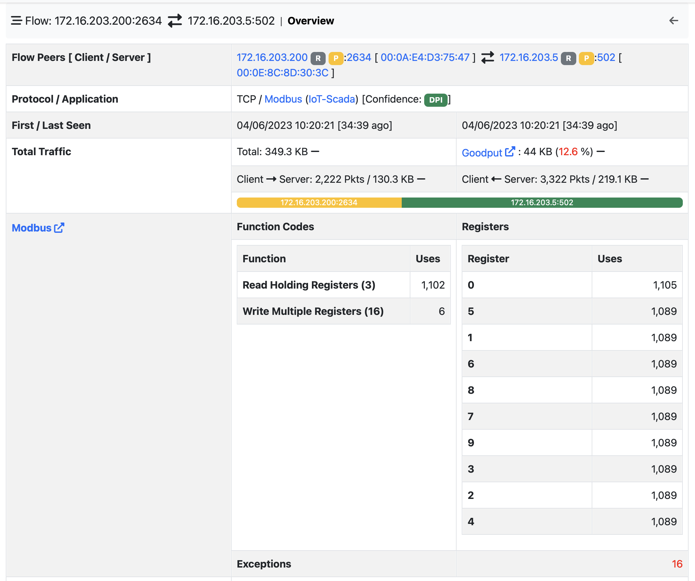

ModbusTCP
=========

`ModbusTCP <https://www.prosoft-technology.com/kb/assets/intro_modbustcp.pdf>`_ is a variant of the original `Modbus <https://en.wikipedia.org/wiki/Modbus>`_ protocol used for communications over TCP/IP.

ntopng detected Modbus flows and dissects them buiding an internal flow representation.

