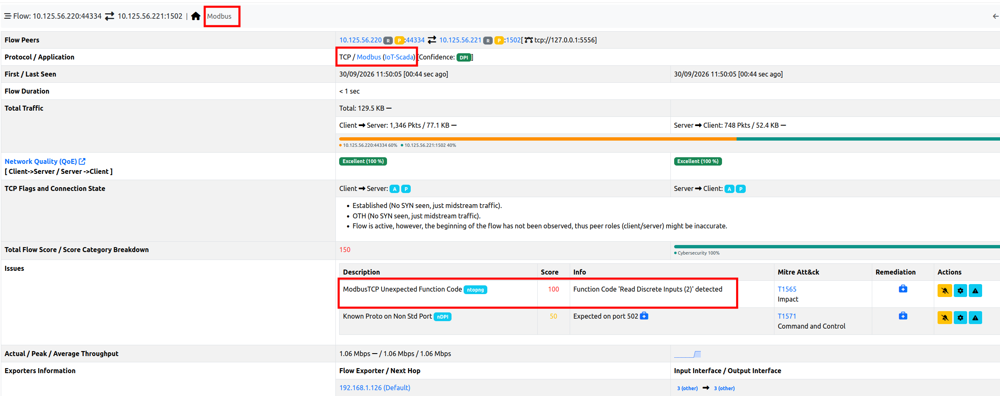
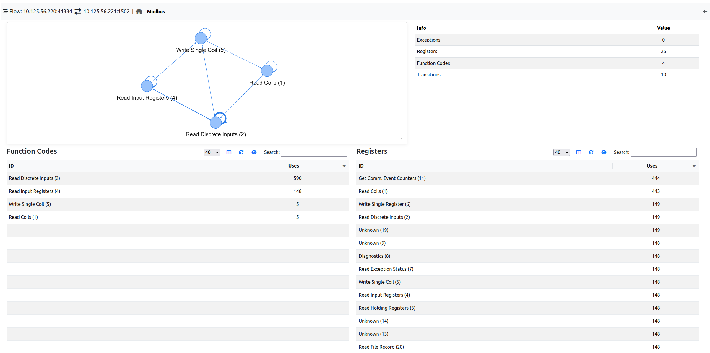
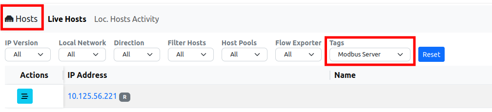
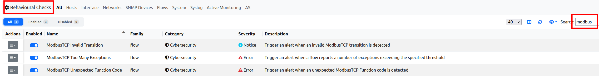
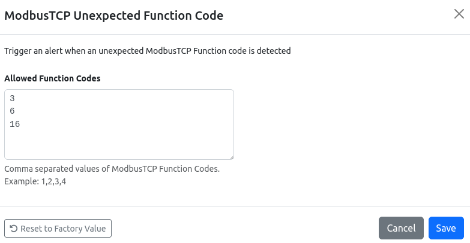
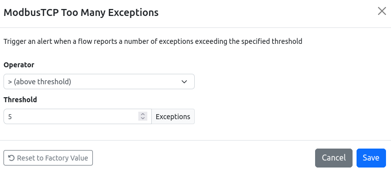
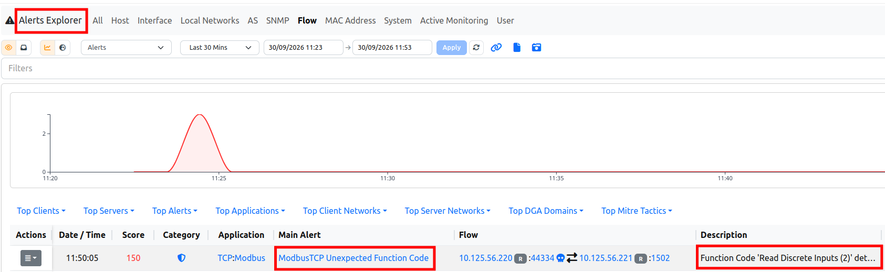

ModbusTCP
=========

.. note::

  This feature is available only from Enterprise L license.

`ModbusTCP <https://www.prosoft-technology.com/kb/assets/intro_modbustcp.pdf>`_ is a variant of the `Modbus <https://en.wikipedia.org/wiki/Modbus>`_ protocol used for communications over TCP/IP. It is widely used by HMIs, SCADA systems and engineering stations to read and write the data (coils, discrete inputs, input and holding registers) of PLCs and other field devices. The default port is TCP 502; ntopng detects Modbus traffic also on TCP port 1502.

For each Modbus flow, ntopng keeps track of the function codes used, of the transitions between them, of the registers accessed and of the exceptions. ntopng shows this information in the flow details, stores it together with the flow and uses it to detect unexpected behaviours.

Flow Information
----------------

Modbus flows are reported in the flows list with the :code:`TCP:Modbus` application protocol. When opening the details of a Modbus flow, the flow overview reports the protocol and, in the top bar, an additional *Modbus* tab. The *Issues* section lists the alerts triggered by the flow (see `Behavioural Checks`_ below).

  Modbus Flow Overview

The *Modbus* tab contains the Modbus information of the flow:

  Modbus Flow Details

- **Transitions graph** (top left): each node is a function code used in the flow, and each arrow is a transition from a function code to the next one. The more transitions, the thicker the arrow. Loops on the same node mean that consecutive messages have the same function code (e.g. a request and its response, or the same request repeated over time by a polling HMI). The graph can be zoomed in/out with the mouse wheel and moved by dragging it.
- **Summary** (top right): the number of *Exceptions* reported for the flow, and the number of distinct *Registers*, *Function Codes* and *Transitions* observed.
- **Function Codes** (bottom left): the list of function codes used in the flow, with the number of times (*Uses*) each of them has been used.
- **Registers** (bottom right): the list of registers accessed in the flow, with the number of times (*Uses*) each of them has been accessed. Only the register addresses are reported, not the values read or written.

A Modbus exception is a response by which the device reports that it could not execute a request (e.g. because the requested function or address is not supported).

Function codes are reported with their name and their numeric (decimal) value, e.g. :code:`Read Coils (1)`. These are the function codes known by ntopng; other codes are reported as :code:`Unknown (<code>)`.

.. list-table::
  :header-rows: 1
  :widths: 15 35 50

  * - Code
    - Name
    - Description
  * - 1
    - Read Coils
    - Read of the status of coils (discrete outputs)
  * - 2
    - Read Discrete Inputs
    - Read of the status of discrete inputs
  * - 3
    - Read Holding Registers
    - Read of holding registers
  * - 4
    - Read Input Registers
    - Read of input registers
  * - 5
    - Write Single Coil
    - Write of a single coil
  * - 6
    - Write Single Register
    - Write of a single holding register
  * - 7
    - Read Exception Status
    - Read of the device exception status
  * - 8
    - Diagnostics
    - Diagnostic functions (e.g. communication tests, counters reset)
  * - 11
    - Get Comm. Event Counters
    - Read of the communication event counter
  * - 12
    - Get Comm. Event Log
    - Read of the communication event log
  * - 15
    - Write Multiple Coils
    - Write of multiple coils
  * - 16
    - Write Multiple Registers
    - Write of multiple holding registers
  * - 17
    - Report Slave ID
    - Read of the device identification and status
  * - 20
    - Read File Record
    - Read of file records
  * - 21
    - Write File Record
    - Write of file records
  * - 22
    - Mask Write Register
    - Modification of a holding register through AND/OR masks
  * - 23
    - Read Write Register
    - Write and read of multiple registers in a single transaction
  * - 24
    - Read FIFO Queue
    - Read of a FIFO queue of registers
  * - 43
    - Encap. Interface Transport
    - Encapsulated interface (e.g. read of the device identification)
  * - 90
    - Unity (Schneider)
    - Schneider Electric proprietary function, used e.g. by the programming software
  * - 100
    - Scattered Holding Reg. Read
    - Proprietary function to read non-contiguous holding registers

In the example above, an HMI polls the device by reading its discrete inputs, input registers and coils (:code:`Read Discrete Inputs`, :code:`Read Input Registers`, :code:`Read Coils`), and occasionally writes a coil (:code:`Write Single Coil`).

The Modbus information is also available for the historical flows when flows are dumped to ClickHouse (see :ref:`Historical Flows <Historical Flows>`): the historical flow details report the same *Modbus* tab.

Finally, the server of a Modbus flow (i.e. the PLC or field device) is marked with the *Modbus Server* tag (see :ref:`Tags`). The tag can be used, for instance, to list all the Modbus devices in the *Hosts* page, by selecting *Modbus Server* in the *Tags* filter:

  Modbus Server Tag

Behavioural Checks
------------------

The Modbus information is used by three flow behavioural checks, available in *Settings* → *Behavioural Checks* (type :code:`modbus` in the search box to list them). All of them are disabled by default.

  Modbus Behavioural Checks

Configuration
~~~~~~~~~~~~~

Each check is enabled with its toggle, and configured by clicking on its actions button.

ModbusTCP Unexpected Function Code
^^^^^^^^^^^^^^^^^^^^^^^^^^^^^^^^^^

Triggers an alert when a flow uses a function code that is not in the list of the allowed function codes. The alert is triggered the first time the function code is used in the flow. Codes must be specified as decimal values (hexadecimal values are not supported), one per line or comma separated.

  ModbusTCP Unexpected Function Code Configuration

By default, the allowed function codes are :code:`3` (Read Holding Registers), :code:`6` (Write Single Register) and :code:`16` (Write Multiple Registers). The list should be tailored to the network, by allowing the function codes normally used by its HMIs and SCADA systems; for instance:

- In the example above, the HMI also reads coils, discrete inputs and input registers, and writes coils: allowing only the default codes, an alert is triggered for :code:`Read Discrete Inputs (2)`. To consider this traffic as legitimate, allow:
  :code:`1,2,3,4,5,6,15,16`.
- In a network where the devices are only read (e.g. by a monitoring system), allow only the read function codes, so that any write is reported:
  :code:`1,2,3,4`.

Function codes such as :code:`8` (Diagnostics) or :code:`90` (Unity, used by Schneider Electric programming software) are usually not part of the normal operations and are worth being reported.

Note that any function code not in the list (including the ones unknown to ntopng) triggers an alert.

ModbusTCP Too Many Exceptions
^^^^^^^^^^^^^^^^^^^^^^^^^^^^^

Triggers an alert when the number of exceptions reported for a flow reaches the configured threshold (default: 5 exceptions). Many exceptions may indicate a misconfiguration, a malfunction or someone probing the device (e.g. scanning for supported function codes or valid addresses).

  ModbusTCP Too Many Exceptions Configuration

ModbusTCP Invalid Transition
^^^^^^^^^^^^^^^^^^^^^^^^^^^^

Triggers an alert when a flow reports a transition between two function codes that has never been observed before in the flow. For each flow, ntopng first learns the transitions between function codes for a *learning period*; once the learning period is over, any new transition triggers an alert. The learning period is configured in *Settings* → *Preferences* → *OT Protocols* → *ModbusTCP Learning Period* (the preference is visible in the *Expert View*); the default is 6 hours, and the minimum is 1 hour.

.. figure:: ../img/ot_learning_period.png
  :target: ../_images/ot_learning_period.png
  :align: center
  :alt: ModbusTCP Learning Period

  ModbusTCP Learning Period

Alerts
~~~~~~

Modbus alerts are flow alerts: they are reported in the *Alerts Explorer* (under *Flow*) and in the *Issues* section of the flow details.

  Modbus Alerts

The alert description reports the details of the event:

.. list-table::
  :header-rows: 1
  :widths: 35 65

  * - Alert
    - Description (example)
  * - ModbusTCP Unexpected Function Code
    - :code:`Function Code 'Read Discrete Inputs (2)' detected`
  * - ModbusTCP Too Many Exceptions
    - :code:`5 Exceptions`
  * - ModbusTCP Invalid Transition
    - :code:`Read Coils (1) -> Write Single Coil (5)`
