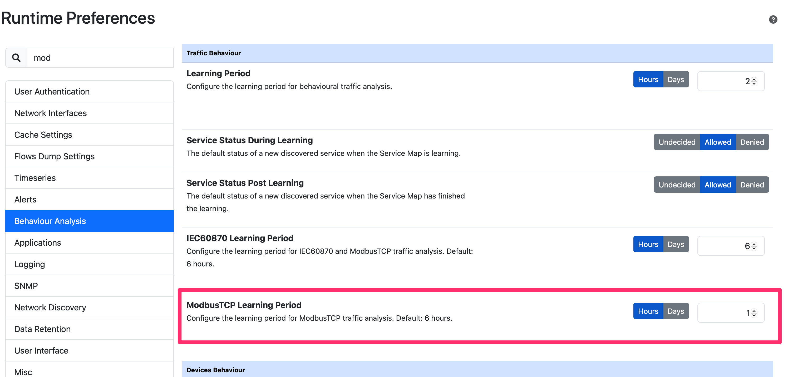

ModbusTCP
=========

.. note::

  This feature is available only from Enterprise L license.

`ModbusTCP <https://www.prosoft-technology.com/kb/assets/intro_modbustcp.pdf>`_ is a variant of the original `Modbus <https://en.wikipedia.org/wiki/Modbus>`_ protocol used for communications over TCP/IP.

ntopng detects Modbus flows and dissects them building an internal flow representation.

For each flow, ntopng keeps track of the function codes uses, exceptions and registers accessed.

ntopng also reports the transitions between function Ids and depicts them graphically: the more transitions the ticker is the line of the graph.

Various behavioural checks are implemented. In particular they trigger an alert when a flow
  - Reports too many (configurable) exceptions that usually indicate issues.
  - Requests an unexpected function code. The network administrator can list the allowed function codes, triggering an alert for other function codes that have been observed but not configured.
  - An unexpected function code transition is reported.

As with IEC 60870-5-104, in ntopng preferences it is possible to specify for how long transitions of a ModbusTCP flows are observed.

During the learning period, ntop keeps track of the transitions and stores them internally. Past the specified learning time, ntopng triggers an alert whenever an invalid transition is observed.

