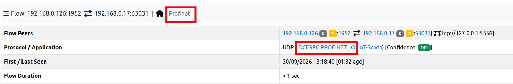
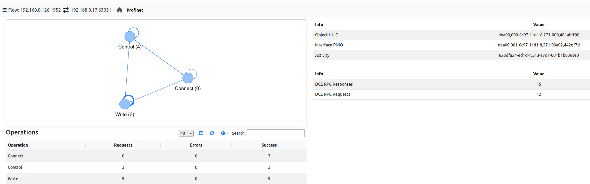
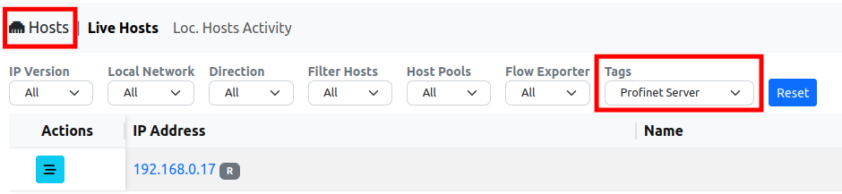
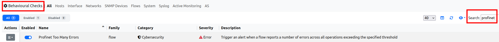

PROFINET
========

.. note::

  This feature is available only when ntopng collects flows from `nProbe <https://www.ntop.org/products/netflow-probes/nprobe/>`_ via ZMQ (see :ref:`UsingNtopngWithNprobe`). PROFINET traffic is dissected by nProbe, which exports the protocol information to ntopng: this information is not available on packet interfaces, where ntopng analyzes the traffic by itself.

`PROFINET <https://en.wikipedia.org/wiki/PROFINET>`_ is an industrial Ethernet standard used to exchange data between IO controllers (e.g. PLCs) and IO devices (e.g. remote IOs, drives, sensors). The cyclic process data is exchanged directly over Ethernet, without IP. The management of the communication between the devices (e.g. establishing a connection, configuring a device, reading diagnostics) is instead based on DCE/RPC over UDP, usually on port 34964: this is the traffic analyzed by nProbe.

For each PROFINET flow, nProbe keeps track of the DCE/RPC operations performed (e.g. Connect, Write, Control), of their outcome and of the transitions between them, and exports them to ntopng. ntopng shows this information in the flow details, stores it together with the flow and uses it to detect unexpected behaviours.

Flow Information
----------------

PROFINET flows are reported in the flows list with the :code:`DCERPC.PROFINET_IO` application protocol. When opening the details of a PROFINET flow, the flow overview reports the protocol and, in the top bar, an additional *Profinet* tab. The *Issues* section lists the alerts triggered by the flow (see `Behavioural Checks`_ below).

  PROFINET Flow Overview

The *Profinet* tab contains the PROFINET information of the flow:

  PROFINET Flow Details

- **Transitions graph** (top left): each node is an operation performed in the flow, and each arrow is a transition from an operation to the next one. The more transitions, the thicker the arrow. Loops on the same node mean that consecutive messages belong to the same operation (e.g. a request and its response, or several consecutive writes). The graph can be zoomed in/out with the mouse wheel and moved by dragging it.
- **Identification** (top right): the DCE/RPC identifiers of the communication:

  - *Object UUID*: the PROFINET object the requests are addressed to; it also encodes the identification of the device;
  - *Interface PNIO*: the PROFINET interface used (e.g. IO device or IO controller interface);
  - *Activity*: the identifier of the DCE/RPC session of the client.

- **DCE/RPC counters** (right): the number of DCE/RPC *Requests* and *Responses* of the flow.
- **Operations** (bottom left): the list of the operations performed in the flow, with the number of *Requests*, and the number of responses reporting an error (*Errors*) or a success (*Success*).

Operations are reported with their name and, in the transitions graph, with their numeric value, e.g. :code:`Write (3)`.

.. list-table::
  :header-rows: 1
  :widths: 15 25 60

  * - Code
    - Operation
    - Description
  * - 0
    - Connect
    - Establishment of an application relationship (AR) between an IO controller and an IO device
  * - 1
    - Release
    - Termination of an application relationship
  * - 2
    - Read
    - Read of data records (e.g. diagnostics, identification and maintenance data) within an application relationship
  * - 3
    - Write
    - Write of data records (e.g. the parameterization of the device) within an application relationship
  * - 4
    - Control
    - Control commands (e.g. end of the parameterization, application ready)
  * - 5
    - Read Implicit
    - Read of data records without an application relationship (e.g. by engineering or diagnostic tools)

In the example above, an IO controller starts up an IO device: it connects to the device (:code:`Connect`), writes its parameters (:code:`Write`) and signals the end of the parameterization (:code:`Control`). Depending on the ports used by the devices, the requests and the responses of an operation can be reported in different flows: this is why, in the example, :code:`Connect` reports successful responses but no requests.

The PROFINET information is also available for the historical flows when flows are dumped to ClickHouse (see :ref:`Historical Flows <Historical Flows>`): the historical flow details report the same *Profinet* tab.

Finally, the server of a PROFINET flow is marked with the *Profinet Server* tag (see :ref:`Tags`). The tag can be used, for instance, to list all the PROFINET devices in the *Hosts* page, by selecting *Profinet Server* in the *Tags* filter:

  Profinet Server Tag

Behavioural Checks
------------------

The PROFINET information is used by one flow behavioural check, available in *Settings* → *Behavioural Checks* (type :code:`profinet` in the search box to list it). The check is disabled by default.

  PROFINET Behavioural Checks

Configuration
~~~~~~~~~~~~~

The check is enabled with its toggle, and configured by clicking on its actions button.

Profinet Too Many Errors
^^^^^^^^^^^^^^^^^^^^^^^^

Triggers an alert when the number of errors reported for a flow reaches the configured threshold (default: 5 errors). The errors are the responses reporting an error, summed across all the operations of the flow (i.e. the *Errors* column of the *Operations* table). Many errors may indicate a misconfiguration (e.g. a device parameterized with a wrong configuration), a malfunction or someone probing the devices.

Alerts
~~~~~~

PROFINET alerts are flow alerts: they are reported in the *Alerts Explorer* (under *Flow*) and in the *Issues* section of the flow details.

The alert description reports the details of the event:

.. list-table::
  :header-rows: 1
  :widths: 35 65

  * - Alert
    - Description (example)
  * - Profinet Too Many Errors
    - :code:`5 Errors`
