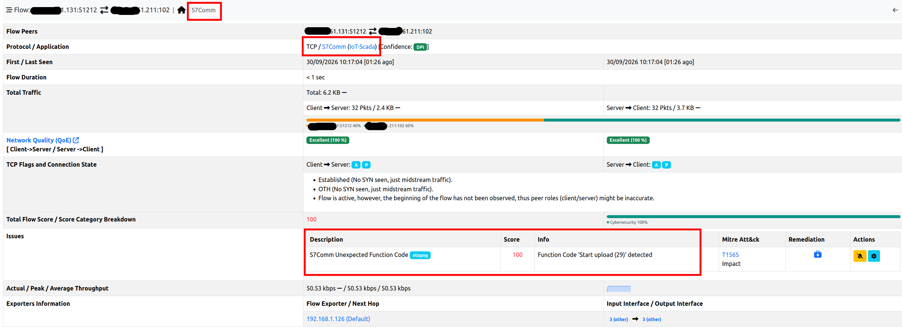
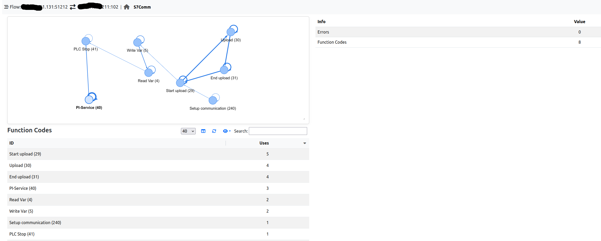
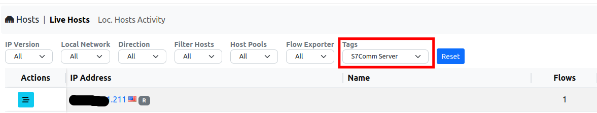
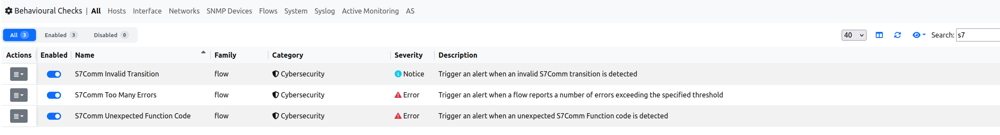
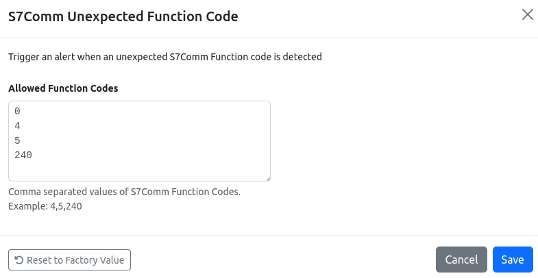
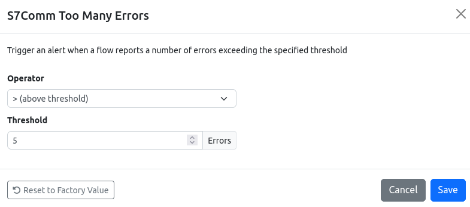
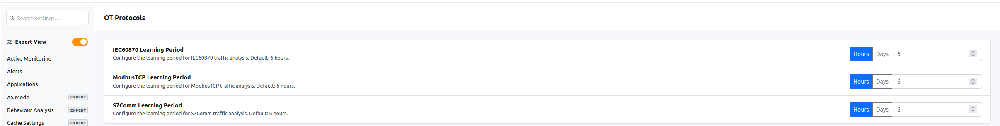
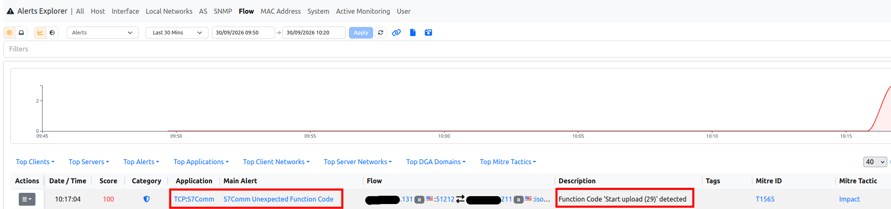

S7Comm
======

.. note::

  This feature is available only when ntopng collects flows from `nProbe <https://www.ntop.org/products/netflow-probes/nprobe/>`_ via ZMQ (see :ref:`UsingNtopngWithNprobe`). S7Comm traffic is dissected by nProbe, which exports the protocol information to ntopng: this information is not available on packet interfaces, where ntopng analyzes the traffic by itself.

`S7Comm <https://wiki.wireshark.org/S7comm>`_ (S7 Communication) is the Siemens proprietary protocol used by SIMATIC S7 PLCs to talk with HMIs, SCADA systems and engineering stations (e.g. to read and write PLC variables, upload and download programs, start and stop the PLC). It runs over ISO-on-TCP, usually on TCP port 102.

For each S7Comm flow, nProbe keeps track of the function codes used, of the transitions between them and of the errors, and exports them to ntopng. ntopng shows this information in the flow details, stores it together with the flow and uses it to detect unexpected behaviours.

Flow Information
----------------

S7Comm flows are reported in the flows list with the :code:`TCP:S7Comm` application protocol. When opening the details of an S7Comm flow, the flow overview reports the protocol and, in the top bar, an additional *S7Comm* tab. The *Issues* section lists the alerts triggered by the flow (see `Behavioural Checks`_ below).

  S7Comm Flow Overview

The *S7Comm* tab contains the S7Comm information of the flow:

  S7Comm Flow Details

- **Transitions graph** (top left): each node is a function code used in the flow, and each arrow is a transition from a function code to the next one. The more transitions, the thicker the arrow. Loops on the same node mean that consecutive messages have the same function code (e.g. a request and its response). The graph can be zoomed in/out with the mouse wheel and moved by dragging it.
- **Summary** (top right): the number of *Errors* reported for the flow and the number of distinct *Function Codes* used.
- **Function Codes** (bottom left): the list of function codes used in the flow, with the number of times (*Uses*) each of them has been used.

Function codes are reported with their name and their numeric (decimal) value, e.g. :code:`Start upload (29)`. These are the function codes known by ntopng; other codes are reported as :code:`Unknown (<code>)`.

.. list-table::
  :header-rows: 1
  :widths: 15 35 50

  * - Code
    - Name
    - Description
  * - 0
    - CPU services
    - CPU functions (e.g. reading diagnostics or system information)
  * - 1
    - Mode transition
    - Change of the CPU operating mode
  * - 4
    - Read Var
    - Read of PLC variables
  * - 5
    - Write Var
    - Write of PLC variables
  * - 26
    - Request download
    - Start of a block download (engineering station → PLC)
  * - 27
    - Download block
    - Block download
  * - 28
    - Download ended
    - End of a block download
  * - 29
    - Start upload
    - Start of a block upload (PLC → engineering station)
  * - 30
    - Upload
    - Block upload
  * - 31
    - End upload
    - End of a block upload
  * - 40
    - PI-Service
    - Program invocation (e.g. PLC start, block compression)
  * - 41
    - PLC Stop
    - Stop of the PLC
  * - 240
    - Setup communication
    - Session setup, sent at the beginning of each connection

In the example above, an engineering station uploads some blocks from the PLC (:code:`Start upload` → :code:`Upload` → :code:`End upload`), reads and writes some variables, stops the PLC (:code:`PLC Stop`) and restarts it (:code:`PI-Service`).

The S7Comm information is also available for the historical flows when flows are dumped to ClickHouse (see :ref:`Historical Flows <Historical Flows>`): the historical flow details report the same *S7Comm* tab.

Finally, the server of an S7Comm flow (i.e. the PLC) is marked with the *S7Comm Server* tag (see :ref:`Tags`). The tag can be used, for instance, to list all the PLCs in the *Hosts* page, by selecting *S7Comm Server* in the *Tags* filter:

  S7Comm Server Tag

Behavioural Checks
------------------

The S7Comm information is used by three flow behavioural checks, available in *Settings* → *Behavioural Checks* (type :code:`s7` in the search box to list them). All of them are disabled by default.

  S7Comm Behavioural Checks

Configuration
~~~~~~~~~~~~~

Each check is enabled with its toggle, and configured by clicking on its actions button.

S7Comm Unexpected Function Code
^^^^^^^^^^^^^^^^^^^^^^^^^^^^^^^

Triggers an alert when a flow uses a function code that is not in the list of the allowed function codes. The alert is triggered the first time the function code is used in the flow. Codes must be specified as decimal values (hexadecimal values are not supported), one per line or comma separated.

  S7Comm Unexpected Function Code Configuration

By default, the allowed function codes are :code:`0` (CPU services), :code:`4` (Read Var), :code:`5` (Write Var) and :code:`240` (Setup communication), i.e. the functions normally used by HMIs and SCADA systems to monitor and control the process. With this configuration, an alert is triggered whenever the program of a PLC is uploaded or downloaded, or whenever a PLC is stopped or started. The list can be tailored to the network; for instance:

- If program uploads and downloads are part of the normal operations, and only PLC stops and starts must be reported, also allow the upload/download function codes:
  :code:`0,4,5,26,27,28,29,30,31,240`.
- In a network where the PLCs are only read (e.g. by a monitoring system), remove :code:`5` (Write Var), so that any write to a PLC is reported:
  :code:`0,4,240`.

Note that any function code not in the list (including the ones unknown to ntopng) triggers an alert.

S7Comm Too Many Errors
^^^^^^^^^^^^^^^^^^^^^^

Triggers an alert when the number of errors reported for a flow reaches the configured threshold (default: 5 errors). Many errors may indicate a misconfiguration, a malfunction or someone probing the PLC (e.g. trying to access resources that do not exist).

  S7Comm Too Many Errors Configuration

S7Comm Invalid Transition
^^^^^^^^^^^^^^^^^^^^^^^^^

Triggers an alert when a flow reports a transition between two function codes that has never been observed before in the flow. For each flow, ntopng first learns the transitions between function codes for a *learning period*; once the learning period is over, any new transition triggers an alert. The learning period is configured in *Settings* → *Preferences* → *OT Protocols* → *S7Comm Learning Period* (the preference is visible in the *Expert View*); the default is 6 hours, and the minimum is 1 hour.

  S7Comm Learning Period

Alerts
~~~~~~

S7Comm alerts are flow alerts: they are reported in the *Alerts Explorer* (under *Flow*) and in the *Issues* section of the flow details.

  S7Comm Alerts

The alert description reports the details of the event:

.. list-table::
  :header-rows: 1
  :widths: 35 65

  * - Alert
    - Description (example)
  * - S7Comm Unexpected Function Code
    - :code:`Function Code 'Start upload (29)' detected`
  * - S7Comm Too Many Errors
    - :code:`5 Errors`
  * - S7Comm Invalid Transition
    - :code:`Write Var (5) -> PLC Stop (41)`
