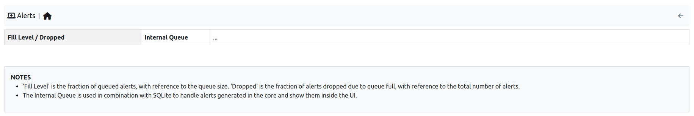

.. _Alert Monitor:

Alert Monitor
=============

This monitor is used to understand if there is some alert loss and how much is the internal queue filled. 

  The Alert Monitor Home

The overview has the following items:

- :code:`Fill Level/Dropped`: indicates how much is the internal queue filled and the number of alerts dropped.
