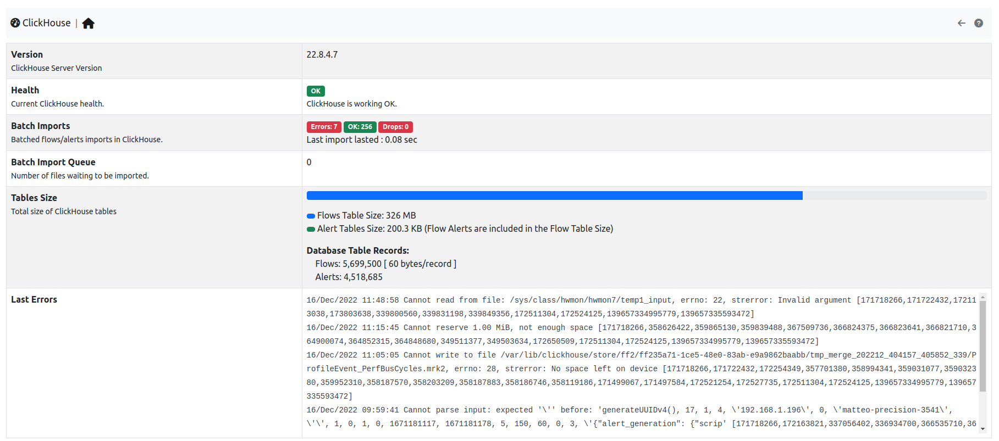

.. _ClickHouse Monitor:

ClickHouse Monitor
==================

ntopng features ClickHouse to export flows to `ClickHouse <https://clickhouse.com/>`_. Enabling the export into ClickHouse Database is going to make the :doc:`Historical Flow Explorer <../clickhouse/historical_flow_explorer>` page available.

.. note::
    ClickHouse export is available only with Enterprise license

  The ClickHouse Monitor Home

The overview has the following items:

- :code:`Health`: A badge which is either green, yellow or red, depending on the status of ClickHouse. The badge is green when ntopng is correctly exporting to ClickHouse, yellow when there are export errors that are recoverable and didn't cause any data loss, red when export errors are persistent and data loss is occurring.
- :code:`Tables Size`: Total disk space used by ClickHouse.
- :code:`Last Errors`: A log trace used to check if some error occurred during the export of the flows
