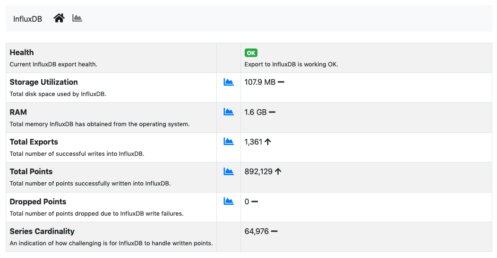
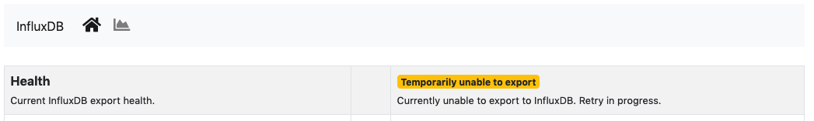
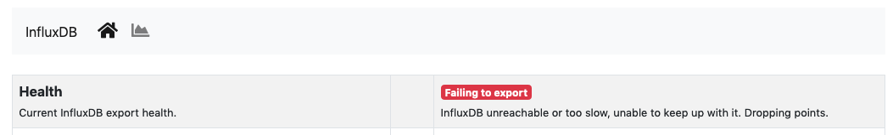
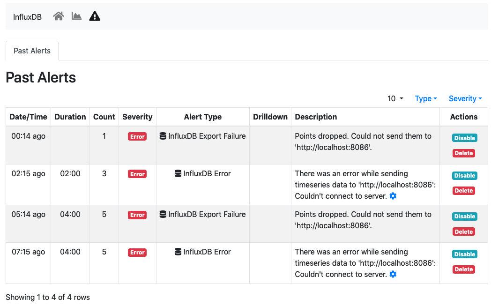
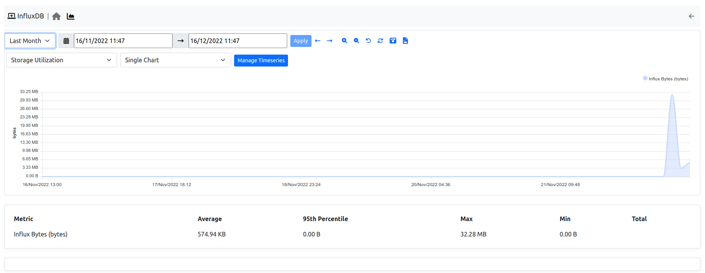

.. _InfluxDB Monitor:

InfluxDB Monitor
================

ntopng features an :ref:`InfluxDB Driver` to export timeseries to `InfluxDB <https://www.influxdata.com/>`_. Using InfluxDB causes ntopng to enable and periodically execute the InfluxDB monitor. The InfluxDB monitor checks InfluxDB health and status. The home of the InfluxDB Monitor shows a brief overview

  The InfluxDB Monitor Home

The overview has the following items:

- :code:`health`: A badge which is either green, yellow or red, depending on the status of InfluxDB. The badge is green when ntopng is correctly exporting to InfluxDB, yellow when there are export errors that are recoverable and didn't cause any data loss, red when export errors are persistent and data loss is occurring.
- :code:`storage utilization`: Total disk space used by InfluxDB.
- :code:`ram`: Total memory InfluxDB has obtained from the operating system.
- :code:`total exports`. Total number of successful writes into InfluxDB. A single write writes multiple points at once.
- :code:`total points`: Total number of points successfully written into InfluxDB.
- :code:`dropped points`: Total number of points dropped due to InfluxDB write failures.
- :code:`series cardinality`: An indication of how challenging is for InfluxDB to `handle written points <https://docs.influxdata.com/influxdb/latest/concepts/glossary/#series-cardinality>`_.

When InfluxDB is temporarily unable to export, the :code:`health` turns yellow.

  InfluxDB Temporarily Unable to Export

`Temporarily unable to export` means ntopng is actively retrying failing exports. Exports typically fails when InfluxDB is down or cannot ingest new data. After several attempts, ntopng gives up and drops the data it couldn't export. In this case, the :code:`health` turns into red.

  InfluxDB Failing to Export

`Failing to export` also causes alerts to be triggered with the reason of the failure to help the administrator fixing the issue.

  InfluxDB Monitor Alerts

ntopng keeps retrying even when the :code:`health` is red to recover as soon as InflulxDB becomes fully functional again.

Timeseries of items shows in the overview are available as well from the *char* page.

  InfluxDB Monitor Timeseries

Timeseries can be disabled from the :ref:`ntopngPreferences`, tab *Timeseries->System Probes*.

The InfluxDB monitor is implemented as an ntopng plugin. Source code is available on `gitHub <https://github.com/ntop/ntopng/tree/dev/scripts/plugins/influxdb_monitor>`_.
