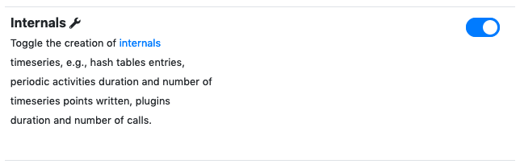
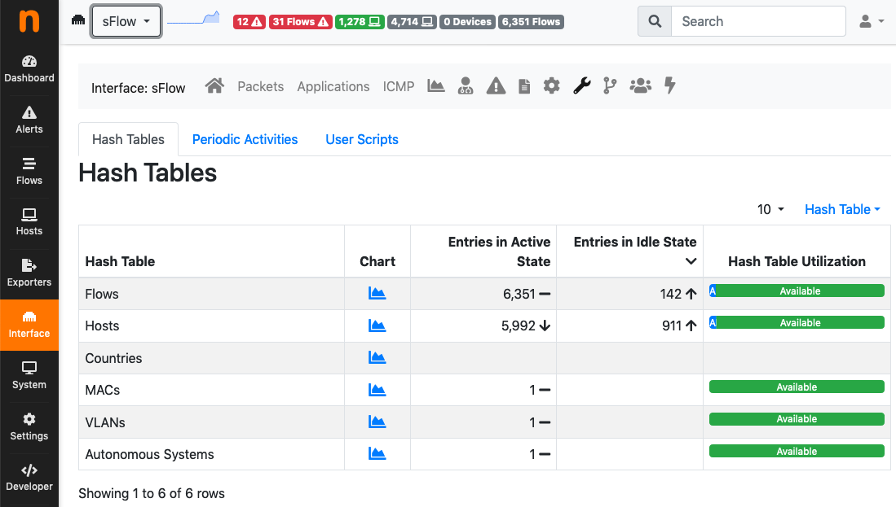

.. _Internals:

Internals
=========

Internals expose status and health of certain ntopng components. Internal components are:

- `Hash Tables`
- `Periodic Activities`
- `User Scripts`

Information exposed is accessible from the `wrench` icon of any interface - including the :ref:`BasicConceptSystemInterface` - and is discussed detail below for each component.

Internals timeseries generation is of by default and can be enabled from  `Preferences->Timeseries->Internals`.

  Internals Timeseries

.. _InternalsHashTables:

Hash Tables
-----------

ntopng uses `hash tables <https://en.wikipedia.org/wiki/Hash_table>`_ to keep `active` network elements in memory. Hosts are kept in the `Hosts` hash table, flows are kept in the `Flows` hash table, and so on.

To ensure smooth functionalities, ntopng hash tables must:

- Have enough room to keep all the active network elements.
- Have enough room to accomodate new network elements that may arrive.
- Be not so full to reduce `collisions <https://en.wikipedia.org/wiki/Hash_table#Collision_resolution>`_.

In addition, every network element in a hash table must:

- Be considered active and updated periodically if it has network traffic associated.
- Be considered idle, removed from the hash table, and deleted from memory when its traffic is no longer seen.

Failing to meet one or more of the conditions will almost surely cause ntopng to malfunction. Under normal circumstances, such conditions are verified but may fail due to:

- ntopng misconfiguration, especially when :ref:`OperatingNtopngOnLargeNetworks` which require fine tuning
- ntopng bugs

Aim of the `Hash Tables` internals table is to monitor hash tables and hash table entries to check and possibly highlight the issues above.

  Internals: Hash Tables

Information shown in the table columns is:

- `Hash Table`: The name of the hash table.
- `Chart`: A link to the historical chart of hash table idle and active entries over time.
- `Entries in Active State`: The total number of network elements that are currently active in the hash table.
- `Entries in Idle State`: The total number of network elements that are currently idle but waiting to be removed from the hash table and deleted from memory.
- `Hash Table Utilization`: The total number of active and idle network elements in the hash table, with reference to the total number of network elements the hash table can accomodate.

Information shown is useful to troubleshoot the following issues:

- `Network elements that are idle but are not being removed from the hash table`: This can exhausts hash table room and prevent new elements to be inserted. In this case, column `Entries in Idle State` will have a value comparable to, or even greater than, `Entries in Active State`. Having this issue means ntopng cannot remove idle elements with a sufficient speed and it should not happen.
- `The hash table is almost full`: This degrades ntopng performances as hash table accesses become slower and it can also prevent new elements from being inserted into the hash table. In this case, the bar in column `Hash Table Utilization` will be composted mostly of `Active` entries. Increasing the number of hosts and flows as described in :ref:`OperatingNtopngOnLargeNetworks` can solve.

Periodic Activities
-------------------

Periodic activities are executed by ntopng periodically. Periodic activities include, but are not limited to:

- `Timeseries generation`.
- `Execution of Plugins` as described in :ref:`Plugins`.
- `Handling idle and active hash table entries` as described in :ref:`InternalsHashTables`.

Multiple threads are available for the execution of periodic activities. A thread executes one periodic activity at time. Multiple periodic activities are executed sequentially by the same thread. Multiple parallel threads execute multiple periodic activities simultaneously.

Issues:

- A task is taking too long

User Scripts
------------

