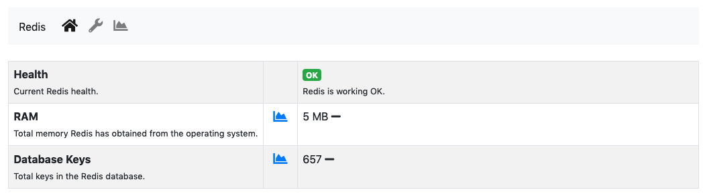
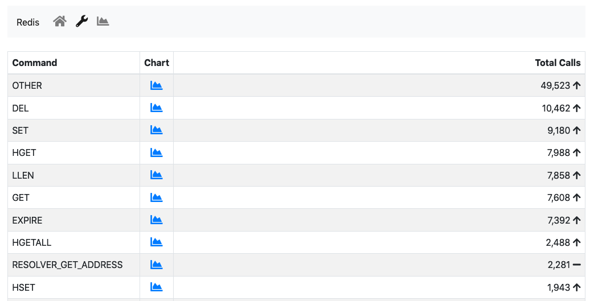
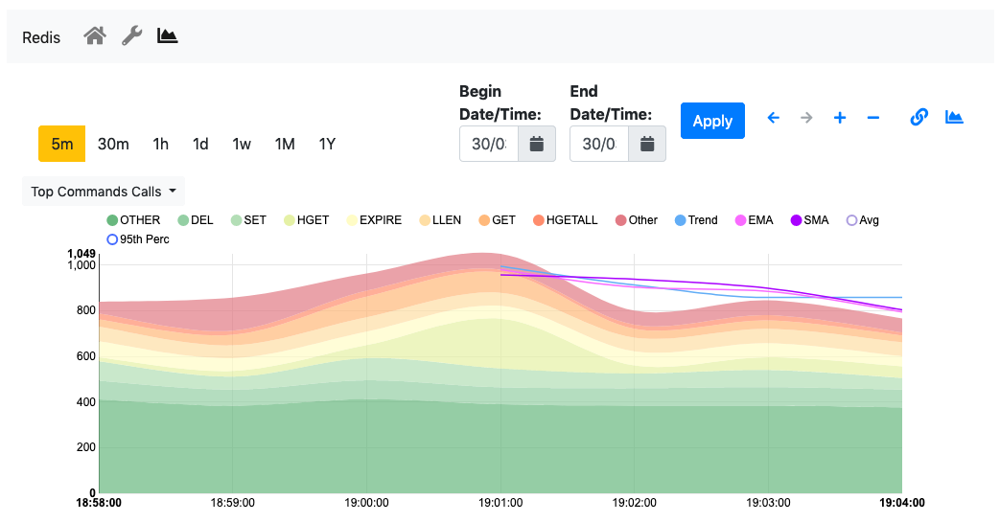

.. _Redis Monitor:

Redis Monitor
=============

`Redis <https://redis.io/>`_ is a key-value store used by ntopng to cache data and preferences. Redis runs as an external service both on Linux and on Windows. ntopng connects to Redis using sockets. Failing to connect to Redis would cause ntopng to malfunction. Redis must always be up, running and reachable to ensure ntopng functionalities.

Aim of this monitor is to check Redis health and resources used. The home of the Redis Monitor shows a brief overview

  The Redis Monitor Home

The overview has three items:

- :code:`health`: A badge which is either green or red, depending on the status of Redis. The badge is green when the Redis Append Only File (AOF) is operational, otherwise the badge is red.
- :code:`ram`: Total memory Redis has obtained from the operating system.
- :code:`database keys`: Total number of keys currently stored in Redis.

ntopng inteacts with Redis using `commands <https://redis.io/commands>`_. The number of times each command is issued is reported under the *wrench* page

  The Redis Commands Monitor

This page is mostly useful to debug anomalous uses of commands and it not really relevant for a user. Debugging is also supported by the available timeseries which are generated by the Redis monitor and that are available from the *chart* page

  Redis Timeseries

Available timeseries are:

- A stacked `Top Commands Call` to have an overview of the top commands used in time.
- RAM used
- Database keys
- Number of calls for a subset of Redis commands used.

Timeseries can be disabled from the :ref:`ntopngPreferences`, tab *Timeseries->System Probes*.

The Redis Monitor is implemented as an ntopng plugin. Source code is available on `gitHub <https://github.com/ntop/ntopng/tree/dev/scripts/plugins/redis_monitor>`_.

