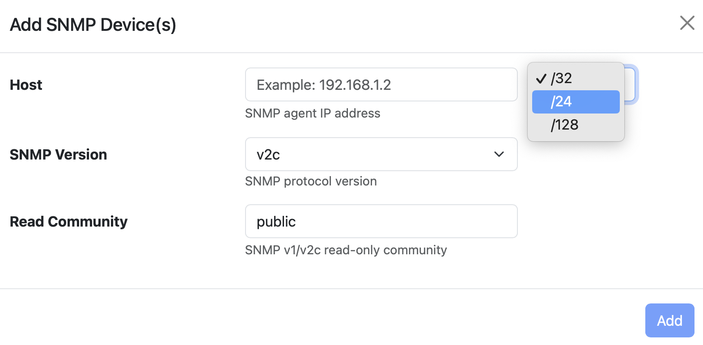

Configuration and Discovery
---------------------------

You can configure a single device or discover devices on a subnet by clicking on the '+' icon and filling up the form below

Alternatively, you can import a JSON or a CSV file containing the configuration of the devices by clicking on the import icon (|import|).

.. |import| image:: ../img/SNMP_ImportIcon.png
  :height: 25px

.. figure:: ../img/SNMP_ImportDevices.png
  :align: center
  :alt: Import SNMP Devices

ntopng will then discover all the active SNMP devices adding them to the device list

.. figure:: ../img/SNMP_Overview.png
  :align: center
  :alt: SNMP Devices Overview

Devices are polled automatically every 5 minutes and timeseries are created if enabled in preferences where you can also specify the default SNMP community.

SNMP Import file
~~~~~~~~~~~~~~~~

The file to import for SNMP device configuration must be either a JSON array or a CSV.
The format of the two files is different; in case of the CSV, the file has to be formatted with 1 SNMP device per line and the data has to be in the following order in case of SNMP v.1 or SNMP v.2c (leave empty values in case no value is needed):

.. code:: json

  DEVICE_IP,READ_COMMUNITY,WRITE_COMMUNITY,VERSION

For the SNMP v.3 instead:

.. code:: json

  DEVICE_IP,READ_COMMUNITY,WRITE_COMMUNITY,VERSION,LEVEL,USERNAME,AUTH_PROTOCOL,AUTH_PASSPHRASE,PRIVACY_PROTOCOL,PRIVACY_PASSPHRASE

Example:

.. code:: json

  192.168.2.1,public,,3,hello,ntop,md5,hello,,,   (v3)
  192.168.2.222,public,,2                         (v2c)

For the JSON instead follow the example of the one exporter by ntopng in this same page, example:

.. code:: json

  {
    "modules": {
      "snmp": {
        { 
          "ip_address":"192.168.2.38",
          "version":"2c",
          "community":"public"
        },
        {
          "ip_address":"192.168.2.0/24",
          "version":"2c",
          "community":"public"
        }
      }
    }
  }
