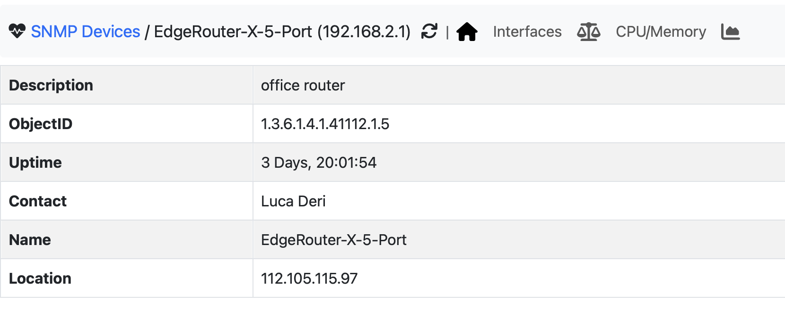
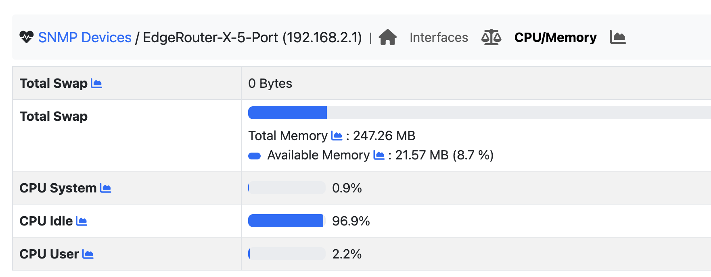
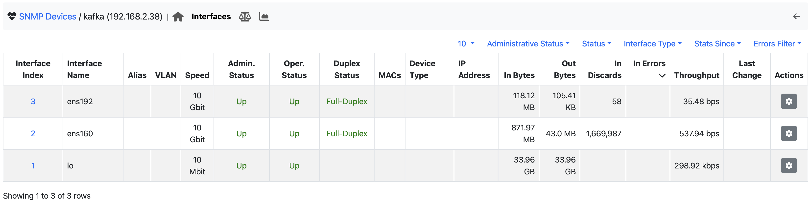
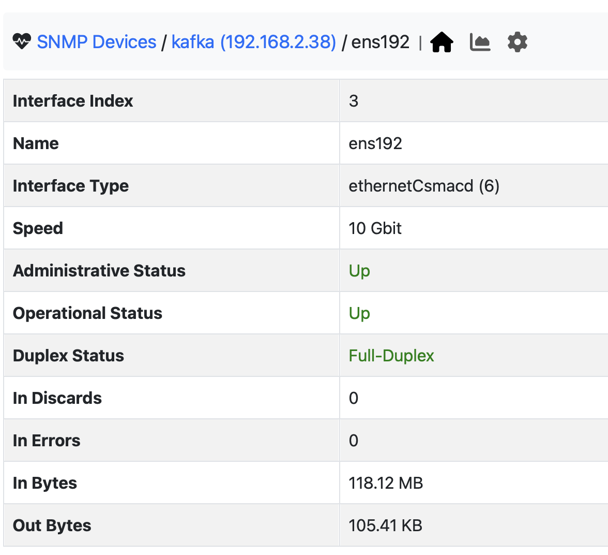
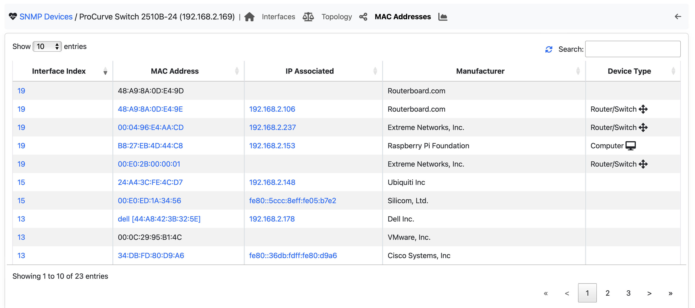
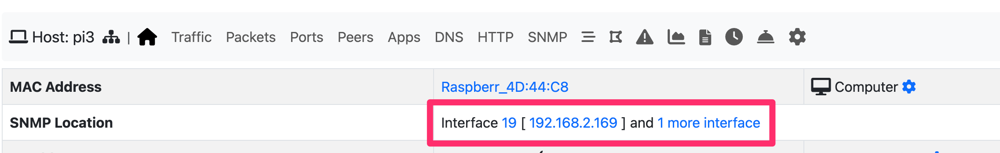

Device Monitoring
-----------------

ntopng supports several MIBS including (but not limited to):

- MIB-II
- LLDP / CDP MIB
- Bridge MIB
- netSNMP

Below you can see an overview of a device:

During device discovery, ntopng automatically detectes the MIBs and in the device menu are displayed icons of those that aare available. In the picture below you can see for instance an overview of the SNMP memory and CPU usage.

Network Interfaces
------------------

One of the main uses of SNMP is monitoring of network interfaces. ntopng displays them in a table view:

Clicking on an interface id a drill-down page is shown

Binding MAC Address to Interface
--------------------------------

If present, ntopng polls the bridge MIB that is used to discover the MAC addresses observed on a network interface.

As shown above, ntopng reports the list of MAC addresses for each network interface and uses this information in network monitoring.

In the above picture you can see how SNMP is used to bind an IP address to SNMP and thus to a physical device.

