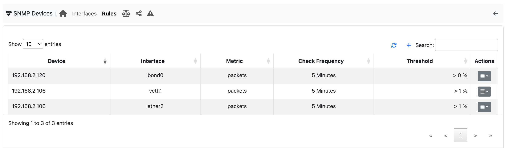
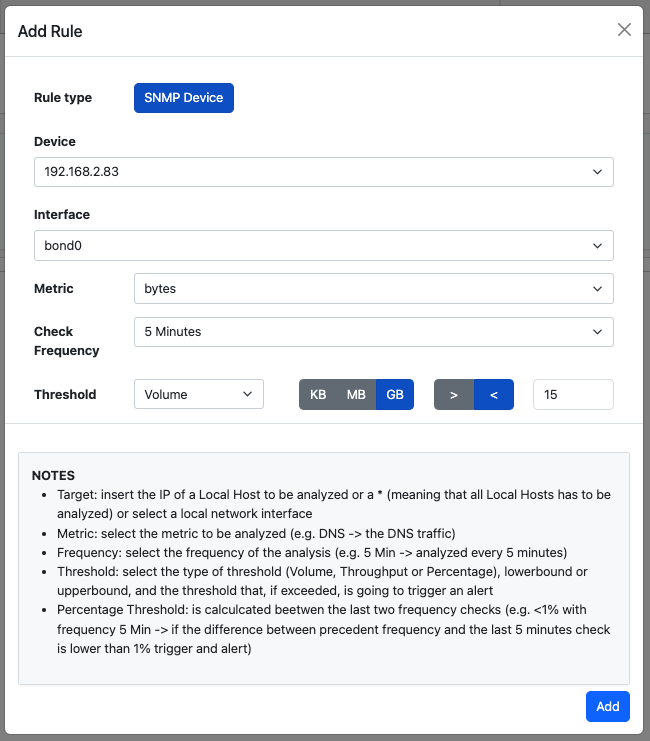

Device rules
-----------------

.. note::

  This feature is available only from Enterprise L license.

Using SNMP Device rules, ntopng can generate an alert when a specific interface of a designated SNMP device crosses a threshold.

  SNMP Devices Rules

Thresholds can be configured for SNMP metrics such as packets, bytes, and errors. 
When selecting packets or errors as the metric, the threshold can be specified as a percentage or throughput. 
On the other hand, if bytes is chosen as the metric, the threshold can also be expressed in terms of volume (KB, MB, GB).
These checks are performed at frequencies of every 5 minutes, every hour, and every day.

  Add SNMP Device Rule