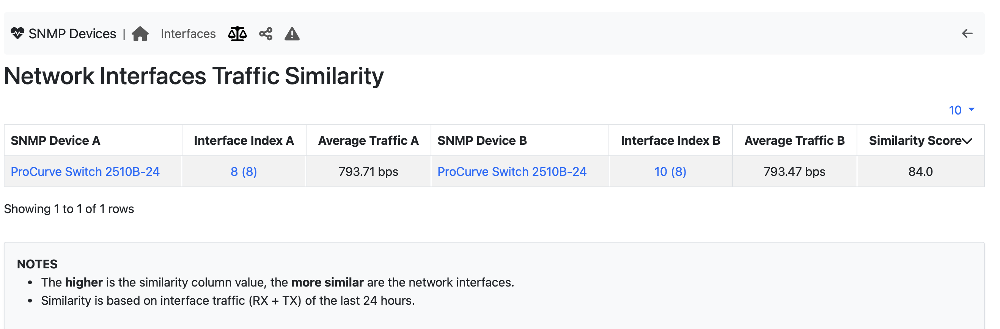

Interface Similarity
--------------------

.. note::

	A ntopng Enterprise L license or above is required.

In addition to interface counter polling, ntopng allows interface traffic to be compared for similarity. This activity is important as it allows a simple questions to be answer: "what other interface is similar to a given interface" ? This is because if a device is simbehaving, probably another device is affected by the same problem.

In the above picture an example of interface similarity it is shown. In the table, each line has two interfaces that are somehow similar (traffic bytes are used in the comparison) in term of traffic volume and distribution. All comparisons are performed on the traffic of the last day.

