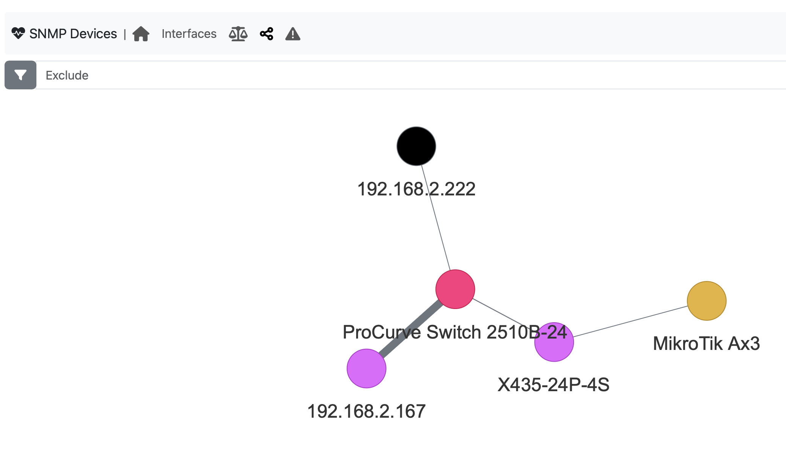
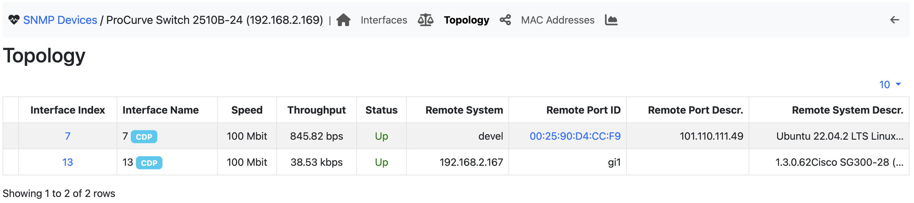

Network Topology
----------------

With SNMP it is possible not only to detect what devices are connected to a switch port, but also how ports are connected together. This is implemented with the `LLDP <https://en.wikipedia.org/wiki/Link_Layer_Discovery_Protocol>`_ and `CDP <https://en.wikipedia.org/wiki/Cisco_Discovery_Protocol>`_ MIBs. During polling, if these MIBs are detected, they are polled and the device information is merged

The devices that are interconneted are displayed graphically with link size wider or thin according to the link traffic. It is possible to click on a device in order to jump on the device page. The above graph can also be depicted as a table for better displaying the device adjacencies.

