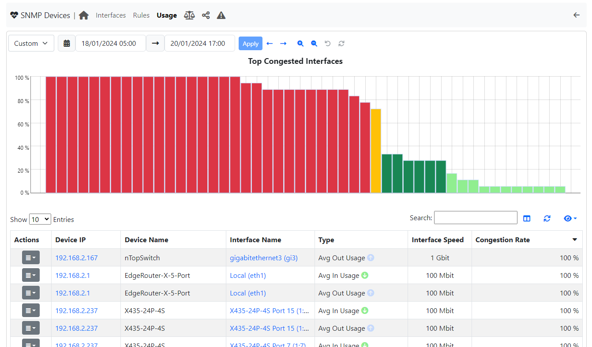
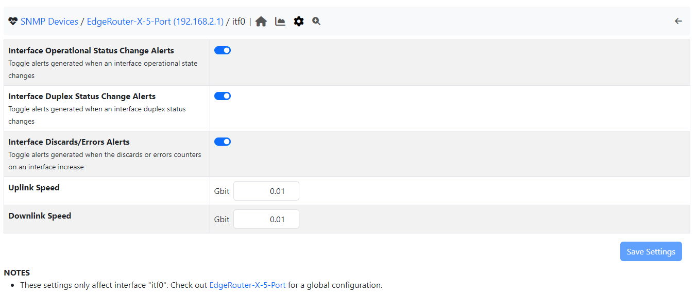
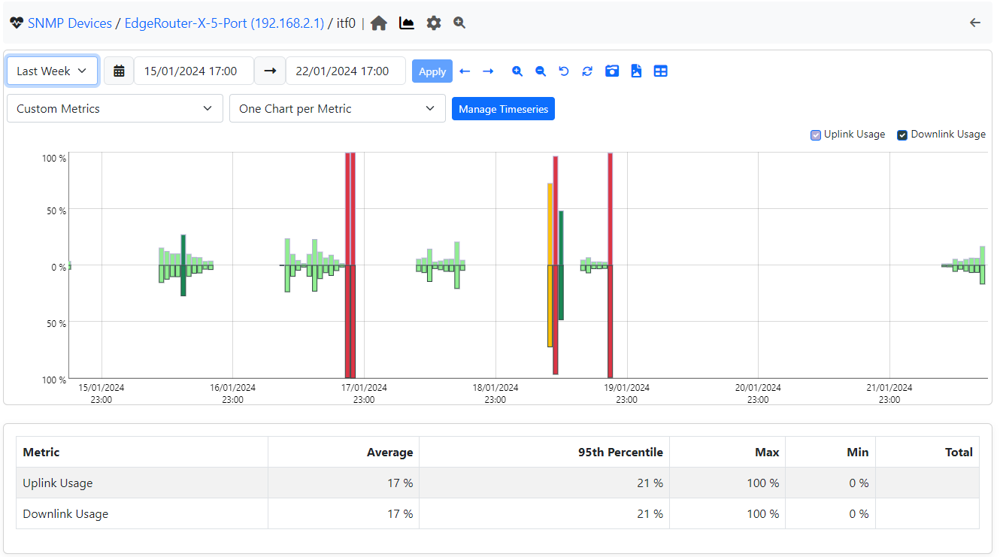
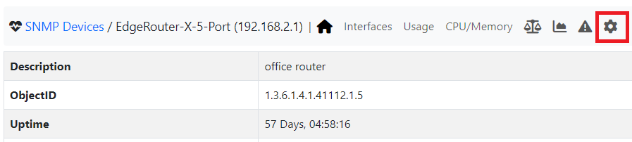
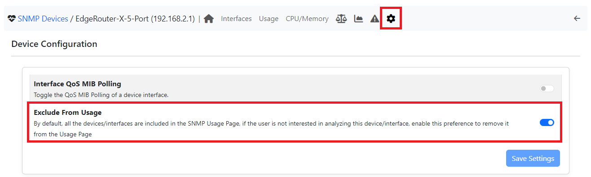
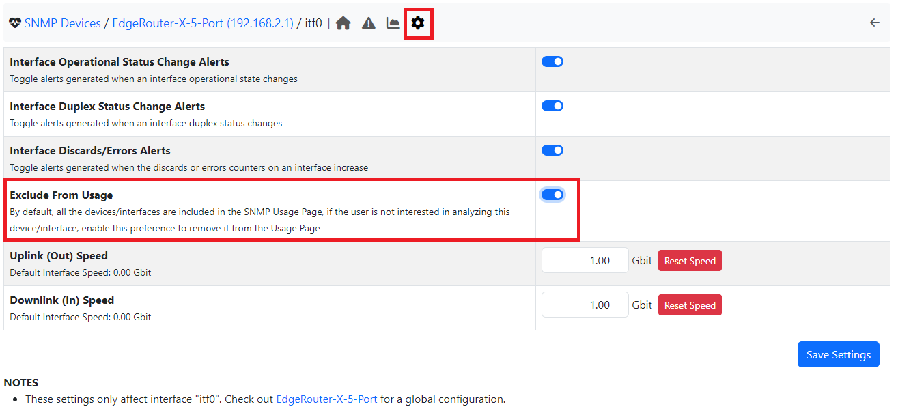
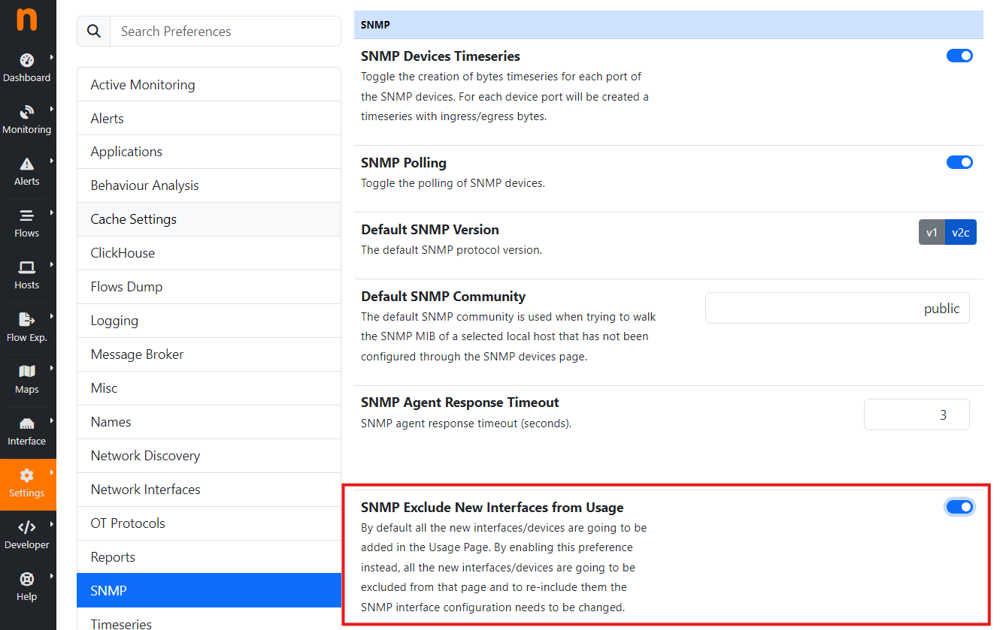

.. _Usage:

SNMP Usage
###############

ntopng has the ability to monitor the usage percentage of each interfaces for each SNMP device.

.. note::
  Enterprise L license or above is required

.. warning::
  It is mandatory to have the SNMP timeseries enabled; then a new Usage page is going to be accessible.

Here it is possible to understand the congested interfaces.

The chart, shows only the Top congested SNMP interfaces; an interface is considered congested if at least 75% of the link is used.
The link speed (up and down) info, is provided by SNMP in most cases, however sometimes the link speed is not correct. It is however possible to manually configure it by jumping to the SNMP Interface configuration page.

Given the timeframe (selectable above the Top Congested Interfaces chart), the congestion percentage is calculated by adding the various usage percentages (a timeserie, obtained by comparing the Traffic and the configured Max Link Speed) of the interface and dividing it per the number of points.

.. note::

	Being the congestion, dependent on the usage timeseries, it can have at most 1 point per 5 minutes (the usage timeseries is updated every 5 minutes).

The table instead, shows the congestion rate and other base information of the devices.
By clicking on the 'Action' button, it is possible to jump to the interface configuration (in case of misconfiguration) or directly drill-down to the Usage timeserie.

.. note::

	An other way to drill-down to the timeserie is by clicking on the corresponding bar in the chart

Note that both, the Usage timeseries and the Top Congested Interfaces charts, have different colored bars based on the percentage:

- between 0 and 24, the bar has a light green color
- between 25 and 49, the bar has a green color
- between 50 and 75, the bar has a yellow color
- between 76 and 100, the bar has a red color

Exclude Interfaces or Devices
-----------------------------

By default, all SNMP devices/interfaces are included in the Usage page; however it is possible to exclude entire devices or single interfaces (if not interested in them).
By jumping to the device summary page (by clicking on an SNMP device), click on the configuration page.

Here toggle the 'Exclude From Usage' preference.

The same thing is achievable with the interfaces, by jumping to the interface summary and clicking on the configuration page.

Automatic Exclusion
===================

Moreover it is possible to automatically exclude all the SNMP Devices/Interfaces newly added into ntopng automatically.
In order to do that, a preference is needed to be enabled; jump to Settings, Preferences, SNMP (see image below) and enable the 'SNMP Exclude New Interfaces from Usage' preference.
From now on, all the newly added devices (with the interfaces) are going to be automatically excluded from the SNMP Usage.

It is however still possible to include back again the excluded interfaces/devices by jumping to the preferences and disabling the relative preference (just like for disabling them).

