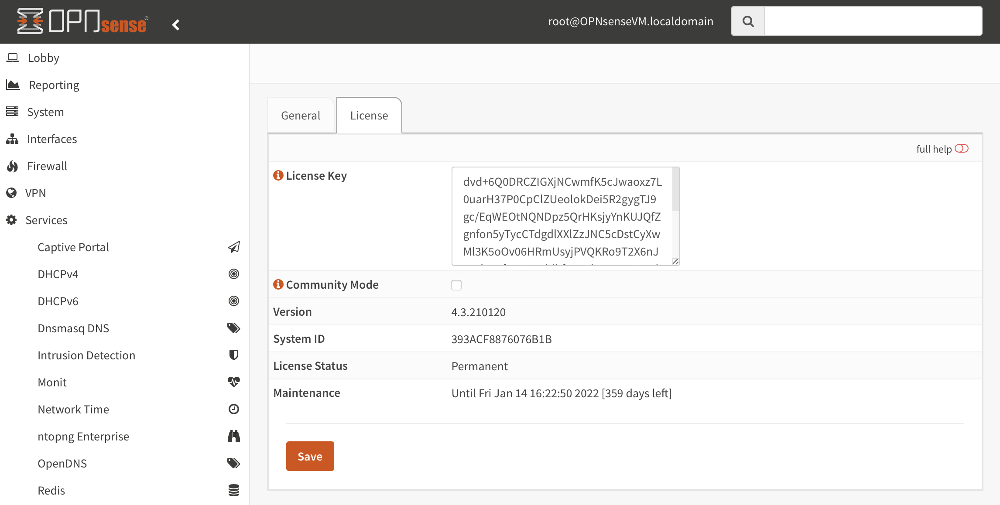
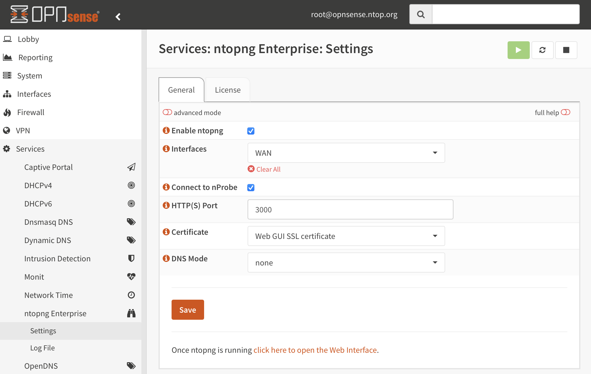

.. _OPNsenseIntegration:

OPNsense
########

ntopng can be installed on OPNsense as plugin using the Web interface (recommended)
or using the command line. In both cases the ntop repository for FreeBSD should be
configured as described at https://packages.ntop.org/FreeBSD/.

Repository Configuration
========================

Log into the OPNsense Shell as administrator (select option 8).

  OPNsense Shell

And install the repository using the command provided at https://packages.ntop.org/FreeBSD/
(you can cut&paste the command below).

.. code:: bash

   pkg add https://packages.ntop.org/FreeBSD/FreeBSD:12:amd64/latest/ntop-1.0.txz   

The output should look like the below.

  ntop Repository Installation

Plugin Installation
===================

.. note::

   Plugins installation in OPNsense requires you to log in as administrator.

Go to the *System* > *Firmware* > *Plugins* page and click on the *Check for updates*.

  Plugins - Check For Updates

The *os-ntopng-enterprise* plugin should appear in the list, in addition to the built-in
*os-ntopng* plugin, which does not provide enhanced and Enterprise features (please make
sure you remove it in case the latter is already installed).

Install both *os-ntopng-enterprise* and the *os-redis* (which is a requirement) plugins by
clicking on the *+* symbol.

  ntopng and Redis Plugins Installation

License Configuration
=====================

.. note::

   ntopng Community Edition is free of charge and does not require a license. Skip this
   section if you want to run ntopng in Community mode.

Go to *Services* > *ntopng Enterprise* > *Info* to get all the information required
by the license generator (*Version* and *System ID*).

  ntopng Info

The license can be installed in the *General* page when configuring ntopng as described
in the next section.

ntopng Configuration
====================

Going to *Services* > *ntopng Enterprise* > *General* it is possible to configure
the ntopng service. A basic configuration usually includes the below steps:

  1. Enable the service by checking *Enable ntopng*
  2. Configure a port and select a *Certificate* for enabling HTTPS support for the GUI
  3. Configure a license for enabling ntopng Pro/Enterprise or select *Community Mode*

  ntopng Configuration

Save the configuration and run the service. A link at the bottom of the page will
redirect you to the ntopng Web GUI.

By default ntopng analyses traffic from all the interfaces. Select the *advanced mode*
to select a specific interface. Alternatively it is possible to use the *Connect to nProbe*
switch to collect traffic information from a local nProbe instance (please take a look
at the *os-nprobe* `nProbe plugin guide <https://www.ntop.org/guides/nprobe/third_party_integrations/opnsense.html>`_).

