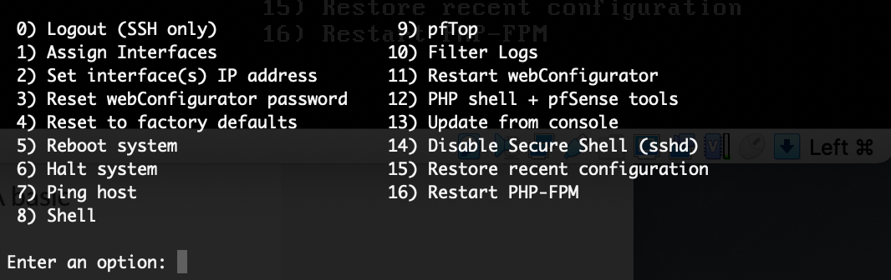
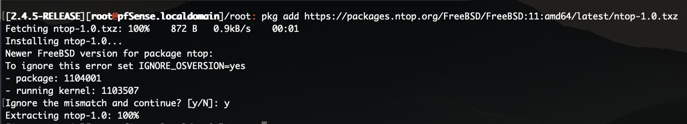
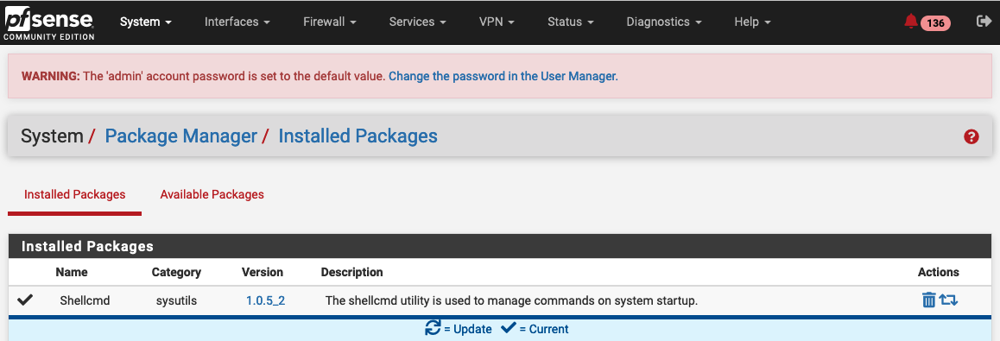
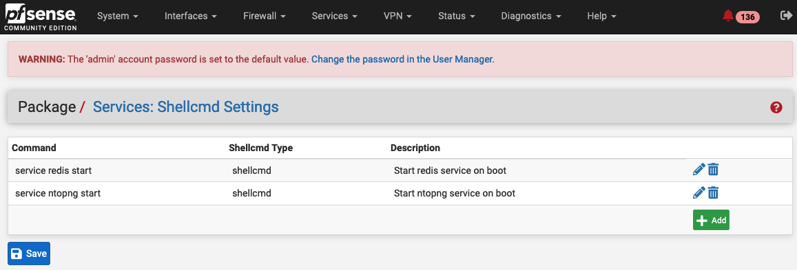

   .. _pfSenseIntegration:

pfsense
########

ntopng Pro/Enterprise can be installed on pfsense using 
the command line. This requires the configuration of the FreeBSD
repository (FreeBSD 11 for pfSense CE 2.4, FreeBSD 12 for 
pfSense CE 2.5 and pfSense Plus) as described at
https://packages.ntop.org/FreeBSD/.

Repository Configuration
========================

Log into the pfsense Shell as administrator (select option 8).

  pfsense Shell

And install the repository using the command provided at https://packages.ntop.org/FreeBSD/
(you can cut&paste the command below according to your pfSense edition).

pfSense CE 2.4
~~~~~~~~~~~~~~

.. code:: bash

   pkg add https://packages.ntop.org/FreeBSD/FreeBSD:11:amd64/latest/ntop-1.0.txz

pfSense CE 2.5 / pfSense Plus
~~~~~~~~~~~~~~~~~~~~~~~~~~~~~

.. code:: bash

   pkg add https://packages.ntop.org/FreeBSD/FreeBSD:12:amd64/latest/ntop-1.0.txz

The output should look like the below.

  ntop Repository Installation

Package Installation
====================

.. note::

   If you already have ntopng community build installed from the builtin repository,
   please remove it and also delete the data directory under */var/db/ntopng* to let
   the new package create it with the right permissions.

Run the below command to install the ntopng package:

.. code:: bash

   pkg install ntopng

License Configuration
=====================

.. note::

   ntopng Community Edition is free of charge and does not require a license. Skip this
   section if you want to run ntopng in Community mode.

Run the below command in order to get all the information required
by the license generator (*Version* and *System ID*).

.. code:: bash

   /usr/local/bin/ntopng -V

The license should be installed under /usr/local/etc/ntopng.license

.. code:: bash

   echo LICENSE_KEY > /usr/local/etc/ntopng.license

ntopng Configuration
====================

A sample ntopng configuration file is located under /usr/local/etc/ntopng/ntopng.conf.sample,
please copy it to /usr/local/etc/ntopng.conf (it is recommended to keep the 'ntopng' user as
owner) and open it with the preferred editor in case the default settings should be modified.
Add a new line with the *--community* option to run ntopng in Community mode.

.. code:: bash

   cp /usr/local/etc/ntopng/ntopng.conf.sample /usr/local/etc/ntopng.conf
   chown ntopng:ntopng /usr/local/etc/ntopng.conf

Services
========

ntopng depends on redis. To start redis type

.. code:: bash

   service redis start

.. note::

   If redis does not start, check out the Troubleshooting section below.

To start the ntopng service run

.. code:: bash

   service ntopng start

Starting Services on Boot
=========================

pfSense ignore the standard :code:`rc.d` file. For this reason, to start redis and ntopng on boot, Shellcmd should be used. Install the Shellcmd package (System -> Package Manager -> Available Packages):

  pfsense Shellcmd Install

Then, create two Shellcmd commands (Services -> Shellcmd -> Add), with :code:`service redis start` and :code:`service ntopng start`, respectively:

  pfsense Shellcmd Install

Now, a simple restart of pfSense, will start redis and ntopng automatically.

Troubleshooting
===============

.. note::

   If you experience issues running the redis service on pfSense 2.4.x,
   please try upgrading your pfSense installation to 2.5 with *pfSense-upgrade*

On certain versions of pfSense, redis fails to start automatically and it requires some intervention on configuration files. To check if redis has been started successfully run the following command:

.. code:: bash

   ps aux | grep redis

If the service has been started successfully, the command should output a line similar to:

.. code:: bash

   root    91871   0.0  0.2  15184   4848  -  Ss   08:06    0:00.99 redis-server: /usr/local/bin/redis-server *:6379 (redis-server)

If the service has not been started, take the following actions to troubleshoot. First, check the log file :code:`/var/log/redis/redis.log` for errors such as

.. code:: bash

   42323:M 05 May 2021 09:15:01.808 # Short read or OOM loading DB. Unrecoverable error, aborting now.
   42323:M 05 May 2021 09:15:01.808 # Internal error in RDB reading function at rdb.c:2124 -> Unexpected EOF reading RDB file

Errors such as the one above may prevent redis to start. In this case, clear the redis data directory and try to restart it

.. code:: bash

   rm -rf /var/db/redis/*
   service redis start

The service may fail to start also because it is unable to write its pid file or because it is running without enough privileges.

To make sure redis is able to write its pid file, change the pidfile path in redis configuration file :code:`/usr/local/etc/redis.conf` to

.. code:: bash

   pidfile /var/run/redis.pid

Then, also update the redis pidfile directive in the service file :code:`/usr/local/etc/rc.d/redis` to

.. code:: bash

   pidfile="/var/run/$name.pid"

Finally, if the service keeps refusing to start, also update  the redis_user directive in the service file :code:`/usr/local/etc/rc.d/redis` to

.. code:: bash

   : ${redis_user="root"}

Now, if everything has been set up properly, redis can be started/stopped as

.. code:: bash

   [root@pfSense.localdomain]/root: service redis stop
   Stopping redis.
   Waiting for PIDS: 87765.
   [root@pfSense.localdomain]/root: service redis start
   Starting redis.
   [root@pfSense.localdomain]/root: service redis status
   redis is running as pid 21581.
   [root@pfSense.localdomain]/root: service redis stop
   Stopping redis.
   Waiting for PIDS: 21581.

