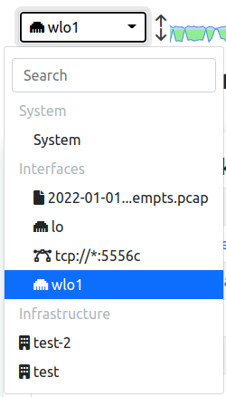

Network Interface
#################

This Web Interface is used to monitor the status of a Network Interface; there can be different types of network interfaces, see this `section`_ for more info.

  System Interface Dropdown

By changing interface and jumping to the Network Interface some options are going to be available.

.. _`section`: ../../advanced_features/interfaces/index.html

Dashboard
---------

.. toctree::
    :maxdepth: 1

    dashboard/dashboard
    ../../flow_dump/clickhouse/reports
    interface/sites

Monitoring
----------

.. toctree::
    :maxdepth: 2

    monitoring/network_discovery
    monitoring/active_scan

Alerts
------

.. toctree::
    :maxdepth: 2

    alerts/flow_alerts_analyser

Flows
-----

.. toctree::
    :maxdepth: 2

    flows/flows
    ../../flow_dump/clickhouse/historical_flows
    flows/server_ports

Hosts
-----

.. toctree::
    :maxdepth: 2

    hosts/hosts

Maps
----

.. toctree::
    :maxdepth: 3
    
    maps/analysis_map
    maps/geo_map
    maps/host_map

Interface
---------

.. toctree::
    :maxdepth: 2

    interface/interfaces
    interface/networks
    interface/host_pools
    interface/autonomous_systems
    interface/countries
    interface/operating_systems

